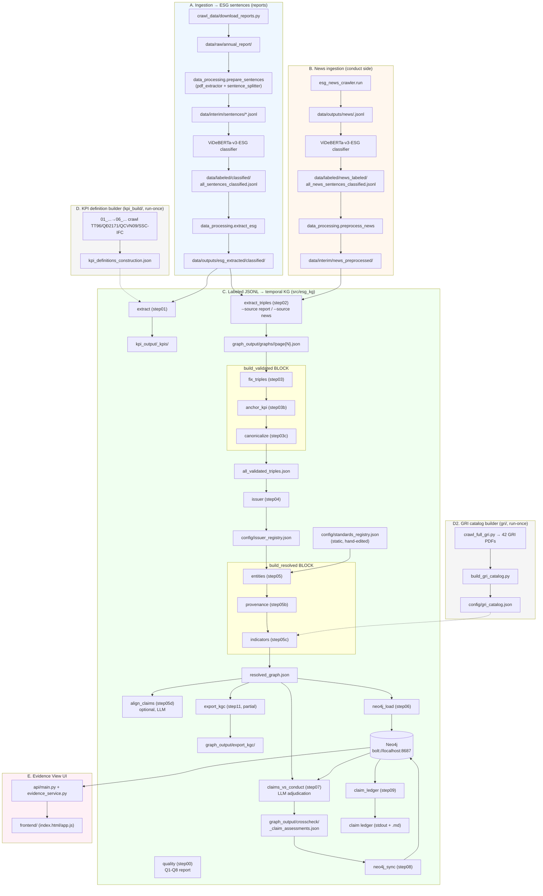

# Data Construction Pipeline

End-to-end flow from raw annual reports / news through to the temporal ESG knowledge
graph and the Evidence View UI. Stage names in parentheses (e.g. `step05c`) are the
`old_step` labels used by `python src/run.py <stage>` — see `CLAUDE.md` for the full
command reference.

