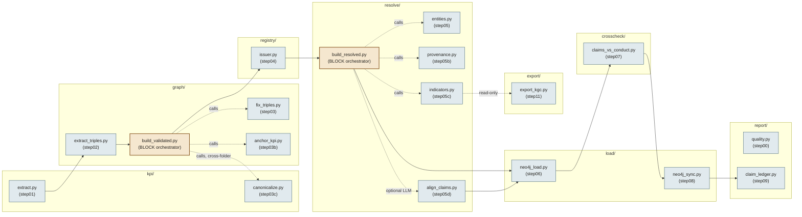
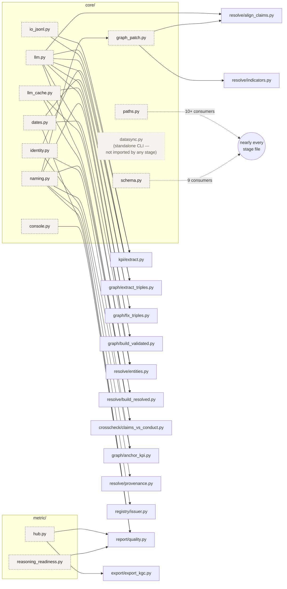

# Stage C Pipeline — Organized by `src/esg_kg/` Module

Quick-look draft: the labeled-JSONL → temporal-KG pipeline (Stage C in
`DATA_CONSTRUCTION_PIPELINE.md` / `CLAUDE.md`), redrawn with swimlanes matching
`src/esg_kg/`'s actual folder structure instead of plain run order. Execution
order still flows left → right within and across lanes; `core/` is drawn as a
shared base layer since every stage imports from it, not because it runs at
any particular point.

```mermaid
flowchart LR
    subgraph KPI["kpi/"]
        S01["extract (step01)\nGemini -> kpi_output/"]
    end

    subgraph GRAPH["graph/ — BLOCK: build_validated"]
        direction LR
        S02["extract_triples (step02)\nGemini/DeepSeek"] --> S03["fix_triples (step03)\nLLM repair + P4 dates"]
        S03 --> S03B["anchor_kpi (step03b)\noffline gazetteer"]
        S03B --> S03C["canonicalize (step03c)\noffline kpi_id"]
    end

    subgraph REGISTRY["registry/"]
        S04["issuer (step04)\nrun-once bootstrap"]
    end

    subgraph RESOLVE["resolve/ — BLOCK: build_resolved"]
        direction LR
        S05["entities (step05)\nStage A-D, --no-llm today"] --> S05B["provenance (step05b)\noffline stamp"]
        S05B --> S05C["indicators (step05c)\noffline TT96/GRI axis"]
        S05C -.optional LLM.-> S05D["align_claims (step05d)\nLLM topic align"]
    end

    subgraph EXPORT["export/ (side branch, read-only)"]
        S11["export_kgc (step11)\nhub decomposition"]
    end

    subgraph LOAD["load/"]
        S06["neo4j_load (step06)\nbase graph -> Neo4j"]
        S08["neo4j_sync (step08)\nadvisory layer -> Neo4j"]
    end

    subgraph CROSSCHECK["crosscheck/"]
        S07["claims_vs_conduct (step07)\nLLM adjudication, mandatory"]
    end

    subgraph REPORT["report/"]
        S00["quality (step00)\nQ1-Q8 offline diagnostics"]
        S09["claim_ledger (step09)\nNeo4j-only presentation"]
    end

    CORE["core/ — shared kernel\npaths · io_jsonl · llm · schema · naming · dates · identity · graph_patch"]

    S01 --> S02
    S03C --> S04
    S04 --> S05
    S05C -.-> S11
    S05D --> S06
    S05C --> S06
    S06 --> S07
    S07 --> S08
    S08 --> S09

    CORE -.used by.-> KPI
    CORE -.used by.-> GRAPH
    CORE -.used by.-> REGISTRY
    CORE -.used by.-> RESOLVE
    CORE -.used by.-> LOAD
    CORE -.used by.-> CROSSCHECK
    CORE -.used by.-> REPORT

    METRIC["metric/ — hub.py\n(multi-issuer cluster detection)"]
    METRIC -.used by.-> EXPORT
    METRIC -.used by.-> S00

    classDef block fill:#F3EFE4,stroke:#B7AD96,color:#211F1B;
    classDef llm fill:#F5E7CF,stroke:#8C5A26,color:#211F1B;
    classDef offline fill:#E1EAEE,stroke:#33566B,color:#211F1B;
    classDef kernel fill:#F6F4EE,stroke:#615A4C,color:#211F1B,stroke-dasharray: 3 3;

    class S01,S02,S03,S05,S05D,S07 llm;
    class S03B,S03C,S05B,S05C,S06,S08,S09,S00,S11 offline;
    class S04 block;
    class CORE,METRIC kernel;
```

## Notes on this grouping vs. the run-order view

- **`graph/` and `resolve/` each cluster into one BLOCK** (`build_validated`,
  `build_resolved` — DESIGN.md §5.7), so grouping by folder lines up with a
  distinction that already exists in the code: each block writes its shared
  artifact (`all_validated_triples.json` / `resolved_graph.json`) exactly
  once, no matter how many stages live in the folder.
- **`core/` is not a pipeline stage** — it's the shared kernel every other
  folder imports from (`RateLimiter`, `_GeminiProvider`, schema loaders,
  identity helpers, …). Drawn as a base layer, not a step in the flow.
- **`export/` is a read-only side branch**, not a continuation of the main
  chain: `export_kgc` reads `resolved_graph.json` and never patches it or
  Neo4j (P6 boundary, `TEMPORAL_KG_DESIGN.md`).
- **`metric/`** (`hub.py`) is reused by both `export_kgc` (bucket
  decomposition) and `quality` (R5/Q7(d) hub checks) — drawn once, referenced
  by both rather than duplicated.
- Color key: tan = LLM-driven stage (Gemini/DeepSeek), blue = offline-only,
  dashed box = shared kernel/cross-cutting, not a stage.

This is a first-pass sketch for review — once the grouping is confirmed, the
TikZ version (matching `pipeline_diagram.tex`'s palette, as a companion
Panel C) can follow the same lane structure.

---

## v2 — file-level components (each `.py` = one node)

**Correction from v1 above:** `canonicalize.py` (step03c) actually lives in
`kpi/`, not `graph/` — the folder-level sketch got this wrong by assuming
run-order clusters folder membership. Verified against the real imports in
`src/esg_kg/pipeline.py` and each file's `from esg_kg... import` lines.

Going to file granularity surfaces something the folder view hides: the two
BLOCK orchestrator files behave differently. `build_validated.py` reaches
**across** folders (`graph/` → `kpi/`) to call `canonicalize`, while
`build_resolved.py` stays entirely inside `resolve/` (`entities`,
`provenance`, `indicators` are all local). That asymmetry is invisible once
files are grouped into folder boxes.

### Diagram A — stage files (execution flow)

### Diagram B — kernel files (`core/` + `metric/`), consumer fan-out

`paths.py` and `schema.py` are imported by nearly every stage file (10+
consumers each) — drawing each of those edges individually would swamp the
diagram, so they're collapsed to one grouped edge. The rest of `core/` has
narrow enough fan-out to draw explicitly, which is the point of going
file-level: it shows *which* stages actually share *which* helper, not just
"they all depend on core somehow."

### Reading this pair of diagrams

- **Diagram A = what runs; Diagram B = what's shared.** Keeping them
  separate is deliberate — merging kernel fan-out into the main flow (every
  stage file also fanning out to `paths.py`) is what makes single-diagram
  file-level attempts unreadable.
- `datasync.py` is drawn with a different (dotted/pale) style: it's a
  standalone CLI (`python src/esg_kg/core/datasync.py status`), not imported
  by any stage — it lives in `core/` by convention, not because anything
  calls into it.
- `llm_cache.py` fans out only to the three call sites that cache a paid
  result (`build_validated`, `build_resolved`, `claims_vs_conduct`) — per
  `DESIGN.md`'s block-pattern rule, only non-deterministic *paid* results are
  cached, never a merely-billed-but-deterministic one (e.g. embeddings), so
  this narrow fan-out is a direct reflection of that rule, not an accident.
- `reasoning_readiness.py` and `console.py` each have exactly one consumer
  (`report/quality.py`) — worth knowing before assuming every `core/`/`metric/`
  file is broadly shared kernel; some are single-purpose helpers that just
  happen to be filed there.

Next candidate refinement, if this level of detail earns its place in the
report: fold Diagram A's BLOCK-orchestrator edges and Diagram B's fan-out
into one combined view once the grouping is final, or keep them as two
figures (flow + dependencies) the way `pipeline_diagram.tex` already
separates panels.
