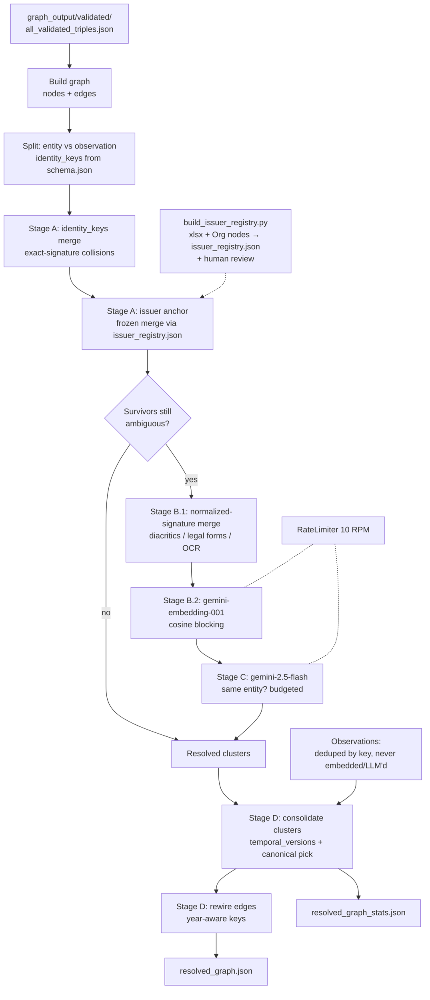

# Entity resolution — purpose, reason and logic

Scripts: [`src/build_issuer_registry.py`](../src/build_issuer_registry.py) (one-time issuer-registry
bootstrap) → [`src/resolve_entities.py`](../src/resolve_entities.py) (the resolver).
Engineering checklist: [`ENTITY_RESOLUTION_PLAN.md`](../ENTITY_RESOLUTION_PLAN.md).

This step takes the single clean triple list produced by
[`fix_invalid_triplets.py`](../src/fix_invalid_triplets.py)
(`graph_output/validated/all_validated_triples.json`) and collapses the **many
duplicate entity nodes** that per-page extraction inevitably creates into single
**canonical entities**, while preserving each entity's temporal history. The output is a
deduplicated temporal knowledge graph at `graph_output/resolved/resolved_graph.json`,
ready for downstream Graph-RAG querying and the greenwashing cross-check.

It plays the role of EmeraldMind's `4-entity_resolution.py`, but is a **deliberate
redesign** rather than a port: it is driven by the schema's `identity_keys`, anchored on
the company ticker, made Vietnamese- and OCR-aware, and runs on the project's single
`GEMINI_API_KEY` (embeddings *and* matching) instead of a local Ollama server. Section 4
explains every change and why it matters for the Vietnamese greenwashing study.

---

## 1. Why this step exists

Triple extraction (step 2) runs **per page**. A real-world entity is therefore re-created
on every page it appears on, with no memory of previous pages or previous years' reports.
After step 3 flattens all 13 AAA annual reports into one list, the issuer alone appears as
dozens of near-duplicate `Organization` nodes. A real sample from
`graph_output/graphs/AAA_Baocaothuongnien_2011/`:

```
CÔNG TY CỔ PHẦN NHỰA VÀ MÔI TRƢỜNG XANH AN PHÁT      valid_from = 2011
CÔNG TY CỔ PHẦN NHỰA VÀ MÔI TRƢỜNG XANH AN PHÁT      valid_from = 2011-01-01
CÔNG TY CỔ PHẦN NHỰA VÀ MÔI TRƢỜNG XANH AN PHÁT      valid_from = 2009-01-08
An Phat Green Environment and Plastic Joint Stock Company
An Phat Green Plastic and Environment Joint Stock Company
```

All five are the same company (ticker **AAA**). They illustrate the three duplicate
patterns this step must defeat:

1. **Exact-string duplicates** that differ only in a temporal field (`valid_from`). These
   are *versions*, not different entities.
2. **Cross-lingual variants** — the Vietnamese legal name vs the company's English name.
3. **OCR / encoding garble** — `MÔI TRƢỜNG` is a broken-Unicode rendering of *môi trường*
   ("environment") from PDF extraction.

The scale makes this non-optional: one report yields **345 KPIObservation, 79
Organization, 65 Person, 37 Location** nodes; multiply by 13 reports.

**Why it matters for the project.** The greenwashing question is "do a company's *reported*
ESG claims match its *real-world* conduct?" That cross-check only works if every claim,
KPI, controversy and penalty for a company hangs off **one** node. If the issuer is
fragmented into 30 `Organization` nodes, the graph cannot connect a 2018 sustainability
claim to a 2021 controversy about the same firm. Entity resolution is what makes the
company graph queryable as a single subject over time.

---

## 2. What it consumes and what it produces

**Inputs**

| Input | Default path | Role |
|---|---|---|
| Validated triples | `graph_output/validated/all_validated_triples.json` | Flat, schema-valid triple list from step 3. |
| Schema | `config/schema.json` | Each class's `identity_keys` (the dedup mechanism). |
| Issuer registry | `config/issuer_registry.json` | Canonical issuer aliases / exclusions, **bootstrapped once** by `build_issuer_registry.py` (from `config/company_annual_report.xlsx` + the Organization nodes) and reviewed by a human. Consumed by Stage A. |

**Outputs**

```
graph_output/resolved/
  resolved_graph.json         ← {nodes, edges}; merged nodes carry a temporal_versions[] array
  resolved_graph_stats.json   ← node reduction, merges (free vs LLM), comparisons, versions preserved
```

A merged node keeps a canonical property set plus the full version history:

```json
{
  "class": "Organization",
  "properties": {
    "name": "CTCP Nhựa An Phát Xanh",
    "ticker": "AAA",
    "industry": "Plastics and Environmental Services"
  },
  "temporal_versions": [
    { "valid_from": "2011", "valid_to": null, "is_current": false,
      "properties": { "name": "CÔNG TY CỔ PHẦN NHỰA VÀ MÔI TRƯỜNG XANH AN PHÁT", "valid_from": "2011" } },
    { "valid_from": "2020", "valid_to": null, "is_current": true,
      "properties": { "name": "CTCP Nhựa An Phát Xanh", "valid_from": "2020" } }
  ]
}
```

Edges are rewired onto the canonical node indices but keyed so that the **same relation in
different years stays a distinct edge** (see §3, Stage D).

---

## 2b. Pipeline at a glance



The dashed `RateLimiter` gates only the two Gemini stages (B embeddings, C adjudication);
Stage A is pure local computation. Observation nodes (KPIObservation, Emission, Waste, …)
bypass the fuzzy stages entirely — they are deduped by `identity_keys` and passed through.

---

## 3. Logic walkthrough

### 3.0 Build graph and split classes

The validated triples are dereferenced into a `{nodes, edges}` graph (identical
class+properties nodes are merged on the way in). The input is already schema-valid (step 3
guarantees it), so it is not re-validated. Each node is tagged **entity** (needs resolution)
or **observation** (inherently per-occurrence): the per-class `identity_keys` are read from
`config/schema.json`, while the entity-vs-observation split is declared in the resolver
(`OBSERVATION_CLASSES`) because the schema carries no such flag.

### 3.1 Stage A — deterministic `identity_keys` merge (free, precise)

Every class in `config/schema.json` declares `identity_keys` — the minimal property set
that identifies the thing:

```json
{ "class": "Organization", "identity_keys": ["name"] }
{ "class": "KPIObservation",
  "identity_keys": ["kpi_type", "source_id", "year", "target_year", "baseline_year"] }
```

For each node we compute a stable **signature** from its `identity_keys`. Nodes with an
identical signature are the same entity and are merged immediately — no embeddings, no LLM,
no network call. This single pass:

- collapses the **exact-string duplicates** (rows 1–3 of the §1 example, which share
  `name` and differ only in `valid_from`) into one node with three temporal versions;
- **dedups observations** too: two extractions of the same KPI (same `kpi_type` +
  `source_id` + `year`) collapse, instead of being kept as twins.

This is the cheapest, highest-precision pass and does the bulk of the work for a
single-company corpus.

### 3.2 Stage A — issuer anchor via a bootstrapped registry

`identity_keys=["name"]` cannot merge the *cross-lingual*, *OCR* and *renamed* variants of
the issuer, because their `name` strings genuinely differ. The issuer — the one company a
report is about — is the backbone of the greenwashing cross-check, so its identity must be
**deterministic, never decided by embeddings or an LLM**. We make it so with a *canonical
issuer registry* (`config/issuer_registry.json`) built once by
[`build_issuer_registry.py`](../src/build_issuer_registry.py).

Naïvely matching the issuer to the official name in `company_annual_report.xlsx` does **not**
work: in the AAA corpus the official string `CTCP Nhựa An Phát Xanh` is not even among the
top name variants (AAA was renamed from `…Nhựa và Môi trường Xanh An Phát`), and the
look-alike `An Phát Holdings` is a *different* listed company (the parent, ticker APH), as
are `An Tiến Industries` (HII) and `Nhựa Hà Nội` (NHH). So the registry is **bootstrapped
from the data** and only ambiguous cases are left for a human:

1. **Corpus ticker** from the report-stem in KPI `source_id`s
   (`AAA_Baocaothuongnien_2011.pdf…` → **AAA**); its official name comes from the xlsx.
2. **Per distinct Organization name, score signals:** (a) *structural* — how often the name
   is the **subject** of report-type edges (`reportsKPI`/`claims`/`setsGoal`/…); the issuer
   dominates (`AAA` 1319, the VN current+pre-rename names 441/434, English forms…, while
   `An Phát Holdings` sits at 80); (b) *lexical* — does the normalized name carry the
   issuer's distinctive core tokens (`an phat xanh`, with `green→xanh` so English forms
   match); (c) ticker / file-stem match.
3. **Classify into three buckets** written to the registry:
   - `aliases` — confident issuer variants (carry the full core, or are the ticker), merged automatically;
   - `exclusions` — known-separate entities (parent / affiliates), never merged;
   - `needs_review` — ambiguous (a shorthand like `An Phát`, an English form lacking the
     `xanh`/`green` token, an OCR-garbled name, or a subsidiary like `…An Phát – Yên Bái`),
     emitted with a reason and an `include`/`exclude` suggestion for a human to confirm.

The resolver then merges every `Organization` node whose name ∈ `aliases` (and ∉
`exclusions`) into one **frozen** cluster, stamped with `ticker` and the canonical name; the
frozen cluster never enters Stages B–C. In the AAA POC the 57 reviewed aliases match **536**
raw Organization nodes, collapsing to a **single** issuer node spanning 1999→2025, while
`An Phát Holdings` correctly remains its own node. Names in `needs_review` are treated as
non-issuer (conservative) until promoted; other mentioned organizations
(e.g. `Trung ương hội Doanh nhân trẻ Việt Nam`) are left to Stages B–C as usual.

### 3.3 Stage B — Vietnamese-aware blocking (non-issuer survivors)

Everything Stage A did not merge — non-issuer organizations, people, locations, facilities
with name variants — goes through two further passes. After the free exact merge there are
still ~3,900 entity clusters, so blocking does real work. Two devices:

- **B.1 normalized-signature merge (free).** `normalize_name` lowercases, repairs OCR
  artifacts (`Ƣ → Ư`), strips diacritics and Vietnamese/English legal forms (`Công ty Cổ
  phần`, `CTCP`, `Tập đoàn`, `JSC`, `Joint Stock Company`, …) and canonicalizes a few
  bilingual tokens (`green → xanh`). Two nodes whose *normalized identity signature* (the
  `identity_keys` values run through `normalize_name`) match are merged deterministically —
  catching diacritic / case / legal-form variants (`An Phát` vs `An Phat`) with no LLM.
- **B.2 embedding blocking.** Within each entity class, the remaining cluster
  representatives are embedded with `gemini-embedding-001` (batched, 768-dim, L2-normalized);
  every pair above the cosine `--similarity-threshold` becomes a *candidate* for Stage C.
  Multilingual embeddings are what let a Vietnamese name and its English translation fall in
  the same block.

### 3.4 Stage C — Gemini adjudication (ambiguous pairs only)

Blocking generates *candidates*; it does not decide identity. For genuinely ambiguous
pairs, `gemini-2.5-flash` makes the call using **structured output** (a boolean
`response_schema`), replacing EmeraldKG's brittle `"yes" in response and "no" not in
response` string check. The prompt is anchored with Vietnamese examples — `CTCP X` and
`X JSC` are the *same*; `Sở TN&MT tỉnh A` and `Sở TN&MT tỉnh B` are *different* — and is
told that two records with different temporal validity may still be the same entity (a
version, not a different thing). Calls are throttled by the shared `RateLimiter`.

### 3.5 Stage D — build the resolved graph

- **Consolidate.** Each cluster becomes one node. Non-temporal properties are merged into a
  canonical set; every member is preserved in a `temporal_versions` array so no year of
  history is lost.
- **Deterministic canonical.** The canonical identity is chosen by a stable rule —
  has-ticker first, then most-complete properties, then longest name — never "the first
  node in the list" (EmeraldKG's arbitrary choice), so runs are reproducible.
- **Year-aware edge rewiring.** Edges are remapped to canonical node indices and
  de-duplicated by `(subject, predicate, object, year)` rather than
  `(subject, predicate, object)`. This is deliberate: collapsing on the 3-tuple would merge
  an `adoptsStandard` edge recorded in 2018 with the same edge in 2021 and **throw away one
  year's `temporal_metadata`** — destroying exactly the time series the greenwashing
  analysis reads. Keying on the year preserves the trend.
- **Stats.** `resolved_graph_stats.json` records node reduction %, how many merges were free
  (identity-key) vs LLM-adjudicated, comparison/match counts, and temporal versions preserved.

---

## 4. Design improvements & changes vs EmeraldMind's step 4

This is the heart of the adaptation. EmeraldMind's `4-entity_resolution.py` was written for
English corpora, a local Ollama stack, and a schema without identity keys. Each change
below is motivated by either the Vietnamese setting or the greenwashing goal.

| # | Aspect | EmeraldMind step 4 | This step | Why it matters here |
|---|---|---|---|---|
| 1 | Compute backend | Local Ollama (`nomic-embed-text` + `gemma3`) at `localhost:11434` | Single `GEMINI_API_KEY`: `gemini-embedding-001` + `gemini-2.5-flash` | Matches the project's one-key convention; no local server; multilingual out of the box. The existing key was verified to serve `gemini-embedding-001` (3072-dim). |
| 2 | Primary dedup mechanism | Embeddings + LLM for **all** entities | **`identity_keys` exact merge first**, fuzzy only on survivors | The schema was *built* around `identity_keys`; using them is free, exact, and reproducible, and shrinks the expensive fuzzy stage to a handful of cases. |
| 3 | Issuer identity | Inferred like any other entity via embeddings | **Bootstrapped issuer registry** (`build_issuer_registry.py`): structural + lexical signals auto-sort name variants into aliases / exclusions / needs_review; the resolver merges aliases into one **frozen** cluster | The issuer is the report-vs-conduct backbone, so its identity is deterministic — never embeddings/LLM. Handles AAA's rename and the look-alike parent `An Phát Holdings`; 536 raw nodes → 1 issuer. |
| 4 | Observations | Passed through, **never deduped** | Deduped by `identity_keys` (e.g. same KPI by `source_id`) | Avoids twin KPI/Emission nodes from overlapping pages; keeps measurement counts honest. |
| 5 | Language handling | English-centric embedding; English LLM prompt | `normalize_vn_name` (legal-form stripping, OCR repair, diacritics) + multilingual embeddings + VN-anchored prompt | Vietnamese names carry heavy legal boilerplate, appear in both VN and EN, and arrive with OCR garble (`MÔI TRƢỜNG`). English tooling silently fails on all three. |
| 6 | Match decision | `"yes" in resp and "no" not in resp` string parse | **Structured-output boolean** | Removes a fragile parser; the model returns a typed verdict. |
| 7 | Edge de-duplication | Key `(subject, predicate, object)` — drops later `temporal_metadata` | Key `(subject, predicate, object, year)` | Preserves multi-year entity→entity edges; without this the greenwashing **trend** signal is lost. |
| 8 | Canonical selection | First node in the cluster (arbitrary) | Deterministic: has-ticker > most-complete > longest name | Reproducible runs and a sensible canonical record. |
| 9 | Identity keys / class split | Hardcoded | **`identity_keys` read from `schema.json`**; entity-vs-observation split declared in the resolver | Dedup keys live in the schema, so adding a class or changing its keys is a no-code change; only the observation flag is in code (the schema carries none). |
| 10 | Cost profile | O(n²) blocking + O(k²) LLM, one embedding call per node | Identity-key pre-merge + batched embeddings + LLM only on ambiguous survivors | Keeps a POC run inside the Gemini free tier; scales to the full corpus without an Ollama box. |
| 11 | I/O & conventions | Required CLI args; writes into the input dir | Repo-relative defaults; output in `graph_output/resolved/`; reuses `REPO_ROOT`, `RateLimiter`, `load_schema_sets`, `validate_triple` | Drop-in with the rest of `src/`; clean re-runs; no duplicated helpers. |

**Version representation (a deliberate POC choice).** Like EmeraldMind we keep version
history *inline* as a `temporal_versions` array, which any JSON/Graph-RAG consumer can read
directly. The schema also defines `supersedes` edges between entity versions; emitting those
is kept as a forward option, to be decided alongside the graph-backend question (Neo4j vs
JSON store) raised in [`VIETNAM_IMPROVEMENT_PLAN.md`](./VIETNAM_IMPROVEMENT_PLAN.md) (open
question #1).

---

## 5. Schema reference

The ontology is [`config/schema.json`](../config/schema.json). Two pieces drive this step:

- **`identity_keys`** (every node class) — the minimal identifying property set used to
  compute merge signatures. Examples: `Organization → ["name"]`,
  `Location → ["name", "country"]`,
  `KPIObservation → ["kpi_type", "source_id", "year", "target_year", "baseline_year"]`.
- **Entity vs observation split** — resolvable entities (Organization, Person, Facility,
  Location, …) are versioned only when their properties change; observation classes
  (KPIObservation, Emission, Waste, SustainabilityClaim, Controversy, Penalty, …) are
  per-occurrence and merged only on an exact key match. Because `schema.json` carries no
  entity/observation flag, this split is declared by the resolver's `OBSERVATION_CLASSES`.

Changing a class's `identity_keys` is a **no-code change** — the next run reads the new
schema. Adding a brand-new *observation* class also needs a one-line addition to
`OBSERVATION_CLASSES`. See [`SCHEMA_EXPLAINED.md`](./SCHEMA_EXPLAINED.md) for the ontology tour.

---

## 6. Setup

```bash
pip install -r requirements.txt   # adds no new deps beyond step 2/3 (uses google-genai, numpy, pandas)
```

`.env` at the repo root must contain the key (used for both embeddings and adjudication):

```bash
# .env
GEMINI_API_KEY="..."
```

The key is the same one used by steps 1–3; the Gemini API does not separate "chat" from
"embedding" access — one key serves `gemini-2.5-flash` and `gemini-embedding-001` on a
shared quota. Make sure **step 3 has been run**, so
`graph_output/validated/all_validated_triples.json` exists.

---

## 7. Run

Two steps — bootstrap the issuer registry once (and review it), then resolve:

```bash
# 0. Bootstrap config/issuer_registry.json, then open it and move each
#    needs_review entry into "aliases" or "exclusions"
python src/build_issuer_registry.py

# 1a. Free offline preview: identity-key + frozen issuer anchor + normalized merge
#     (no tokens, no writes)
python src/resolve_entities.py --dry-run

# 1b. Deterministic-only run (writes; no embeddings/LLM)
python src/resolve_entities.py --no-llm

# 1c. Full hybrid run
python src/resolve_entities.py --max-llm-pairs 400
```

### `resolve_entities.py` flags

| Flag | Default | Meaning |
|------|---------|---------|
| `-i, --input` | `graph_output/validated/all_validated_triples.json` | Validated triples |
| `-s, --schema` | `config/schema.json` | Schema (`identity_keys`) |
| `-o, --out-dir` | `graph_output/resolved/` | Output directory |
| `--registry` | `config/issuer_registry.json` | Issuer registry (from `build_issuer_registry.py`) |
| `--similarity-threshold` | `0.92` | Embedding cosine cutoff for Stage B.2 candidates |
| `--max-llm-pairs` | `400` | Budget: max Stage-C adjudications (highest-similarity pairs first) |
| `--rate-limit` | `10` | Max RPM for the Gemini stages |
| `--model` | `gemini-2.5-flash` | Adjudicator (Stage C) |
| `--embed-model` | `gemini-embedding-001` | Embedder (Stage B.2) |
| `--embed-dim` | `768` | Embedding dimensionality |
| `--no-llm` | off | Stages A + B.1 only (deterministic; no embeddings/LLM) |
| `--dry-run` | off | `--no-llm` and write nothing (offline preview) |

> **Tuning note.** ESG entity names are short and lexically similar, so a low
> `--similarity-threshold` yields a very large candidate set (≈136k pairs at 0.86 in the AAA
> POC). The deterministic stages (A + B.1) already do the bulk of the merging and the entire
> issuer backbone; for the fuzzy stage, keep the threshold high (≥ 0.92) and use
> `--max-llm-pairs` as a cost ceiling — the highest-similarity pairs are adjudicated first.

---

## 8. Related docs

- [`TRIPLET_VALIDATION.md`](./TRIPLET_VALIDATION.md) — step 3, produces the validated triple list this step consumes.
- [`TRIPLET_EXTRACTION_FROM_JSONL.md`](./TRIPLET_EXTRACTION_FROM_JSONL.md) — step 2, the per-page graphs.
- [`SCHEMA_EXPLAINED.md`](./SCHEMA_EXPLAINED.md) — the ontology and the `identity_keys` rationale.
- [`VIETNAM_IMPROVEMENT_PLAN.md`](./VIETNAM_IMPROVEMENT_PLAN.md) — broader Vietnam adaptation, incl. the graph-backend / `supersedes` question.
- [`ENTITY_RESOLUTION_PLAN.md`](../ENTITY_RESOLUTION_PLAN.md) — the engineering build checklist for this step.
