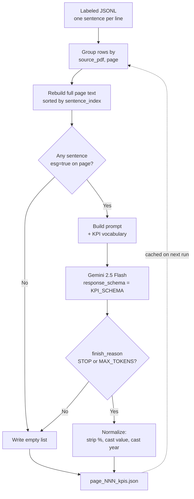

# KPI extraction from labeled JSONL — purpose, reason and logic

Script: [`src/extract_kpi_from_jsonl.py`](../src/extract_kpi_from_jsonl.py)

This step turns the ESG-labeled sentence stream (output of the ViDeBERTa classifier in
`data_processing/`) into **structured, numeric KPI observations** — one JSON file per
page — ready to populate `KPIObservation` nodes in the knowledge graph defined by
[`SCHEMA_EXPLAINED.md`](./SCHEMA_EXPLAINED.md).

It mirrors the role of EmeraldMind's `1-kpi-extraction.py`, but adapts that script to
our own pipeline: it reads **already-extracted sentences** (not PDFs), uses the
**single-sector** construction KPI vocabulary built by
[`KPI_DEFINITIONS_CONSTRUCTION_BUILD.md`](./KPI_DEFINITIONS_CONSTRUCTION_BUILD.md), and
calls **Gemini 2.5 Flash** with structured outputs.

---

## 1. Why this step exists

The previous stages tell us **which sentences are ESG-relevant** and **which pillar
(E/S/G)** they belong to. They do not tell us **what is being measured, by how much,
in what unit, in which year, and whether it is an actual or a target**. Without those
attributes there is no quantitative ESG signal — only topical text.

The knowledge-graph schema is built around `KPIObservation` (see §3.3 of
`SCHEMA_EXPLAINED.md`), whose fields are precisely those attributes:
`kpi_type`, `value`, `unit`, `kind` (baseline / target / achieved / projection),
`direction` (absolute / reduction / increase), `year`, `target_year`, `baseline_year`,
`source_id`. This step is the bridge: **free-text Vietnamese ESG sentences →
typed `KPIObservation` records keyed to the controlled vocabulary in
`kpi_definitions_construction.json`**.

We chose an LLM (Gemini 2.5 Flash) rather than rules/regex because Vietnamese ESG
disclosure is irregular: numbers are spelled in mixed formats (`1.500`, `1,5 triệu`,
`15%`), units are implicit, the same KPI is phrased differently across companies,
and a single sentence can carry several observations (baseline + target + achieved).
Structured-output JSON mode pins the model to the exact schema we want, which removes
the brittle "parse the LLM's prose" step.

---

## 2. What it consumes and what it produces

**Input** (default): `data/labeled/annual_labeled/labeled_annual_report_company_aaa.jsonl`

Each line is one classified sentence with at minimum:
`source_pdf`, `page`, `sentence_index`, `text`, `esg` (boolean from the ViDeBERTa
neutral-threshold rule), and the classifier `labels` / `scores`.

**Output** (default): `kpi_output/<source_pdf_stem>_kpis/page_NNN_kpis.json`

One JSON file per page, holding a (possibly empty) list of KPI objects. Empty list
means "this page was processed and yielded no KPI" — distinct from "not processed
yet" (no file). Pages with no ESG sentence write `[]` and skip the LLM entirely.

A non-empty file looks like:

```json
[
  {
    "kpi_type": "other",
    "title": "Số lượng thành viên Hội đồng quản trị",
    "observations": [
      {
        "value": 5,
        "unit": "người",
        "kind": "achieved",
        "direction": "absolute",
        "year": 2017,
        "target_year": null,
        "baseline_year": null,
        "source_id": "AAA_Baocaothuongnien_2017.pdf_12_1",
        "snippet": "Hội đồng quản trị hiện tại gồm 5 thành viên"
      }
    ],
    "page": 12,
    "doc_name": "AAA_Baocaothuongnien_2017.pdf",
    "company": "AAA_Baocaothuongnien",
    "sector": "Xây dựng - Vật liệu xây dựng - Bất động sản"
  }
]
```

The per-page granularity exists for three reasons: (a) it preserves the source page
number on every record so each KPI is traceable back to the report; (b) it makes the
run **resumable** — if the script crashes or you cancel after 200 pages, those files
are kept and a re-run skips them; and (c) each LLM call has a bounded context (a page,
not a whole report), which keeps latency and token usage predictable.

---

## 2b. Pipeline at a glance



Solid arrows are the runtime data flow for one page; the dashed arrow shows the
resumability shortcut — on a re-run, any page whose output file already exists is
loaded from disk instead of re-sent to the LLM.

---

## 3. Logic walkthrough

### 3.1 Reconstructing page text from sentences (`load_pages_from_jsonl`, `build_page_text`)

The labeled JSONL is sentence-level. To give the LLM real context we group rows back
into `{ source_pdf: { page: [(sentence_index, text, esg), ...] } }` using a
`collections.OrderedDict` so document order is preserved.

Page text is then reassembled by sorting on `sentence_index` and joining with single
spaces (`build_page_text`). We deliberately rebuild the **full** page — not just the
ESG-tagged sentences. This is because the ESG classifier flags the topical claim
(e.g. *"chúng tôi đặt mục tiêu giảm phát thải"*) but the supporting number can sit
on an adjacent sentence the classifier marked Neutral (a table caption, a follow-up
clause). Cutting to ESG sentences only would systematically lose values.

### 3.2 ESG gating decides *whether* to call the LLM (`page_has_esg`)

Calling the LLM on every page of every annual report is wasteful — most pages are
financial statements, photos or shareholder lists with no ESG content. The default
mode (`--all-pages` off) sends a page to the LLM **only if at least one sentence on
that page is `esg=true`**. Other pages are written as `[]` and never billed.

The full page text is still the input *when* the LLM is called — so the gate only
controls *whether* to spend tokens, not *what* the model sees.

`--all-pages` overrides the gate and processes every non-empty page; we keep it for
recall experiments and for documents where the classifier under-fires.

### 3.3 Prompting (`KPIExtractor._build_prompt`)

The prompt has two halves:

- **System** — pins identity (`ESG-KPI-EXTRACTOR-V2`), declares JSON-only output,
  hardcodes `company`, `sector`, `page`, `doc_name` for every record (the model
  cannot hallucinate metadata), and lays out the four classification rules for
  `kind` using both Vietnamese and English trigger keywords (`mục tiêu / cam kết`
  for `target`, `đạt được / đã giảm` for `achieved`, etc.).
- **User** — injects the KPI vocabulary (`{id}: {definition}` per line, from
  `kpi_definitions_construction.json`) and the reconstructed page text inside triple
  quotes with the page number and document name.

Two important conventions:

- If a metric does not fit any KPI definition, the model must set `kpi_type` to
  `"other"` with a descriptive `title`. This is intentional — we would rather get a
  typed observation we can post-process than lose information.
- `source_id` is templated as `"{doc}_{page}_{index}"`, giving every observation a
  stable cross-document key (used downstream for `KPIObservation.identity_keys` =
  `(kpi_type, source_id, year, target_year, baseline_year)`).

### 3.4 Constrained generation (`KPI_SCHEMA`, `extract_page`)

We pass `response_mime_type="application/json"` and a `response_schema` to
`generate_content`. The schema is the Gemini OpenAPI-3 dialect (note: nullable fields
use `"nullable": True`, not a type union, and there is no `additionalProperties`).

Critically, the schema marks the model-discretion fields (`value`, `unit`, `year`,
`target_year`, `baseline_year`) as **nullable but required** — this forces the model
to *emit* a key for every observation (even if null), instead of silently dropping
fields. That removes a common failure mode where post-processing would have to guess
whether a missing key means "unknown" or "model forgot".

`temperature=0` for determinism; `max_output_tokens=8000` is generous enough for
KPI-dense pages.

### 3.5 Robustness around model termination

Even with structured output, Gemini can terminate for reasons other than `STOP`:
safety blocks, recitation, or other non-recoverable states. The code reads
`resp.candidates[0].finish_reason` and only accepts `STOP` or `MAX_TOKENS`; anything
else logs a warning and returns `[]` for that page. This keeps the whole document
processable when a single page hits a safety classifier — no exception, no halt.

An empty `resp.text` is also handled (returns `[]`).

### 3.6 Post-processing (`normalize_kpi_response`)

The schema declares `value` as `number`, but Gemini still occasionally emits a string
like `"15%"` because the source text was *literally* `"15%"`. The normalizer strips
the trailing `%`, lifts it into `unit` if `unit` is empty, and casts to `float`. It
also coerces any 4-digit-string year (`"2025"`) to `int`. This carries over verbatim
from EmeraldMind's step 1.

This is the *only* mutation we apply after the LLM — we do not invent or impute
values.

### 3.7 Parallelism and resumability (`process_document`)

Pages of one document are processed concurrently with a `ThreadPoolExecutor` of
`--max-workers` workers (default 4). Threads (not processes) are correct here because
the bottleneck is network I/O to the Gemini API; the Google SDK is thread-safe.

Before each page is sent, the worker checks whether `page_NNN_kpis.json` already
exists; if so it is read back and counted. That is what makes the script **resumable**:
a run that processes 1,000 pages, crashes at 700, then restarts will only spend tokens
on the remaining 300.

Failures inside a worker are caught, logged, and the page is added to a `failed` list
that is reported at the end of each document. The output file is *not* written for a
failed page, so the next run will retry it (rather than caching the failure as `[]`).

### 3.8 Filename → `company` / `year` (`parse_company_year_from_filename`)

We need `company` for every record but the labeled JSONL only carries `source_pdf`.
The parser tries two strategies, in order:

1. A 4-digit year at the **end** of the basename (`AAA_Baocaothuongnien_2017.pdf` →
   `AAA_Baocaothuongnien`, `2017`).
2. Otherwise, scan underscore-separated tokens right-to-left for the first 4-digit
   year.

If neither matches we fall back to the basename and `"unknown"`, with a warning.
Logic is verbatim from EmeraldMind step 1 so downstream tooling sees the same
company-name shape.

### 3.9 Document scoping (`select_documents`)

The default behavior is "process the first document only", so a casual run is cheap
and you find out it works before you spend on the whole corpus. Explicit scope flags
override:

- `--doc <substr>` — only documents whose `source_pdf` name contains the substring.
- `--limit-docs N` — first N documents.
- `--all` — everything.

---

## 4. Differences from EmeraldMind's step 1

The script started as a port of `EmeraldMind/src/EmeraldKG/1-kpi-extraction.py` and
keeps the same record shape, the same normalizer, and the same prompt skeleton. The
deliberate divergences are:

| Aspect | EmeraldMind step 1 | This script | Why |
|---|---|---|---|
| Input | PDF files | Labeled sentence JSONL | We already extracted/cleaned text in the previous stage; re-parsing PDFs is wasted work. |
| KPI vocab | Multi-sector, with FAISS to pick a sector subset | Single-sector construction file, no FAISS | Our KPI file is one sector; FAISS in step 1 was never actually used to subset the KPI list per page. |
| Sector detection | Heuristic per document | Hardcoded `"Xây dựng - Vật liệu xây dựng - Bất động sản"` | Same — single-sector corpus. |
| LLM | Gemini with 7 rotating keys (rate-limit workaround) | Gemini 2.5 Flash, one key | Flash has higher per-key quotas; we did not need the rotation. |
| Output mode | JSON in prose + fence-stripping | `response_mime_type=application/json` + `response_schema` | Constrained generation is cheaper and removes parsing bugs. |
| Gating | Process every page | ESG-gated by default; `--all-pages` to disable | We have a strong upstream ESG classifier — using it cuts cost without losing recall (full page text is still sent when the gate fires). |

---

## 5. Setup

```bash
pip install -r requirements.txt   # adds google-genai, python-dotenv
```

The script loads a **project-global** `.env` from the repo root regardless of the
working directory. Copy the example and paste your key:

```bash
cp .env.example .env
# .env:
# GEMINI_API_KEY="..."
```

## 6. Run

```bash
# Default: just the first document (cheap smoke test)
python src/extract_kpi_from_jsonl.py

# A specific document (substring match against source_pdf)
python src/extract_kpi_from_jsonl.py --doc AAA_Baocaothuongnien_2023

# First N documents
python src/extract_kpi_from_jsonl.py --limit-docs 3

# Everything
python src/extract_kpi_from_jsonl.py --all

# Recall sweep — run every non-empty page, not just ESG-tagged ones
python src/extract_kpi_from_jsonl.py --all --all-pages
```

### Flags

| Flag | Default | Meaning |
|------|---------|---------|
| `-i, --input` | `data/labeled/annual_labeled/labeled_annual_report_company_aaa.jsonl` | Labeled JSONL |
| `-k, --kpi-defs` | `kpi_definitions_construction.json` | KPI definitions |
| `-o, --out-dir` | `kpi_output/` | Output directory |
| `--doc <substr>` | — | Only docs whose `source_pdf` contains this substring |
| `--limit-docs N` | — | First N documents |
| `--all` | — | All documents |
| `--all-pages` | off | Run every non-empty page (default: only pages with ≥1 `esg=true` sentence) |
| `--max-workers N` | 4 | Parallel page workers |
| `--model` | `gemini-2.5-flash` | Gemini model id |

---

## 7. Related docs

- [`KPI_DEFINITIONS_CONSTRUCTION_BUILD.md`](./KPI_DEFINITIONS_CONSTRUCTION_BUILD.md) — how the KPI vocabulary fed into the prompt is built from official sources.
- [`SCHEMA_EXPLAINED.md`](./SCHEMA_EXPLAINED.md) — the knowledge-graph schema that consumes these KPI records as `KPIObservation` nodes.
- [`VIETNAM_IMPROVEMENT_PLAN.md`](./VIETNAM_IMPROVEMENT_PLAN.md) — broader plan for adapting the GRI/ESRS-shaped graph to the Vietnamese regulatory reality.
