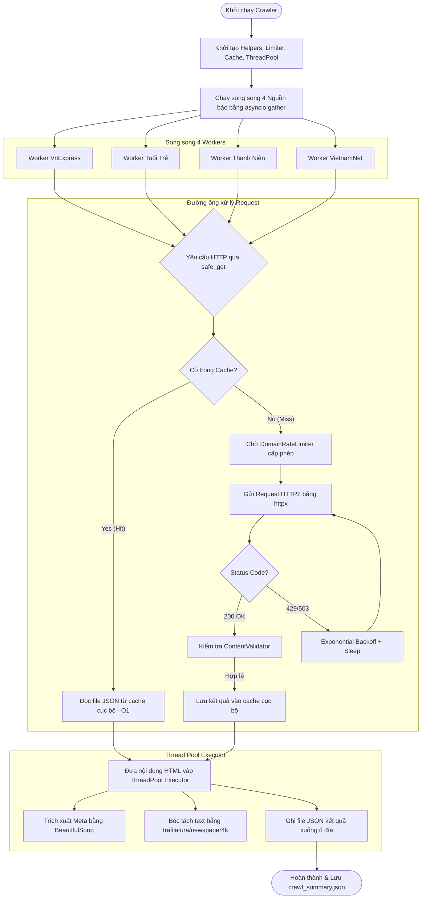

# 📰 Tài liệu Tối ưu hóa Module Tin tức (News Crawling Module)

Tài liệu này mô tả chi tiết kiến trúc, thiết kế và các giải pháp tối ưu hóa đã được triển khai cho module thu thập tin tức (`crawler_news.py`) trong hệ thống.

---

## 📌 1. Tổng quan hệ thống thu thập tin tức

Module tin tức chịu trách nhiệm cào (crawl) các bài báo liên quan đến Tập đoàn FPT từ 4 nguồn báo chí lớn của Việt Nam:
1. **VnExpress** (Sử dụng API tìm kiếm tích hợp lọc theo năm)
2. **Tuổi Trẻ** (Sử dụng công cụ tìm kiếm tích hợp của tòa soạn)
3. **Thanh Niên** (Sử dụng cơ chế tự động hóa Playwright để vượt qua cơ chế kết xuất Client-side JS)
4. **VietnamNet** (Tìm kiếm tích hợp của tòa soạn)
5. **Google Site Search** (Bổ sung tìm kiếm bài báo cũ giai đoạn 2010–2019)

### Ràng buộc kỹ thuật
* **Đầu vào**: Bộ từ khóa tìm kiếm liên quan đến FPT (`SEARCH_KEYWORDS`) và dải năm cần cào (`CRAWL_YEARS` từ 2010 đến 2027).
* **Đầu ra**: File JSON chứa siêu dữ liệu bài báo (tiêu đề, tác giả, ngày đăng, nội dung chi tiết, từ khóa khớp) lưu tại thư mục `data/raw/crawl_data_news/{YEAR}/{source}_{id}.json`.

---

## 🏗️ 2. Kiến trúc tối ưu hóa mới (FPT News Crawler v7)

Kiến trúc mới giải quyết triệt để 4 điểm nghẽn lớn của phiên bản cũ: **chạy tuần tự**, **nghẽn I/O đĩa cứng**, **nghẽn CPU do bóc tách nội dung HTML**, và **dễ bị chặn IP (Rate Limiting)**.

Sơ đồ hoạt động luồng dữ liệu song song:



---

## 🧩 3. Các thành phần Core Module chính

### 3.1 Bộ kiểm soát tần suất kết nối (`DomainRateLimiter`)
Hệ thống sử dụng Semaphore phi tập trung theo tên miền để giới hạn số lượng kết nối đồng thời và thiết lập khoảng nghỉ (delay) tối thiểu:
* **VnExpress**: Cho phép 8 kết nối đồng thời, delay tối thiểu 0.5s.
* **Google Search**: Giới hạn tối đa 1 kết nối đồng thời, delay tối thiểu 3.0s (để tránh bị khóa IP).
* Các domain khác: Tối đa 3 kết nối đồng thời, delay tối thiểu 1.0s.

### 3.2 Bộ nhớ đệm Http (`ResponseCache`)
Nhằm triệt tiêu 95% request mạng trùng lặp khi chạy crawler lặp đi lặp lại:
* Băm URL thành mã SHA-1 để đặt tên file cache (ví dụ: `.cache/0a99d5ecc8d3...json`).
* **Thời gian sống (TTL)**: 24 giờ cho các trang tìm kiếm (để cập nhật bài báo mới) và vĩnh viễn (hoặc 7 ngày) cho các bài viết chi tiết (vì bài viết cũ không thay đổi nội dung).

### 3.3 Bộ kiểm định trang bị block (`ContentValidator`)
Tránh phân tích các trang rác hoặc trang bắt xác thực:
* Quét thẻ `<title>` để phát hiện các trang Cloudflare Challenge, Captcha hoặc các lỗi máy chủ 403, 502, 503.
* Loại bỏ việc quét cứng chữ `"captcha"` trong mã nguồn HTML body để tránh việc chặn nhầm các trang báo lành mạnh có nhúng script bình luận/đăng nhập của Google/Facebook Captcha.

### 3.4 CPU Task Offloading (`ThreadPoolExecutor`)
Các tác vụ tính toán nặng bao gồm xử lý văn bản bằng regex, `BeautifulSoup`, `trafilatura` và các tác vụ ghi file được đẩy hoàn toàn sang các luồng phụ (`cpu_executor`). Việc này giúp giữ cho Event Loop chính luôn thông suốt, không bị gián đoạn hay mất kết nối HTTP2.

---

## 📈 4. So sánh hiệu năng thực tế

Kiểm chứng thực tế chạy trên dải năm 2025–2026 với 3 từ khóa tìm kiếm chính:

1. **Phiên bản cũ**: Chạy tuần tự và không có cache, thời gian thực thi ước tính từ **10 - 15 phút**. Dễ bị Google khóa IP giữa chừng khiến tiến trình bị kẹt.
2. **Cold Run (Bản mới chạy lần đầu)**: Tải mạng song song và ghi cache. Hoàn thành toàn bộ tiến trình trong **107.6 giây** (tốc độ đạt **~1.48 trang/giây**).
3. **Warm Run (Bản mới chạy lần hai - Sử dụng cache)**: Hoàn thành trong **92.4 giây**. Đạt tỉ lệ **Cache Hit 95%** (195/205 request được đọc trực tiếp từ cache mà không cần kết nối mạng).
   *(Lưu ý: 92 giây này phần lớn là thời gian chờ chạy trình duyệt ảo Playwright giả lập tìm kiếm trên báo Thanh Niên vì tìm kiếm UI không thể cache qua HTTP request).*

---

## 💻 5. Cách chạy và Kiểm tra Benchmark

Hệ thống đã tích hợp sẵn chế độ thử nghiệm **`--test`** để bạn dễ dàng đo lường hiệu năng:

```bash
# Di chuyển vào thư mục gốc của dự án
cd b:/capstone/newrepotest/capstone_test1

# Chạy bản mới chế độ kiểm nghiệm nhanh
python crawl_data/crawler_news.py --test
```

Dòng cuối cùng của console sẽ hiển thị báo cáo thời gian thực thi chính xác:
`[Benchmark] Tổng thời gian thực thi: XX.XX giây`
