# Pipeline diagrams

Visual companion to [SYSTEM_DESIGN.md](SYSTEM_DESIGN.md). Every diagram here is drawn
from the code as it exists; if a diagram and a stage disagree, the stage is right and this
file is stale — fix it.

Diagrams are Mermaid, rendered by GitHub and by most Markdown viewers. Editable
draw.io / PlantUML sources for the presentation versions live in `diagram/`.

**Contents**

1. [System context](#1-system-context)
2. [Report ingestion (channel A)](#2-report-ingestion-channel-a)
3. [News ingestion (channel B)](#3-news-ingestion-channel-b)
4. [Graph construction — the 16 stages](#4-graph-construction--the-16-stages)
5. [Why blocks exist](#5-why-blocks-exist)
6. [Entity resolution stages A–D](#6-entity-resolution-stages-ad)
7. [The indicator axis](#7-the-indicator-axis)
8. [Claim ↔ conduct cross-check](#8-claim--conduct-cross-check)
9. [Schema tiers T1 / T2 / T3](#9-schema-tiers-t1--t2--t3)
10. [Artifact and data layout](#10-artifact-and-data-layout)
11. [End-to-end sequence](#11-end-to-end-sequence)

---

## 1. System context

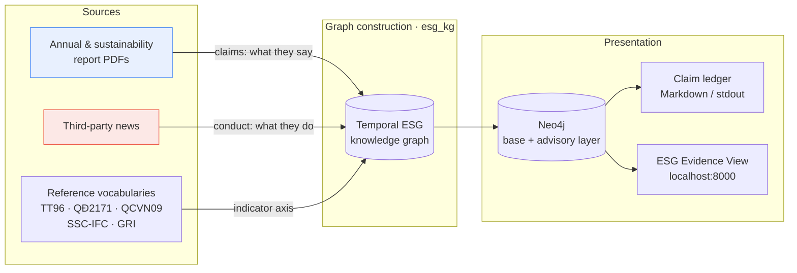

The two channels stay distinguishable inside the graph via `source_type`, which is what
makes the cross-check meaningful rather than circular.

---

## 2. Report ingestion (channel A)

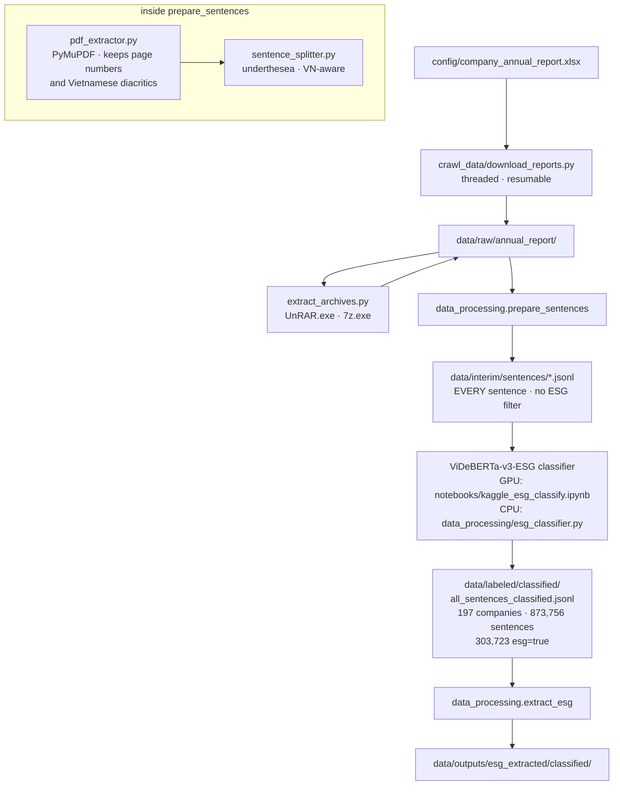

`prepare_sentences` deliberately keeps **every** sentence, not just ESG ones: page text is
reconstructed later from all sentences on a page, while only pages containing at least one
`esg=true` sentence are sent to the LLM.

---

## 3. News ingestion (channel B)

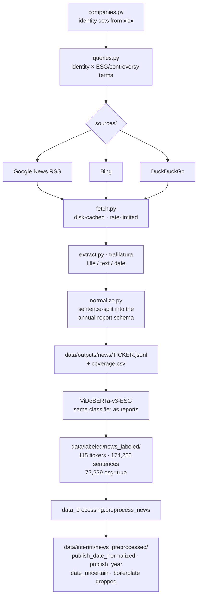

`coverage.csv` is not a by-product — it is the evidence for the coverage caveat in
[SYSTEM_DESIGN.md](SYSTEM_DESIGN.md) §8.3.

---

## 4. Graph construction — the 16 stages

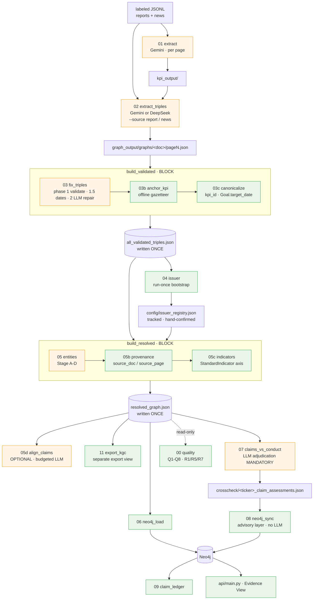

Orange = costs money. Green = free, offline, re-runnable. The colour split is the reason
blocks exist (§5) and the reason caches are scoped to paid results only.

---

## 5. Why blocks exist

The failure mode a block prevents:

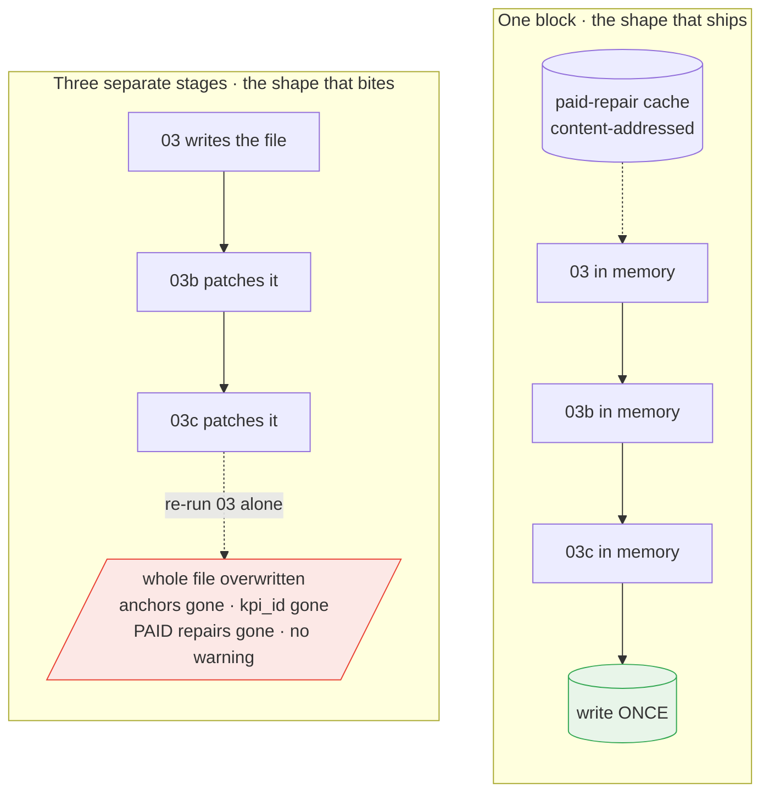

The distinction that makes it safe: the **intermediate artifact** answers "how far did the
pipeline get?" — internal state, droppable. The **cache** answers "what already cost
money?" — not reproducible for free, so it is kept, keyed by content rather than by
position in a batch.

---

## 6. Entity resolution stages A–D

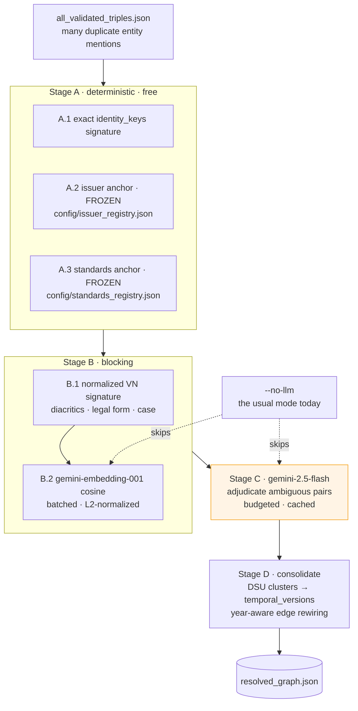

The issuer cluster is frozen on purpose: it is the backbone of the whole cross-check, so
its identity must never depend on an embedding or a model verdict.

---

## 7. The indicator axis

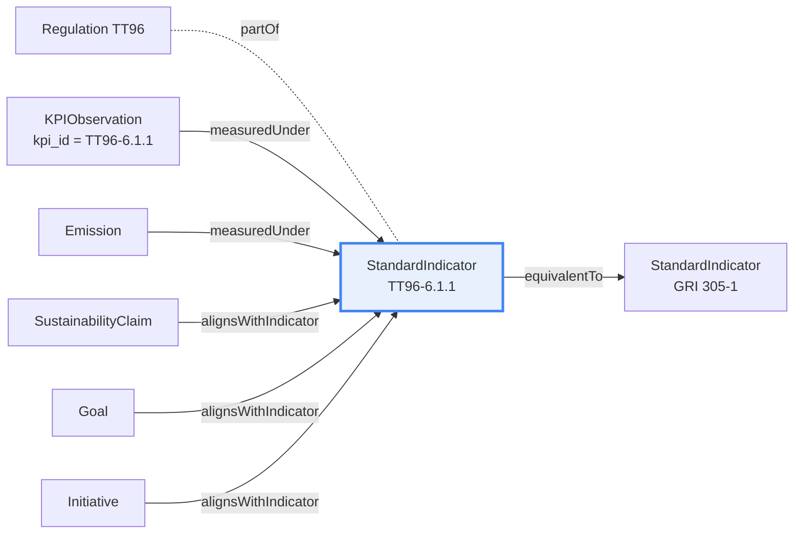

`StandardIndicator` is the **join point**: a company's *claim* about an indicator and the
conduct *KPIs* measured under it hang off one node, so the cross-check can walk two hops
instead of guessing from token overlap. `pillar` on that node is also what gives the UI a
claim's E/S/G column — read, never guessed.

Two rules the stage will not break: it reads `kpi_id` assigned by `canonicalize` rather
than guessing an indicator itself, and a `Penalty` with `amount == 0` is a self-reported
"fined 0 times" boast, flagged and given **no** conduct edge.

---

## 8. Claim ↔ conduct cross-check

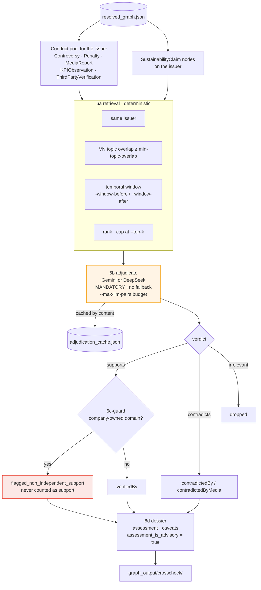

Assessment mapping: any contradiction ⇒ `appears_contradicted`; else any independent
support ⇒ `appears_supported`; else `unverified_insufficient_evidence`. Contradiction
outranks support in a mixed dossier, and the mixed case adds its own caveat.

---

## 9. Schema tiers T1 / T2 / T3

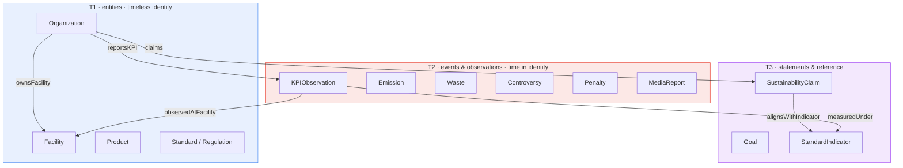

The rule that follows from the tiers (P1): **never put a time field in a T1 class's
`identity_keys`**. Observation classes legitimately carry time in their keys and are
versioned per observation; entities are versioned only when their properties change,
linked by `supersedes`. `quality` lints this, and `test/test_schema_contract.py` asserts
it both ways.

---

## 10. Artifact and data layout

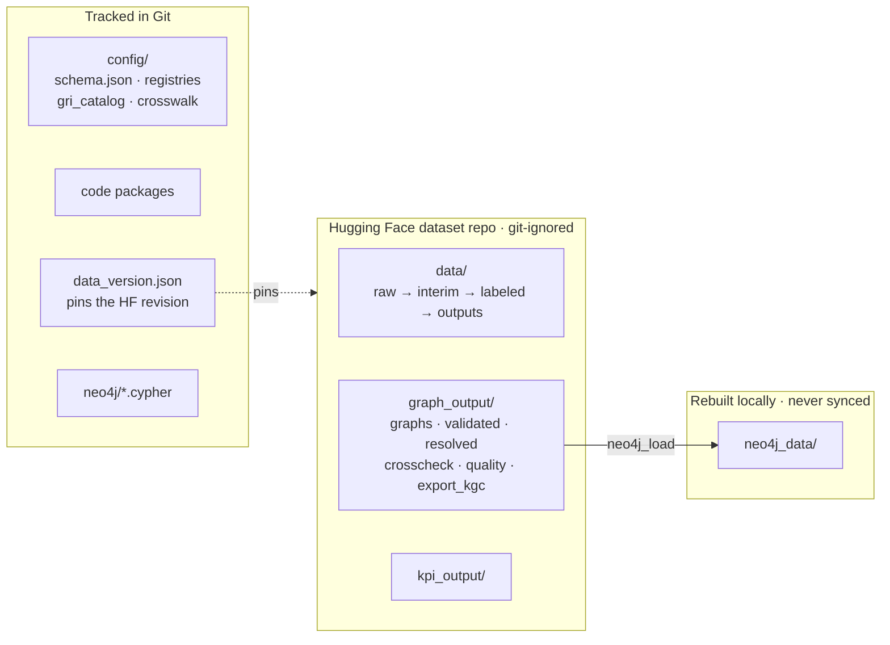

`data_version.json` is the hinge: it is tracked in Git, so checking out an old commit and
pulling recovers the data that commit was built against. See [DATA_SYNC.md](DATA_SYNC.md).

---

## 11. End-to-end sequence

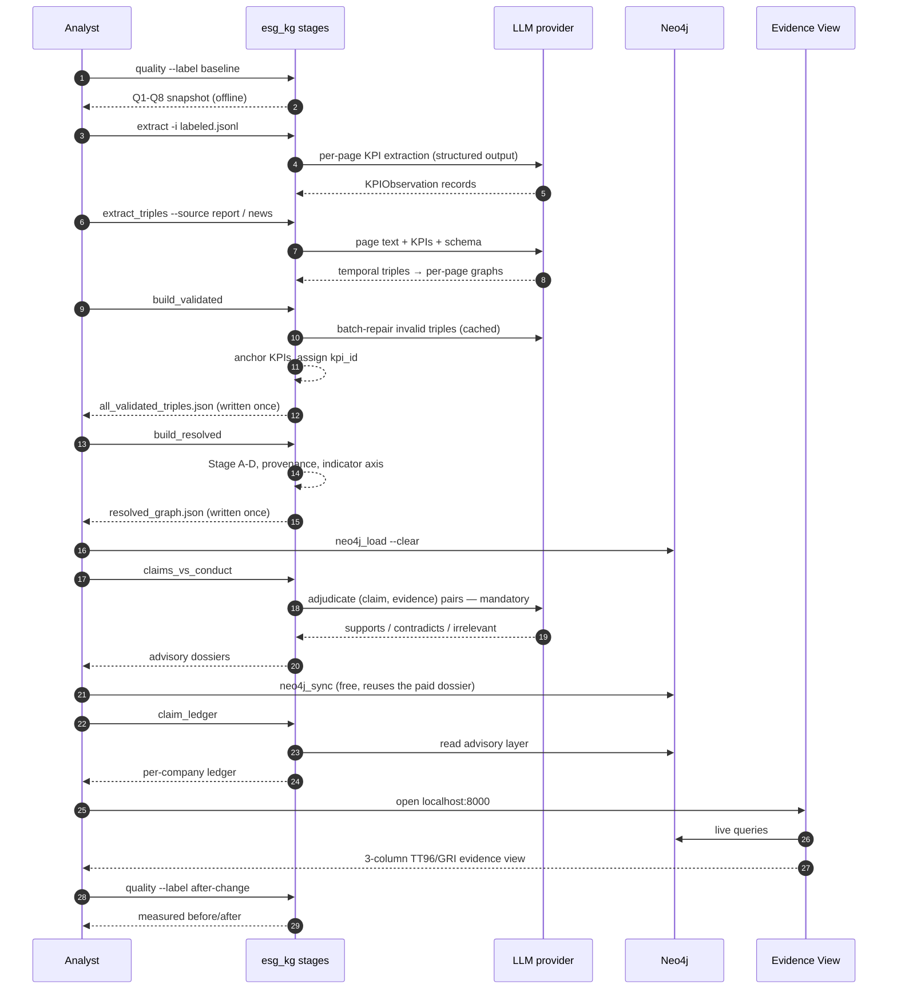

The first and last steps are the same command on purpose: every schema or pipeline change
is expected to carry a measured before/after, and `quality` is free to run.
