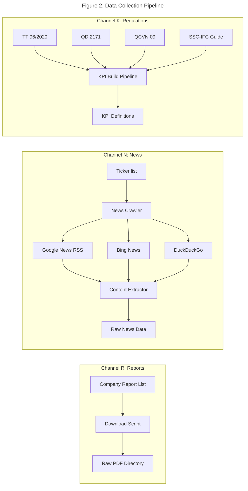
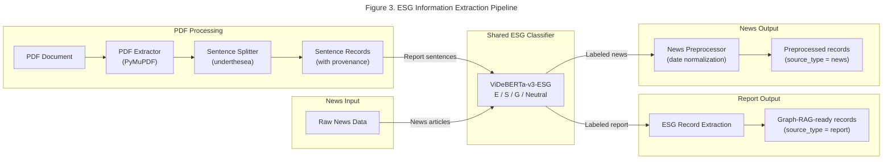
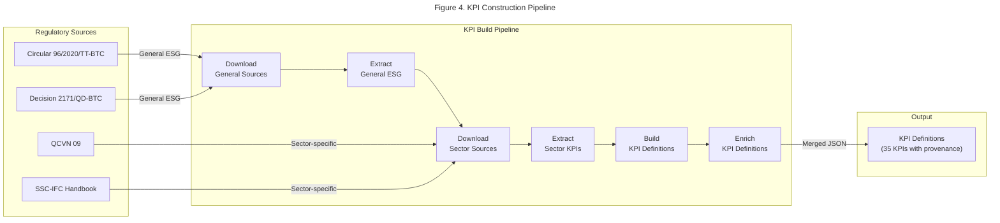
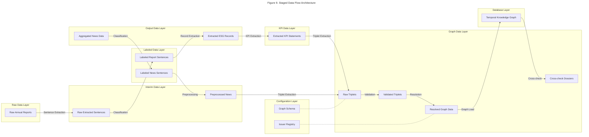
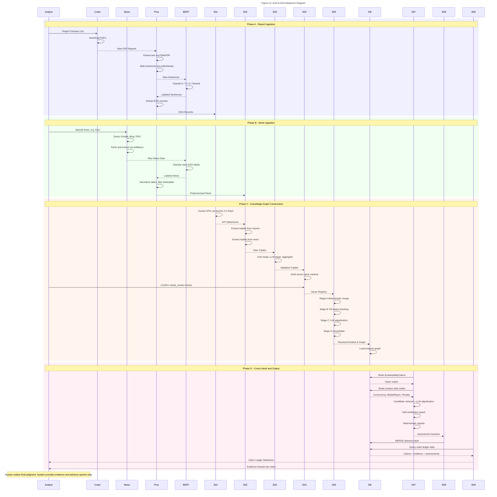

# Pipeline Diagrams — Greenwashing Evidence System

> This document consolidates all architectural and workflow diagrams of the
> Graph-RAG pipeline for detecting greenwashing evidence in Vietnamese listed
> companies. Each diagram corresponds to a distinct subsystem and is intended
> for direct inclusion in a scientific report.

---

## Figure 1. Overall System Architecture

The system is organized into four principal modules operating on two parallel
data channels (Report and News). Both channels share a single ESG classifier
(ViDeBERTa-v3-ESG). The outputs converge into a single temporal knowledge
graph stored in Neo4j.

```mermaid
---
title: Figure 1. Overall System Architecture
---
flowchart LR
    subgraph Input["Input Sources"]
        direction TB
        AR["Annual Reports PDF"]
        NW["Third-party News"]
        LW["Vietnamese ESG Regulations"]
    end

    subgraph Module_A["Module A: Report Processing"]
        direction TB
        A1["Download Reports"]
        A2["Sentence Extraction"]
        A3["ESG Record Extraction"]
        A1 --> A2
        A2 ~~~ A3
    end

    subgraph Module_B["Module B: News Processing"]
        direction TB
        B1["News Crawling"]
        B2["News Preprocessing"]
        B1 ~~~ B2
    end

    CLF["ViDeBERTa-v3-ESG Classifier"]

    subgraph Module_D["Module D: KPI Builder"]
        direction TB
        D1["Regulation Extraction"]
        D2["KPI Definition JSON"]
        D1 --> D2
    end

    subgraph Module_C["Module C: Temporal KG Construction"]
        direction TB
        C1["Step 01: KPI Extraction"]
        C2["Step 02: Triplet Extraction"]
        C3["Step 03: Triplet Validation"]
        C4["Step 04: Issuer Registry"]
        C5["Step 05: Entity Resolution"]
        C6["Step 06: Neo4j Load"]
        C7["Step 07: Cross-check"]
        C8["Step 08: Advisory Sync"]
        C9["Step 09: Claim Ledger"]
        C10["Step 10: Evaluation"]
        C1 --> C2 --> C3 --> C4 --> C5 --> C6
        C6 --> C7 --> C8 --> C9 --> C10
    end

    subgraph Output["Output"]
        direction TB
        KG["Temporal ESG Knowledge Graph"]
        DS["Evidence Dossier per Claim"]
        CL["Claim Ledger Report"]
    end

    AR -->|"PDF files"| A1
    NW -->|"News URLs"| B1
    LW -->|"Regulatory PDFs"| D1

    A2 -->|"Sentences JSONL"| CLF
    B1 -->|"News JSONL"| CLF
    CLF -->|"Labeled report"| A3
    CLF -->|"Labeled news"| B2

    A3 -->|"Labeled report JSONL"| C1
    B2 -->|"Preprocessed news JSONL"| C2
    D2 -->|"35 KPI definitions"| C1

    C6 -->|"Property graph"| KG
    C7 -->|"Claim assessments"| DS
    C9 -->|"Markdown report"| CL
```

---

## Figure 2. Data Collection Pipeline

Two ingestion channels feed the pipeline. The Report channel provides the
claim side (what the company says), and the News channel provides the conduct
side (what independent sources observe). Both are normalized to a common
sentence-level schema before entering Module C.

---

## Figure 3. ESG Information Extraction Pipeline

Sentences from reports are extracted via PyMuPDF, split using underthesea
(Vietnamese-aware), classified by ViDeBERTa-v3-ESG, then filtered to produce
Graph-RAG-ready JSONL records with sentence-level provenance. Both report and
news paths share the same ViDeBERTa-v3-ESG classifier.

---

## Figure 4. KPI Construction Pipeline

The KPI vocabulary is built once from official Vietnamese ESG regulations.
Six scripts download, parse, and enrich regulatory text into a structured
JSON file of 35 KPI definitions, each linked to its legal source.

---

## Figure 5. Temporal Knowledge Graph Construction

Ten sequential scripts transform labeled JSONL into a temporal property graph
in Neo4j. Each step consumes the predecessor's output. Steps 01-06 build the
graph; steps 07-08 create the advisory layer; step 09 renders the ledger;
step 10 evaluates.

```mermaid
---
title: Figure 5. Temporal Knowledge Graph Construction
---
flowchart LR
    subgraph Extraction["Information Extraction"]
        direction TB
        S01["Step 01: Extract KPI\nGemini 2.5 Flash"]
        S02["Step 02: Extract Triplets\nGemini 2.5 Flash"]
        S01 --> S02
    end

    subgraph Validation["Validation and Resolution"]
        direction TB
        S03["Step 03: Fix Invalid Triplets\nauto-swap + LLM repair"]
        S04["Step 04: Build Issuer Registry\ncompany name variants"]
        S05["Step 05: Resolve Entities\n4 stages: A B C D"]
        S03 --> S04 --> S05
    end

    subgraph Loading["Graph Loading"]
        direction TB
        S06["Step 06: Load to Neo4j\nMERGE on _edge_key"]
    end

    subgraph Analysis["Cross-check and Reporting"]
        direction TB
        S07["Step 07: Cross-check\ncandidate retrieval + LLM"]
        S08["Step 08: Advisory Sync\nMERGE to Neo4j"]
        S09["Step 09: Claim Ledger\nsignal-first rendering"]
        S10["Step 10: Evaluate\ncoverage + precision"]
        S07 --> S08 --> S09 --> S10
    end

    S02 -->|"Raw triplets"| S03
    S05 -->|"Resolved graph"| S06
    S06 -->|"Neo4j loaded"| S07
```

---

## Figure 6. Entity Resolution Workflow

Entity resolution (Step 05) proceeds in four stages, combining deterministic
rules, Vietnamese-aware text normalization, embedding-based similarity, and
budgeted LLM adjudication.

```mermaid
---
title: Figure 6. Entity Resolution Workflow
---
flowchart LR
    subgraph Input["Input"]
        direction TB
        IN["Validated Triples"]
        REG["Issuer Registry"]
    end

    subgraph Stage_A["Stage A: Deterministic Merge"]
        direction TB
        A1["Compute identity_keys"]
        A2["Exact-match merge"]
        A3["Freeze issuer anchor"]
        A1 --> A2 --> A3
    end

    subgraph Stage_B["Stage B: VN-aware Blocking"]
        direction TB
        B1["Normalize Vietnamese text"]
        B2["Compute signature"]
        B3["Generate candidate pairs"]
        B4["Embed via gemini-embedding-001"]
        B5["Rank by cosine similarity"]
        B1 --> B2 --> B3 --> B4 --> B5
    end

    subgraph Stage_C["Stage C: LLM Adjudication"]
        direction TB
        C1["Select ambiguous pairs\n--max-llm-pairs budget"]
        C2["Gemini 2.5 Flash\nmerge / keep-separate"]
        C1 --> C2
    end

    subgraph Stage_D["Stage D: Consolidation"]
        direction TB
        D1["Apply merge decisions"]
        D2["Rebuild edge references"]
        D1 --> D2
    end

    subgraph ER_Output["Output"]
        direction TB
        OUT["Resolved Graph Data"]
    end

    IN -->|"Triples"| A1
    REG -->|"Anchor names"| A3
    A3 -->|"Merged entities"| B1
    B5 -->|"Candidate pairs"| C1
    C2 -->|"Decisions"| D1
    D2 -->|"Final graph"| OUT
```

---

## Figure 7. Claim-Conduct Cross-check Workflow

The cross-check (Step 07) is the analytical core. For each SustainabilityClaim,
it retrieves conduct-side candidates, applies LLM adjudication, writes linking
edges, and produces an evidence dossier with advisory assessment.

```mermaid
---
title: Figure 7. Claim-Conduct Cross-check Workflow
---
flowchart LR
    subgraph Retrieval["7a: Candidate Retrieval"]
        direction TB
        R1["Select SustainabilityClaim"]
        R2["Same-issuer constraint"]
        R3["Topic overlap\nESG category + keywords"]
        R4["Temporal window\nconduct date >= Y-1"]
        R5["Embedding rank\ncosine top-k"]
        R1 --> R2 --> R3 --> R4 --> R5
    end

    subgraph Adjudication["7b: LLM Adjudication"]
        direction TB
        A1["Gemini 2.5 Flash\ngpt-4o-mini fallback"]
        A2["Verdict:\nsupports / contradicts / irrelevant"]
        A3["Confidence + rationale"]
        A1 --> A2 --> A3
    end

    subgraph Guard["7c: Self-verification Guard"]
        direction TB
        G1["Check source_domain"]
        G2{"Company-owned?"}
        G3["Drop or flag\nindependent=false"]
        G4["Pass through"]
        G1 --> G2
        G2 -->|"yes"| G3
        G2 -->|"no"| G4
    end

    subgraph Edges["7d: Edge Writing + Signals"]
        direction TB
        E1["verifiedBy edge"]
        E2["contradictedBy edge"]
        E3["contradictedByMedia edge"]
        SG1["Structural flag"]
        SG2["KPI gap flag"]
        E1 --> SG1
        E2 --> SG1
        E3 --> SG1
        SG1 --> SG2
    end

    subgraph Dossier["7e: Evidence Dossier"]
        direction TB
        D1["Per-claim assessment"]
        D2["appears_supported /\nappears_contradicted /\nunverified"]
        D3["advisory = true\n+ caveats"]
        D1 --> D2 --> D3
    end

    R5 -->|"Top-k candidates"| A1
    A3 -->|"supports"| G1
    G4 -->|"verified"| E1
    A3 -->|"contradicts"| E2
    A3 -->|"media"| E3
    SG2 -->|"Signals"| D1
```

---

## Figure 8. Knowledge Graph Schema — Node Classes and Edge Labels

The temporal ESG knowledge graph uses 28 node classes and 50+ directed edge
labels. Every node carries temporal properties (valid_from, valid_to,
is_current) and every edge carries temporal_metadata (valid_from, valid_to,
recorded_at). Nodes are grouped by domain role.

The **Standard Indicator Axis** (step05c/05d) materializes the TT96/GRI
indicator vocabulary as first-class graph structure. StandardIndicator nodes
serve as the JOIN POINT between a company's *claims* and its *conduct* KPIs.
Vietnamese regulations (TT96) are linked to international standards (GRI) via
`equivalentTo` edges, enabling cross-framework analysis.

```mermaid
---
title: Figure 8. Knowledge Graph Schema
---
flowchart TD
    classDef core fill:#e1f5fe,stroke:#01579b,stroke-width:2px,color:#000
    classDef obs fill:#e8f5e9,stroke:#2e7d32,stroke-width:2px,color:#000
    classDef claim fill:#fff3e0,stroke:#e65100,stroke-width:2px,color:#000
    classDef conduct fill:#ffebee,stroke:#c62828,stroke-width:2px,color:#000
    classDef comp fill:#f3e5f5,stroke:#6a1b9a,stroke-width:2px,color:#000
    classDef goal fill:#e0f7fa,stroke:#006064,stroke-width:2px,color:#000
    classDef indicator fill:#fce4ec,stroke:#880e4f,stroke-width:2px,color:#000

    subgraph Core_Entities["Core Entities"]
        Organization:::core
        Person:::core
        Facility:::core
        Product:::core
        Material:::core
        Location:::core
        Country:::core
        Community:::core
        Authority:::core
    end

    subgraph ESG_Observations["ESG Observations"]
        KPIObservation:::obs
        Emission:::obs
        Waste:::obs
        Investment:::obs
        Project:::obs
    end

    subgraph Indicator_Axis["Standard Indicator Axis"]
        SI_TT96["StandardIndicator\n(TT96 / SSCIFC)"]:::indicator
        SI_GRI["StandardIndicator\n(GRI)"]:::indicator
        SI_TT96 <-->|"equivalentTo"| SI_GRI
    end

    subgraph Compliance["Standards and Compliance"]
        Standard:::comp
        Certification:::comp
        Regulation:::comp
    end

    subgraph Goals_Initiatives["Goals and Initiatives"]
        Initiative:::goal
        Goal:::goal
        ScienceBasedTarget:::goal
        CarbonOffsetProject:::goal
    end

    subgraph Claim_Side["Claim Side"]
        SustainabilityClaim:::claim
        ClaimKeyword:::claim
    end

    subgraph Conduct_Side["Conduct Side"]
        Controversy:::conduct
        Penalty:::conduct
        MediaReport:::conduct
        ThirdPartyVerification:::conduct
    end

    %% Organization edges
    Organization -->|"claims"| SustainabilityClaim
    Organization -->|"reportsKPI"| KPIObservation
    Organization -->|"setsGoal"| Goal
    Organization -->|"generatesEmission"| Emission
    Organization -->|"ownsFacility"| Facility
    Organization -->|"adoptsStandard"| Standard
    Organization -->|"holdsCertification"| Certification
    Organization -->|"subjectToRegulation"| Regulation
    Organization -->|"takesPartIn"| Initiative
    Organization -->|"targetsScienceBased"| ScienceBasedTarget
    Organization -->|"offsetsWith"| CarbonOffsetProject
    Organization -->|"subjectToPenalty"| Penalty
    Organization -->|"impactsCommunity"| Community
    Organization -->|"locatedIn"| Location
    Organization -->|"investsIn"| Investment

    %% Claim → Indicator (alignsWithIndicator)
    SustainabilityClaim -->|"alignsWithIndicator"| SI_TT96
    SustainabilityClaim -->|"alignsWithIndicator"| SI_GRI
    Goal -->|"alignsWithIndicator"| SI_TT96
    Initiative -->|"alignsWithIndicator"| SI_TT96

    %% Observation → Indicator (measuredUnder)
    KPIObservation -->|"measuredUnder"| SI_TT96
    Emission -->|"measuredUnder"| SI_TT96
    Penalty -->|"measuredUnder"| SI_TT96

    %% Indicator → Document (partOf)
    SI_TT96 -->|"partOf"| Regulation
    SI_GRI -->|"partOf"| Standard

    %% Claim evidence edges
    SustainabilityClaim -->|"verifiedBy"| ThirdPartyVerification
    SustainabilityClaim -->|"verifiedBy"| KPIObservation
    SustainabilityClaim -->|"contradictedBy"| Controversy
    SustainabilityClaim -->|"contradictedByMedia"| MediaReport
    SustainabilityClaim -->|"hasKeyword"| ClaimKeyword

    Facility -->|"generatesWaste"| Waste
    Facility -->|"locatedIn"| Location

    Product -->|"usesMaterial"| Material
    Product -->|"producedBy"| Organization

    Initiative -->|"reducesEmission"| Emission
    Initiative -->|"reducesWaste"| Waste

    Penalty -->|"enforcedBy"| Authority
    Certification -->|"issuedBy"| Authority
    MediaReport -->|"mentionsOrganization"| Organization
    Person -->|"worksAt"| Organization
    Location -->|"isIn"| Country
```

---

## Figure 9. Staged Data Flow Architecture

The data pipeline follows a staged architecture: raw ingested data
flows through interim processing, labeled classification, extracted outputs,
and finally into graph construction artifacts.

---

## Figure 10. End-to-End Sequence Diagram

This sequence diagram traces the complete process from an analyst uploading a
report and crawling news through to the final evidence dossier and claim
ledger output.

