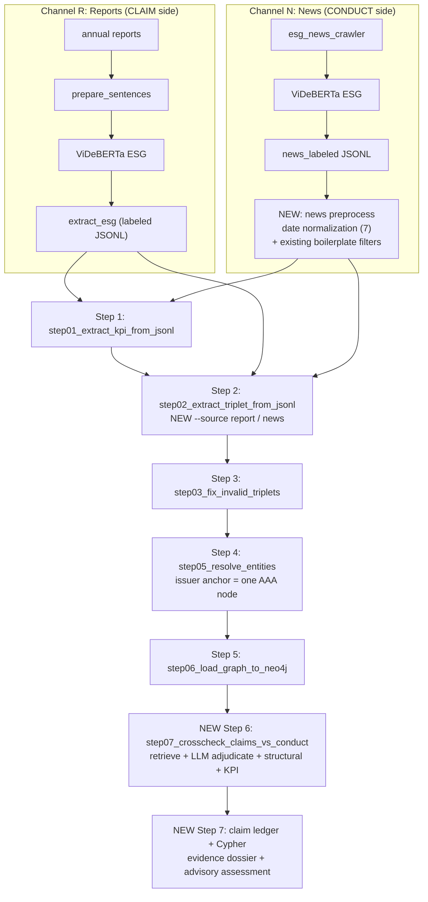

# SYSTEM_DESIGN.md — Greenwashing evidence system (final design)

> **Status:** Final design for the project. This document is the single end-to-end
> reference for *what the system is and how the pieces fit*. It recontextualizes the
> existing pipeline (steps 1–5) and specifies the two missing pieces — a **news → graph**
> branch and a **claim ↔ conduct cross-check** stage — that turn the knowledge graph into
> a greenwashing **evidence** tool.
>
> **Scope:** AAA (CTCP Nhựa An Phát Xanh) proof-of-concept, architected to scale to all
> 115 companies in `config/company_annual_report.xlsx`.
>
> **Read first:** [`SCHEMA_EXPLAINED.md`](./SCHEMA_EXPLAINED.md) for the ontology; this
> document assumes that vocabulary.

---

## 1. Purpose & problem statement

The system helps an analyst answer one question about a Vietnamese listed company:

> *Do the company's **reported** ESG claims hold up against **independent evidence** of what
> it actually did?*

It ingests two things — the company's **own ESG reporting** (annual / sustainability
reports) and **third-party news** about the company — and represents both inside **one
temporal knowledge graph**. Because both live in the same graph, keyed to the same company
and time axis, a claim can be structurally compared to the conduct evidence that surrounds it.

### 1.1 The hard constraint that shapes everything: no ground truth

**We have no labeled greenwashing dataset for Vietnamese companies.** There is no gold
`greenwashing / not_greenwashing` annotation to train or measure against. This is a
deliberate, load-bearing constraint on the design:

- The system is **not a classifier** and does **not** emit a "greenwashing score." Presenting
  a numeric score or a hard label would imply a ground truth we do not have.
- Instead, for each claim the system produces **(a) the evidence** — the supporting and
  contradicting graph nodes, with full provenance — and **(b) an explicitly advisory
  LLM-suggested assessment**: the claim *appears supported*, *appears contradicted*, or is
  *unverified / insufficient evidence*, always with a rationale and caveats.
- The final judgment is a **human's**. The system is decision-support: it surfaces and
  organizes evidence and offers an opinion; it does not adjudicate.

Everywhere below, "detection" means *evidence surfacing + advisory opinion*, never a verdict.

### 1.2 What "greenwashing evidence" looks like here

A concrete AAA example already present in the crawl illustrates the whole idea:

- **Claim side (report):** AAA positions itself as *"tiên phong sản phẩm nhựa thân
  thiện môi trường"* (pioneer of environmentally-friendly plastics) — an Environmental
  `SustainabilityClaim`.
- **Conduct side (independent news):** *"Khai sai thuế, Nhựa An Phát Xanh bị xử lý hơn 1,7
  tỷ đồng"* (tax mis-declaration, penalized > 1.7 bn VND) — a Governance `Controversy` /
  `Penalty` from `vietnamnet.vn`.

The system's job is to put both on the **one** AAA node, link the claim to the contradicting
evidence, and present it to an analyst — **not** to declare AAA a greenwasher.

---

## 2. Core idea & how it differs from the reference (EmeraldMind)

The project ports the EmeraldMind EmeraldKG pipeline for graph construction (steps 1–5) but
**inverts its greenwashing-detection design**. Understanding the inversion is the key to the
whole system.

| Aspect | EmeraldMind (`EmeraldKG`) | This project |
|---|---|---|
| What is a "claim" | An external row in a CSV (`6a-parse_claims_to_nodes.py`) | A `SustainabilityClaim` **node inside the KG**, extracted from the company's reports |
| Where evidence lives | The KG (built from reports) is the evidence corpus | The KG holds **both** claims (reports) **and** conduct (news), provenance-tagged |
| Detection mechanism | Embed the external claim → **retrieve from KG** → LLM classify (`7-classify.py`) | **Intra-graph** claim ↔ conduct linking: retrieve candidate conduct nodes for a claim node, LLM-adjudicate, write `verifiedBy` / `contradictedBy*` edges |
| Query vs corpus | Claim = query (external); KG = corpus | Symmetric: claims and conduct are both first-class nodes; the "query" is a node already in the graph |
| Supervision | **Gold labels**; reports `accuracy / precision / recall` | **No labels**; case studies + coverage + manual link-precision |
| Output | A predicted label per claim | **Evidence dossier + advisory assessment** per claim; no label, no score |
| Independence of evidence | Weak (claims and KG both largely company-authored) | Explicit: reports = claims, news = conduct; a self-verification guard stops the company's own PR from "verifying" its claims (§6.4) |

**Why symmetric.** Greenwashing is a *gap between saying and doing*. Keeping both "saying"
(reports) and "doing" (news) as nodes on the same company, same timeline, lets the gap be
found by graph traversal and compared over time — which a benchmark-style external-query
design cannot do. It also matches the schema, which was **built** for this (§4).

---

## 3. Data channels & provenance

Two ingestion channels feed the graph. Both are normalized to the **same sentence-level
schema** (`source_pdf`, `page`, `sentence_index`, `text`, …) and both are ESG-classified by
the ViDeBERTa-v3-ESG model, so from step 1 onward they share one code path.

### 3.1 The two channels and which side they populate

| Channel | Source | Graph side | Primary node classes produced |
|---|---|---|---|
| **R — Reports** | Annual / sustainability reports (`data/labeled/annual_labeled/…jsonl`) | **Claim side** ("what they say") | `SustainabilityClaim`, reported `KPIObservation` (targets + stated actuals), `Goal`, `Initiative`, `ScienceBasedTarget`, reported `Emission` / `Waste` |
| **N — News** | Third-party news (`data/labeled/news_labeled/…jsonl` from `esg_news_crawler`) | **Conduct side** ("what they do") | `Controversy`, `MediaReport`, `Penalty`, **observed** `KPIObservation`, `ThirdPartyVerification` |

**Decision (locked): no ingestion-time routing.** All `esg=true` news goes to the conduct
side (`source_type=news`) — there is **no** separate PR channel and **no**
`news_domain_policy.json`. Rationale: company-owned/PR content (e.g. `anphatholdings.vn`,
`aneco.com.vn`, `anphatbioplastics.com`) mostly *restates* the annual report, so routing it to
the claim side would only create duplicate `SustainabilityClaim`s. The one risk that routing
was guarding against — the company's own PR *self-verifying* its claims — is instead handled
where it actually matters, at cross-check time, by a lightweight **self-verification guard**
(§6.4) that uses the `source_domain` already present on every node. No config file is needed;
`source_domain` is preserved regardless (§3.2), so the independence judgment is deferred to
Step 6 rather than curated up front.

### 3.2 Provenance tagging (new, essential)

The single most important addition for the symmetric design: **every node and edge carries a
`source_type`** so "reported" and "real-world" never blur once they are in one graph.

```
source_type ∈ { "report", "news" }
```

Alongside `source_type`, existing provenance is carried through unchanged and end-to-end:

| Field | From | Meaning |
|---|---|---|
| `source_id` / `source_pdf` | both | the document/article id (grouping key, traceability) |
| `source_domain` | news | e.g. `vietnamnet.vn` — used by the self-verification guard at cross-check time (§6.4) |
| `url` | news | the article link (for the analyst to verify) |
| `publish_date` | news | to align conduct to a report year (§7) |
| `page`, `sentence_index` | both | sentence-level traceability back to the source |

This tag is what makes the cross-check (§6) meaningful: `verifiedBy` / `contradictedBy*` edges
link a `report` claim to `news` evidence, and `source_domain` lets Step 6 refuse "verification"
that actually comes from the company's own sites (§6.4).

### 3.3 The full record today (news)

The crawler already emits everything needed (see [`esg_news_crawler/README.md`](../esg_news_crawler/README.md)):

```json
{"source_pdf":"AAA__vietnamnet.vn__1a2b3c4d5e","page":1,"sentence_index":1,
 "text":"Khai sai thuế, Nhựa An Phát Xanh bị xử lý hơn 1,7 tỷ đồng",
 "ticker":"AAA","company":"CTCP Nhựa An Phát Xanh","url":"https://...",
 "source_domain":"vietnamnet.vn","title":"...","publish_date":"2024-08-14",
 "date_crawled":"2026-06-14T10:50:00","channel":"google_news",
 "company_mentioned":true,"labels":["Governance"],"esg":true}
```

`source_domain`, `publish_date`, `company_mentioned`, `labels`, and `esg` are exactly the
signals the new preprocessing (§8) and cross-check (§6) consume.

---

## 4. Schema mapping — the graph was built for this

No new node classes and no new edge labels are required. The greenwashing sub-graph already
exists in [`config/schema.json`](../config/schema.json) (see `SCHEMA_EXPLAINED.md` §3.5 & §4.4).
The design simply *populates both sides* and *writes the linking edges*.

### 4.1 Claim side, conduct side, and the linking edges

```
                          claims
        Organization ───────────────▶ SustainabilityClaim
        (one issuer,                        │  │  │
         ticker AAA)                        │  │  │
                                            │  │  └───hasKeyword──▶ ClaimKeyword
        ── CLAIM SIDE (source_type=report) ──
        ════════════════════════════════════════════════════════════
        ── CONDUCT SIDE (source_type=news) ──
                                            │  │
                  verifiedBy (support)      │  │   contradictedBy / contradictedByMedia
             ┌──────────────────────────────┘  └──────────────────────────────┐
             ▼                                                                  ▼
     KPIObservation (observed)                                           Controversy
     ThirdPartyVerification                                              MediaReport ──mentionsOrganization──▶ Organization
                                                                        (Organization ──subjectToPenalty──▶ Penalty)
```

| Role | Classes | Edges (from `config/schema.json`) |
|---|---|---|
| Claim | `SustainabilityClaim`, `Goal`, `ScienceBasedTarget`, reported `KPIObservation` | `Organization —claims→ SustainabilityClaim`, `—setsGoal→ Goal`, `—reportsKPI→ KPIObservation`, `SustainabilityClaim —hasKeyword→ ClaimKeyword` |
| Corroboration | `ThirdPartyVerification`, observed `KPIObservation` | `SustainabilityClaim —verifiedBy→ ThirdPartyVerification`, `—verifiedBy→ KPIObservation` |
| Contradiction | `Controversy`, `MediaReport`, `Penalty` | `SustainabilityClaim —contradictedBy→ Controversy`, `—contradictedByMedia→ MediaReport`, `Organization —subjectToPenalty→ Penalty`, `MediaReport —mentionsOrganization→ Organization` |

The analytical payoff, straight from the schema's design: **a claim with no `verifiedBy` edge
but with a `contradictedBy*` edge is a candidate for analyst review.** The cross-check stage
(§6) is what creates those edges.

### 4.2 Entity resolution already treats both sides correctly

`src/step05_resolve_entities.py` already lists the claim/conduct classes in `OBSERVATION_CLASSES`:

```python
OBSERVATION_CLASSES = {
    "KPIObservation", "SustainabilityClaim", "ThirdPartyVerification", "Controversy",
    "Penalty", "MediaReport", "Investment", "CarbonOffsetProject", "ScienceBasedTarget", …}
```

So claims, controversies, media reports and penalties are treated as **per-occurrence
observations** (deduped only on an exact key), while the **issuer anchor** (frozen via
`config/issuer_registry.json`) collapses every report-derived and news-derived mention of AAA
into **one** `Organization` node. That single-node guarantee is the precondition for §6 — you
cannot link a 2018 claim to a 2024 controversy if the company is fragmented across 30 nodes.

### 4.3 The only schema-adjacent change

`source_type` (§3.2) is an **additive property**. Extraction writes it; the step-3 validator
ignores unknown properties by default. If the pipeline is ever run with `--strict`, add
`source_type` to the relevant classes' `properties` lists in `config/schema.json` — a
**data-only, no-code** edit, consistent with the schema conventions in `ENTITY_RESOLUTION.md`.
We deliberately do **not** add a `GreenwashingScore` node class (see §1.1); advisory output
rides on edge properties + a JSON artifact (§6.6).

### 4.4 The reference layer — the TT96/GRI indicator axis (added 2026-07)

One deliberate class was later added: **`StandardIndicator`** — a materialization of the 35-KPI
controlled vocabulary as graph nodes, so a company's *claim* about an indicator and the *conduct*
measured under it converge on one join point. It sits above the claim/conduct data as a third,
**reference** layer:

```
(Regulation TT96) ◄─partOf─ (StandardIndicator TT96-6.1.1) ─equivalentTo─► (StandardIndicator GRI 305-1)
                                   ▲                    ▲
                     measuredUnder │      alignsWithIndicator │
                          (KPIObservation, conduct)   (SustainabilityClaim, claim)
```

It is built **offline, after entity resolution** by `step05c_link_standard_indicators.py` (nodes
+ `partOf`/`measuredUnder`/`equivalentTo`/`alignsWithIndicator`), fed by `step03c`'s canonical
`kpi_id`, with the reference documents themselves canonicalized by a frozen standards anchor
(`step04b` + step05 Stage A.3). It closes two blind spots of the claim-centric design (§1.2):
**selective disclosure** (a mandatory indicator with no `measuredUnder` is a silence signal that
needs no claim) and **unattached bad conduct** (a penalty gets a structural home on its
indicator). It turns step-6a retrieval into a 2-hop indicator join. Full design, the rejected
alternatives, and the honest coverage limits: `docs/STANDARD_INDICATOR_AXIS.md`.

---

## 5. End-to-end pipeline

Data flows left→right; each stage's output is the next stage's input. **Bold = new work**;
everything else is the existing pipeline, now fed by two channels.



### 5.1 Per-stage summary

| Step | Script | Change | Role in this design |
|---|---|---|---|
| Ingest R | `data_processing.prepare_sentences` → ViDeBERTa → `data_processing.extract_esg` | none | Reports → labeled JSONL (claim side) |
| Ingest N | `esg_news_crawler.run` → ViDeBERTa | none | News → labeled JSONL |
| **Pre-N** | `data_processing.preprocess_news` | **new (done, P1)** | Date normalization (§7) + existing boilerplate filters (§8); **no** domain routing / policy file. Adds `publish_date_normalized` / `publish_year` / `date_uncertain`; `data/labeled/news_labeled/` → `data/interim/news_preprocessed/` |
| 1 | `src/step01_extract_kpi_from_jsonl.py` | none | Typed `KPIObservation`s from reports (and optionally news, for observed numbers) |
| 2 | `src/step02_extract_triplet_from_jsonl.py` | **`--source` mode + news prompt** | Page → triples; stamps `source_type`; news mode biases to conduct classes (§6.1) |
| 3 | `src/step03_fix_invalid_triplets.py` | none | Schema-validate / repair triples from **both** channels |
| 4 | `src/step05_resolve_entities.py` | none | Collapse duplicates; **issuer anchor unifies report+news onto one AAA node** |
| 5 | `src/step06_load_graph_to_neo4j.py` | none | Load property graph; provenance props carried through |
| **6** | **`src/step07_crosscheck_claims_vs_conduct.py`** | **new (done, P4)** | **Link claims ↔ conduct; write `verifiedBy`/`contradictedBy*`; produce advisory assessments** ([`CLAIM_CONDUCT_CROSSCHECK.md`](./CLAIM_CONDUCT_CROSSCHECK.md)) |
| **6b** | **`src/step08_sync_crosscheck_to_neo4j.py`** | **new (done, P5)** | Push the Step-6 dossiers into Neo4j as an advisory layer (no LLM) so Step 7 reads from the graph ([`CLAIM_LEDGER.md`](./CLAIM_LEDGER.md)) |
| **7** | **`src/step09_report_claim_ledger.py` + Cypher** | **new (done, P5)** | Render the per-company claim ledger **from Neo4j only** ([`CLAIM_LEDGER.md`](./CLAIM_LEDGER.md)) |

Steps 1–5 are documented in their own files
([`KPI_EXTRACTION_FROM_JSONL.md`](./KPI_EXTRACTION_FROM_JSONL.md),
[`TRIPLET_EXTRACTION_FROM_JSONL.md`](./TRIPLET_EXTRACTION_FROM_JSONL.md),
[`TRIPLET_VALIDATION.md`](./TRIPLET_VALIDATION.md),
[`ENTITY_RESOLUTION.md`](./ENTITY_RESOLUTION.md),
[`GRAPH_LOAD_NEO4J.md`](./GRAPH_LOAD_NEO4J.md)); this document only describes how they change
when fed two channels.

### 5.2 The `--source` mode on step 2 (locked decision 3)

Step 2 is extended, **not** duplicated, so all helpers stay single-source
(`build_page_text`, `load_pages_from_jsonl`, `RateLimiter`, `_parse_json_response`,
`triple_list_to_graph`, `_validate_extraction_format`):

- `--source report` (default): today's prompt (`TEMPORAL_GRAPH_PROMPT_TEMPLATE`). Claim side.
- `--source news`: a **news-oriented prompt** that instructs the model to prefer conduct
  classes — `Controversy`, `MediaReport`, `Penalty`, **observed** `KPIObservation`,
  `ThirdPartyVerification` — and to treat the article as a *report about* the company, not a
  statement *by* the company. It receives the same page-text + KPI structure, plus
  `source_domain` / `publish_date` / `title` context.

There are only two modes — all news (including company PR) uses `--source news`. PR is not
given a separate mode; its independence is handled downstream by the self-verification guard
(§6.4), not at extraction time.

Every emitted node/edge is stamped with the corresponding `source_type`. Output layout,
resumability, ESG-only gating, and validation are unchanged.

---

## 6. The cross-check stage (Step 6) — the analytical core

New script: **`src/step07_crosscheck_claims_vs_conduct.py`**. It runs *after* the graph is built and
resolved. It reads the resolved graph (`graph_output/resolved/resolved_graph.json`) and/or
Neo4j, and for **each `SustainabilityClaim` on the issuer** performs a **hybrid** analysis
(locked decision 1). It is the in-KG reinterpretation of EmeraldMind's `7-classify.py`
retrieval loop — but it links two node sets already in the graph, and it produces evidence +
an advisory opinion, **not a score**.

### 6.1 Step 6a — candidate retrieval (which conduct might bear on this claim?)

For a claim node, gather **conduct-side candidates** (`source_type=news`) that could plausibly
support or contradict it, using cheap filters first, then embeddings:

1. **Same issuer** — both hang off the one resolved AAA `Organization` node (guaranteed by §4.2).
2. **Topic overlap** — the claim's ESG category (E/S/G, from `labels`) and its `ClaimKeyword`s
   vs the candidate's category/keywords. An Environmental claim is not tested against an
   unrelated Governance snippet unless keywords bridge them.
3. **Temporal window** — the candidate's effective date is within the claim's window (§7).
4. **Embedding rank** — remaining candidates are ranked by `gemini-embedding-001` cosine
   similarity to the claim text (reuse the embedding + `RateLimiter` infrastructure from
   `src/step05_resolve_entities.py`, Stage B.2). Keep the top-`k` above a threshold.

This mirrors EmeraldMind's retrieval (`retrieve_evidence`) but the corpus is *conduct nodes in
the KG*, and the query is *a claim node in the KG*.

### 6.2 Step 6b — LLM adjudication (does this evidence support or contradict?)

For each `(claim, candidate)` pair, call **Gemini 2.5 Flash with structured output** (a typed
`response_schema`, the same robust pattern step 4 uses instead of string-parsing):

```jsonc
{
  "verdict": "supports" | "contradicts" | "irrelevant",
  "confidence": 0.0-1.0,
  "rationale": "grounded, cites the evidence node's text/source"
}
```

The prompt is anchored with Vietnamese ESG examples and instructed to (a) judge only from the
provided claim + evidence text, (b) treat independent news as evidence of conduct, and (c)
prefer `irrelevant` over guessing. Calls are throttled by the shared `RateLimiter`; the pair
count is budgeted with a `--max-llm-pairs` ceiling (highest-similarity pairs first), exactly
like step 4's `--max-llm-pairs`.

### 6.3 Step 6c — write the linking edges

Adjudications become schema-legal edges, each carrying the LLM's reasoning as edge properties
plus provenance and `temporal_metadata`:

| Verdict | Edge written | Endpoint |
|---|---|---|
| `supports` | `verifiedBy` | `SustainabilityClaim → KPIObservation` / `ThirdPartyVerification` |
| `contradicts` | `contradictedBy` | `SustainabilityClaim → Controversy` |
| `contradicts` | `contradictedByMedia` | `SustainabilityClaim → MediaReport` |
| `irrelevant` | *(no edge)* | — |

Edge properties: `llm_verdict`, `confidence`, `rationale`, `source_type` of the evidence,
`recorded_at`. Because these are **suggested** links, they are clearly attributable to the LLM
and can be filtered out or re-run independently of the extracted graph.

### 6.4 Step 6c-guard — the self-verification guard (independence, without a config file)

This is the one piece of independence logic the pipeline keeps — replacing the discarded
ingestion-time domain routing (§3.1). It exists because a company's **own** PR must not be
allowed to "verify" the company's own claims (the circular-evidence failure mode).

Rather than curate a `news_domain_policy.json` up front, the guard runs here, at edge-writing
time, using the `source_domain` that is already on every node (§3.2):

> **Rule.** When about to write a `verifiedBy` edge (a *supports* verdict), if the evidence's
> `source_domain` belongs to the company's own sites, **do not** write it as independent
> verification. Instead drop the support link (or, optionally, keep it flagged
> `independent=false` so it is visible but never counted toward "appears_supported").

Notes on why this is enough and cheap:

- **Contradiction is unaffected.** The guard only touches `verifiedBy` (support). Company PR
  almost never *contradicts* the company, so `contradictedBy*` needs no guard.
- **No maintained file.** The company's own domains are a tiny per-ticker set the crawler
  already knows (it queries each company's official sites); a short inline list or a
  "domain contains the issuer's core tokens" heuristic suffices for the POC. This is a
  ~2-line check, not a curated policy artifact.
- **Safe failure direction.** If the guard misses a PR domain, the only effect is an inflated
  *support* signal (too lenient) — never a false accusation (§12).

### 6.5 Step 6d — deterministic complementary signals (not labels)

Two cheap, explainable signals run alongside the LLM and are recorded as **evidence flags**,
never as a verdict:

- **Structural flag** — a claim with **no** `verifiedBy` edge but **≥1** `contradictedBy*`
  edge in its window. Pure graph query; fully explainable.
- **KPI numeric-gap flag** — when a claim (or a report *target* `KPIObservation`) has a
  numeric counterpart on the conduct side, compare them (respecting `kind`/`direction`): e.g.
  a claimed emissions **reduction** vs an observed **increase**. Flag the gap and its size.

These enrich the dossier and enable ablations (§10); they do not by themselves conclude anything.

### 6.6 Step 6e — the output: evidence dossier + advisory assessment (NOT a score)

For each claim, emit an advisory record to
`graph_output/crosscheck/aaa_claim_assessments.json`:

```jsonc
{
  "claim_id": "…",
  "claim_text": "AAA tiên phong sản phẩm nhựa thân thiện môi trường",
  "claim_source_type": "report",
  "esg_category": "Environmental",
  "year": 2023,

  "assessment": "appears_contradicted",   // appears_supported | appears_contradicted | unverified_insufficient_evidence
  "assessment_is_advisory": true,          // ALWAYS true — see §1.1
  "llm_rationale": "Independent news reports a tax penalty in the same period…",

  "supporting_evidence": [ /* verifiedBy targets: node id, text, source_domain, url, date, confidence */ ],
  "contradicting_evidence": [ /* contradictedBy* targets: … */ ],

  "signals": { "structural_contradiction": true, "kpi_gap": null },
  "caveats": [
    "No ground-truth greenwashing label exists; this is an advisory opinion.",
    "External news coverage for this topic/year is thin (n=2).",
    "1 of 2 evidence items has an uncertain publish_date."
  ]
}
```

Key framing rules baked into the output:

- The field is **`assessment`** with values `appears_supported` / `appears_contradicted` /
  `unverified_insufficient_evidence` — **never** `greenwashing` / `not_greenwashing`, and
  **no numeric greenwashing score.**
- `assessment_is_advisory` is always `true`; `caveats` always includes the no-ground-truth
  note and any coverage / date-uncertainty warnings.
- Optional Neo4j write-back uses an explicitly namespaced property/edge (`llm_suggested_*`) so
  advisory opinions are never confused with extracted facts.

---

## 7. Temporal alignment & matching rules

The graph is temporal; the comparison must be too. But news dates are unreliable (the crawl
contains `publish_date` placeholders like `2002-01-01` and values equal to `date_crawled`).

### 7.1 Date normalization (the one job of the news preprocess step)

1. Use `publish_date` if present and plausible (not a placeholder, not `== date_crawled`,
   within `[1990, current_year]`).
2. Else parse a year from the `url` or the article `text`.
3. Else set `date_uncertain = true` and keep `date_crawled` only as a **loose upper bound**.

The normalized value is stored as the node's `valid_from` / evidence effective date;
`date_uncertain` is surfaced in the dossier caveats.

### 7.2 The matching window

A claim asserted for report year **Y** is compared against conduct whose effective date is
**≥ Y − 1** (contemporaneous with, or after, the claim) — a claim can only be *contradicted by*
conduct around or after it, not by something years prior. The window is a tunable
`--window-before` / `--window-after`. Conduct with `date_uncertain = true` is **still
surfaced** as candidate evidence but flagged, so nothing is silently dropped.

---

## 8. Data-quality handling

The raw news is noisy; the design confronts this explicitly rather than assuming "news = clean
conduct."

### 8.1 No domain routing (design decision)

An earlier draft classified `source_domain` into `independent` / `company_owned` /
`aggregator` buckets via a `config/news_domain_policy.json` and routed company PR to the claim
side. **That routing stage and its config file were removed** for two reasons:

1. Company PR mostly *restates* the annual report, so routing it to the claim side would only
   create duplicate `SustainabilityClaim`s (no new signal).
2. The one thing routing protected — PR self-verifying claims — is handled more cheaply by the
   **self-verification guard** at cross-check time (§6.4), using the `source_domain` already on
   every node. No curated file, no maintenance across 115 companies.

So **all `esg=true` news → conduct side** (`source_type=news`); the independent-vs-PR
distinction is applied only where it matters (support edges), not at ingestion.

### 8.2 Boilerplate & noise filtering (reuse what the crawler already gives)

No new noise machinery is added; rely on signals the crawler already provides:

- Drop records failing `company_mentioned`, or with very short / near-empty `text`.
- Trust the upstream `esg` gate (only `esg=true` sentences drive extraction).
- Known ViDeBERTa false-positives (e.g. Vietstock privacy-policy text mislabeled Governance)
  are mostly removed by the `company_mentioned` + short-text filters; anything that slips
  through is low-volume noise the LLM adjudicator (§6.2) can mark `irrelevant`.

### 8.3 Coverage is a first-class caveat, not silence

From `data/outputs/news/coverage.csv`: **thin coverage means "little external evidence
found," not "the company is clean."** Every company-level summary and every
`unverified_insufficient_evidence` assessment must display coverage counts so an analyst never
reads absence-of-evidence as evidence-of-absence.

---

## 9. Output & querying

### 9.1 The per-company claim ledger (Step 7)

`src/step09_report_claim_ledger.py` renders, for a company, every `SustainabilityClaim` with its
linked evidence and advisory assessment, plus a header summary:

```
AAA — CTCP Nhựa An Phát Xanh   (claims: 42 | appears_supported: 9 |
  appears_contradicted: 5 | unverified/insufficient: 28)
  ⚠ External news coverage: 40 articles, 352 ESG sentences; Environmental-heavy,
    thin on independent Governance conduct — treat "unverified" with caution.

CLAIM #17  [Environmental, 2023, source=report]
  "…tiên phong sản phẩm nhựa thân thiện môi trường…"
  ASSESSMENT: appears_contradicted (advisory)
  ✗ contradictedByMedia → MediaReport (vietnamnet.vn, 2024-08-14, conf 0.78)
     "Khai sai thuế, Nhựa An Phát Xanh bị xử lý hơn 1,7 tỷ đồng"
  rationale: independent report of a tax penalty in the same period undermines the
     'responsible/green' positioning.
  caveats: advisory only; 1 contradicting item; no supporting third-party verification found.
```

### 9.2 Cypher patterns

```cypher
// Claims with contradiction but no verification (analyst review queue) — the schema's payoff
MATCH (o:Organization {ticker:'AAA'})-[:claims]->(c:SustainabilityClaim)
OPTIONAL MATCH (c)-[v:verifiedBy]->()
WITH o, c, count(v) AS verifications
MATCH (c)-[x:contradictedBy|contradictedByMedia]->(e)
WHERE verifications = 0
RETURN c.description, x.llm_verdict, x.confidence, e.source_domain, e.date
ORDER BY x.confidence DESC;

// Temporal: claim year vs contradicting-evidence date (is the gap real over time?)
MATCH (c:SustainabilityClaim)-[x:contradictedByMedia]->(m:MediaReport)
RETURN c.year, m.date, c.description, m.title ORDER BY c.year;

// Coverage sanity: independent conduct evidence available for the issuer
MATCH (o:Organization {ticker:'AAA'})<-[:mentionsOrganization]-(m:MediaReport)
WHERE m.source_type = 'news'
RETURN count(m) AS independent_media_items;
```

### 9.3 The AAA worked example (end to end)

1. Reports → `SustainabilityClaim` "environmentally-friendly plastics pioneer"
   (`source_type=report`, Environmental, 2023).
2. `vietnamnet.vn` article → `MediaReport` + `Controversy`/`Penalty` "tax mis-declaration,
   >1.7 bn VND" (`source_type=news`, Governance, 2024).
3. Step 4 puts both on the one AAA `Organization` node.
4. Step 6 retrieves the controversy as a candidate for the claim, Gemini returns
   `contradicts` (conf ~0.78), a `contradictedByMedia` edge is written.
5. Step 7 shows the claim as **appears_contradicted (advisory)** with the article link and
   caveats — leaving the conclusion to the analyst.

---

## 10. Evaluation without ground truth

Because there is no gold label (§1.1), evaluation validates the **evidence-linking machinery**
and demonstrates utility — not "greenwashing accuracy."

| Method | What it measures | How |
|---|---|---|
| **Case studies** | Does the system surface real, correct evidence links? | AAA: the tax-penalty contradiction; one *appears_supported* claim (e.g. a verified certification); one *unverified* claim. Narrated end-to-end. |
| **Coverage metrics** | How much independent evidence exists per company/topic | From `coverage.csv`; report low coverage as *insufficient evidence*, never *clean*. |
| **Manual link-precision** | Are the LLM `supports/contradicts/irrelevant` verdicts correct? | Hand-check a sample of adjudications; report **agreement with a human annotator** (precision of *linking*), explicitly **not** accuracy vs. a greenwashing gold set. |
| **Ablations** | Contribution of each hybrid component | structural-only vs +LLM; vary the temporal window; vary the embedding threshold / `--max-llm-pairs`. |

Reported honestly, with limitations (§12) stated alongside every number.

---

## 11. Implementation roadmap

Phased, each phase independently runnable and verifiable. Reuse existing helpers; write the
minimum new code.

| Phase | Deliverable | Reuses | Verify |
|---|---|---|---|
| **P1 — News preprocess** ✅ | `data_processing/preprocess_news.py` — date-normalization step (§7.1) + reuse existing boilerplate filters; **no routing, no policy file**. Output → `data/interim/news_preprocessed/<stem>_preprocessed.jsonl` | crawler fields; `data_processing` conventions | news JSONL gains normalized dates + `date_uncertain` flags (AAA: 1054 → 701 kept, 353 boilerplate dropped, 174 uncertain) |
| **P2 — Step 2 `--source`** ✅ done | `news` mode + news prompt in `step02_extract_triplet_from_jsonl.py`; stamps `source_type=news`; adds `--dry-run`; source-aware doc stem (news ids aren't `os.path.splitext`-ed) | `build_page_text`, `load_pages_from_jsonl`, `RateLimiter`, `triple_list_to_graph`, validation | input = P1 output `…/news_preprocessed/…_preprocessed.jsonl`. Live AAA run (30 docs, 16 non-empty): **290 nodes / 302 edges, 100% `source_type=news`**; 16 `MediaReport` + 20 `mentionsOrganization`. Reversed/hallucinated edges quarantined to `_bugged.json` for Step 3; empty `[]` extraction on 1 off-topic page. (No `Penalty`/`Controversy` in this crawl set — mostly company PR restating the report; handled at Step 6.) |
| **P3 — Rebuild graph** ✅ | run steps 1→5 over both channels | all of steps 1–5 unchanged | Resolved graph has one AAA node with report **and** news neighbors; provenance intact. Loaded to Neo4j (`bolt://localhost:8687`, ~13,110 nodes); step 4 ran `--no-llm` (embeddings billing-blocked, no GPU). Downstream P4/P5/P6 all read from this graph. |
| **P4 — Step 6 cross-check** ✅ | `src/step07_crosscheck_claims_vs_conduct.py` (retrieve + adjudicate + self-verification guard + structural + KPI + dossier) | `RateLimiter`, `load_schema_sets`, `normalize_name`/`name_tokens`, structured-output pattern | Offline-first + **multi-provider LLM cascade** (`--provider-order`, default `gemini,openai`): primary `gemini-2.5-flash`, fallback OpenAI `gpt-4o-mini`; globally relevance-ranked + concurrent (`--max-workers`). Gemini project is billing-blocked (flash **and** embeddings 403), so the full AAA run ran on `gpt-4o-mini`: **3113 pairs, 0 failures → 1093 dossiers, 125 edges** (123 `verifiedBy` + 2 `contradictedByMedia`), **66 appears_supported / 22 appears_contradicted / 1005 unverified**; self-verification guard dropped 18 company-domain supports. Real gaps found (e.g. "ensures revenue growth" vs observed −42.3%; "recycled materials" vs 80–85% imported). `--dry-run`/`--no-llm`/`--to-neo4j` supported |
| **P5 — Step 6b sync + Step 7 present** ✅ | `src/step08_sync_crosscheck_to_neo4j.py` (dossier → Neo4j advisory layer, no LLM) + `src/step09_report_claim_ledger.py` (renders **from Neo4j only**; console + `--markdown`; `--review-queue` / `--assessment` / `--claim-id`) + `neo4j/crosscheck_queries.cypher` | Step-5 Neo4j `:_Entity`/`_node_key`/`NEO4J_*` conventions; reuses the paid P4 dossier; no LLM, no new deps | Sync writes 6558 claim props + 182 advisory edges (140 `llm_supports` + 24 `llm_contradicts` + 18 `llm_flagged_support`). Ledger renders 1093 claims (**66 supported / 22 contradicted / 1005 unverified**) from Neo4j; worked examples fire (`AAA_SC_001` −42.3 %; recycled-materials vs 80–85 % imported; bonus-system support); `--review-queue` = 14. `llm_*` edges carry the KPI contradictions the base schema can't (no `Claim→KPIObservation` edge). ESG category not stored on claims (shows year+source); tax-penalty case needs the article re-extracted (`CLAIM_CONDUCT_CROSSCHECK.md` §6/§8) |
| **P6 — Evaluate** ✅ | `src/step10_evaluate.py` (coverage + case studies + ablation → **Vietnamese** report) + `config/evaluation/ablation_cases.json` (30-case gold set) + [`EVALUATION.md`](./EVALUATION.md) | reuses `Adjudicator.adjudicate` from `step07_crosscheck_claims_vs_conduct`; offline artifacts (dossiers, `coverage.csv`), no Neo4j | Offline-first; the only paid work is a **30-case, cost-capped, cached** OpenAI ablation (`gpt-4o-mini`, ~30 calls). Renders `graph_output/evaluation/aaa_evaluation_report.md` (VN): coverage (AAA 40 articles/1054 sentences; 124 conduct nodes; 66/22/1005 split; 115-company sector context), 3 narrated case studies + the tax-penalty known-gap, link-precision **methodology**, and ablation — baseline **73.3%** vs LLM **76.7%** agreement on the gold set (LLM catches all numeric contradictions, over-reaches on the 5 hard `irrelevant` cases = §12 failure mode); corpus structural-only 22/0 vs +LLM 22/66, guard demoted 18. `--coverage`/`--case-studies`/`--ablation`/`--no-llm` supported |

**Cost discipline** (carried from the existing pipeline): ESG-only gating, `--dry-run` /
`--no-llm` previews, budgeted `--max-llm-pairs`, resumable per-page/per-claim caching. See the
memory note *"verify cheaply, not via expensive re-runs."*

---

## 12. Risks, limitations & ethical framing

- **Advisory only.** The system suggests; it does not decide. No output is a greenwashing
  verdict, and there is no numeric greenwashing score (§1.1). Human review is required before
  any external use.
- **Real companies, implied wrongdoing.** Naming a firm beside a "contradicted claim" is
  reputationally sensitive. Mitigations: link every assessment to its **source article + date**
  for verification; keep opinions attributable to the LLM (`llm_suggested_*`); never publish
  assessments as findings.
- **No ground truth ⇒ no accuracy claim.** We report link-precision and case studies, not
  classification accuracy.
- **Coverage bias.** Absence of contradicting news is *not* exoneration; small/PR-heavy
  companies will look "clean." Always shown with coverage caveats (§8.3).
- **Date uncertainty.** Unreliable `publish_date` weakens temporal alignment; flagged, not hidden.
- **LLM error.** Adjudications can hallucinate a contradiction; structured output, grounding to
  provided text, confidence scores, and the manual-precision check bound the risk.
- **PR self-verification.** Company PR sits on the conduct side (no ingestion routing), so it
  could "support" a claim; the self-verification guard (§6.4) drops `verifiedBy` edges from the
  company's own domains. If the guard misses a domain, the only effect is an inflated *support*
  signal (too lenient) — never a false accusation.

---

## 13. Appendix

### 13.1 Glossary

| Term | Meaning |
|---|---|
| Claim side | Graph nodes from the company's own reporting (`source_type=report`) |
| Conduct side | Graph nodes from news (`source_type=news`); company PR sits here too but is barred from verifying claims by the guard (§6.4) |
| Self-verification guard | The §6.4 rule that stops a company's own-domain news from creating a `verifiedBy` edge — the only independence check, replacing ingestion-time routing |
| Assessment | Advisory per-claim opinion: `appears_supported` / `appears_contradicted` / `unverified_insufficient_evidence` — never a verdict or score |
| Issuer anchor | Frozen merge (via `issuer_registry.json`) putting all mentions of the company on one `Organization` node |
| Linking edge | `verifiedBy` / `contradictedBy` / `contradictedByMedia`, written by Step 6 |

### 13.2 File map

| Path | Role | Status |
|---|---|---|
| `config/schema.json` | Ontology (claim + conduct + linking already defined) | exists |
| `config/issuer_registry.json` | Issuer aliases/exclusions (one-node guarantee) | exists |
| `data/labeled/news_labeled/aaa_news_classified.jsonl` | AAA news input | exists |
| `data_processing/preprocess_news.py` | Pre-N news preprocess (date normalization + boilerplate) | **done (P1)** |
| `data/interim/news_preprocessed/aaa_news_classified_preprocessed.jsonl` | Preprocessed AAA news (feeds steps 1–2) | **new output** |
| `src/step02_extract_triplet_from_jsonl.py` | Step 2 (+ `--source news` mode, news prompt, `source_type` stamping, `--dry-run`) | **done (P2)** |
| `src/step05_resolve_entities.py`, `src/step06_load_graph_to_neo4j.py` | Steps 4–5 | exists, unchanged |
| `src/step07_crosscheck_claims_vs_conduct.py` | Step 6 (cross-check) | **done (P4)** |
| `docs/CLAIM_CONDUCT_CROSSCHECK.md` | Step 6 design note | **done (P4)** |
| `src/step08_sync_crosscheck_to_neo4j.py` | Step 6b (dossier → Neo4j advisory layer, no LLM) | **done (P5)** |
| `src/step09_report_claim_ledger.py` | Step 7 (presentation, **reads Neo4j only**) | **done (P5)** |
| `neo4j/crosscheck_queries.cypher` | Step 7 analyst Cypher (review queue, roll-up, dossier, coverage) | **done (P5)** |
| `docs/CLAIM_LEDGER.md` | Step 6b + 7 design note | **done (P5)** |
| `graph_output/crosscheck/aaa_claim_assessments.json` | Advisory dossiers (input to the Step-6b sync) | **done (P4 output)** |
| `graph_output/crosscheck/aaa_claim_ledger.md` | Rendered Markdown ledger | **done (P5 output)** |
| `src/step10_evaluate.py` | Step 8 / P6 evaluation (Vietnamese report: coverage + case studies + ablation) | **done (P6)** |
| `config/evaluation/ablation_cases.json` | 30-case link-precision / ablation gold set (hand-labeled) | **done (P6)** |
| `docs/EVALUATION.md` | P6 evaluation design note | **done (P6)** |
| `graph_output/evaluation/aaa_evaluation_report.md` | Rendered Vietnamese evaluation report | **done (P6 output)** |

### 13.3 Related docs

[`SCHEMA_EXPLAINED.md`](./SCHEMA_EXPLAINED.md) ·
[`KPI_EXTRACTION_FROM_JSONL.md`](./KPI_EXTRACTION_FROM_JSONL.md) ·
[`TRIPLET_EXTRACTION_FROM_JSONL.md`](./TRIPLET_EXTRACTION_FROM_JSONL.md) ·
[`TRIPLET_VALIDATION.md`](./TRIPLET_VALIDATION.md) ·
[`ENTITY_RESOLUTION.md`](./ENTITY_RESOLUTION.md) ·
[`GRAPH_LOAD_NEO4J.md`](./GRAPH_LOAD_NEO4J.md) ·
[`CLAIM_CONDUCT_CROSSCHECK.md`](./CLAIM_CONDUCT_CROSSCHECK.md) ·
[`CLAIM_LEDGER.md`](./CLAIM_LEDGER.md) ·
[`EVALUATION.md`](./EVALUATION.md) ·
[`esg_news_crawler/README.md`](../esg_news_crawler/README.md) ·
[`VIETNAM_IMPROVEMENT_PLAN.md`](./VIETNAM_IMPROVEMENT_PLAN.md)

---

*This is the project's final system design. If `config/schema.json` or any stage changes,
update this document to match.*
