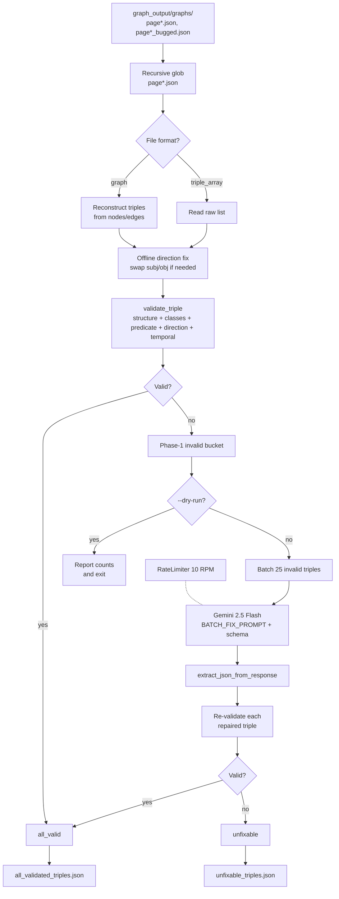

# Triplet validation & repair — purpose, reason and logic

Script: [`src/fix_invalid_triplets.py`](../src/fix_invalid_triplets.py)

This step takes the per-page temporal graphs produced by
[`extract_triplet_from_jsonl.py`](../src/extract_triplet_from_jsonl.py) and turns
them into a single **clean, schema-conformant triple list** at
`graph_output/validated/all_validated_triples.json`, ready to be consumed by
entity resolution (step 4). Triples that can't be repaired are kept in
`unfixable_triples.json` for inspection.

It mirrors the role of EmeraldMind's `3-fix-invalid-triplet.py`, but adapts that
script to our pipeline: a single `GEMINI_API_KEY`, the same `RateLimiter`
class we use in step 2, and aggregated outputs in a dedicated sibling directory
instead of mixed in with the per-page graphs.

---

## 1. Why this step exists

Step 2 calls Gemini with `response_mime_type="application/json"` only — no
schema is enforced server-side, because the triple schema is too dynamic
(every subject/object class has different properties). Step 2 validates each
triple in-line and writes the schema-failing ones into `page{N}_bugged.json`
sidecar files. In practice ~10–20 % of all triples come back with one of three
fixable bugs:

1. **Direction swap** — the model wrote `KPIObservation -reportsKPI-> Organization`
   when the schema declares `Organization -reportsKPI-> KPIObservation`. The
   relationship is correct, only the subject/object are swapped.
2. **Missing temporal properties** — a node lacks `valid_from` / `valid_to` /
   `is_current`, or an edge lacks `temporal_metadata`. The model knew the fact
   but forgot the housekeeping.
3. **Typo'd class or predicate** — `KPIObservaion` instead of `KPIObservation`,
   or `reportKPI` instead of `reportsKPI`. Trivial to repair against the schema.

Throwing these away would lose real signal. This step recovers them in two
phases:

- **Offline (free)**: fixes direction bugs deterministically using the schema's
  declared `source_class` / `target_class` per edge. No LLM cost.
- **LLM (paid)**: batches anything still invalid and asks Gemini to repair it
  against the full schema. Re-validates the model's output and keeps only what
  passes — model-generated repairs are not trusted blindly.

The result is a strict superset of step 2's valid output, at the cost of a
small number of LLM calls (batched at 25 invalid triples per call by default).

---

## 2. What it consumes and what it produces

**Inputs**

| Input | Default path | Role |
|---|---|---|
| Per-page graphs | `graph_output/graphs/<stem>/page{N}.json` | Triples already in graph form `{nodes, edges}` from step 2. Reconstructed back into triples. |
| Per-page bugged lists | `graph_output/graphs/<stem>/page{N}_bugged.json` | Step 2's invalid triples — second chance through phase 2's LLM repair. |
| Schema | `config/schema.json` | Source of truth for validation: 27 entity classes, 44 edge labels, 126 directed `(source_class, target_class)` entries. |

**Outputs**

```
graph_output/validated/
  all_validated_triples.json   ← flat list of every triple that passes validation
  unfixable_triples.json       ← triples the LLM couldn't repair (only present if non-empty)
```

`all_validated_triples.json` is a flat array of triple dicts. Each triple has
the standard `subject` / `predicate` / `object` / `temporal_metadata` shape that
step 4 (entity resolution) expects:

```json
[
  {
    "subject": {
      "class": "Organization",
      "properties": {
        "name": "AAA",
        "industry": "Plastics",
        "valid_from": "2011",
        "valid_to": null,
        "is_current": true
      }
    },
    "predicate": "reportsKPI",
    "object": {
      "class": "KPIObservation",
      "properties": {
        "kpi_type": "TT96-6.6.1",
        "title": "Mức lương trung bình",
        "value": 4000000,
        "unit": "đồng/tháng",
        "year": 2011,
        "valid_from": "2011-01-01",
        "valid_to": "2011-12-31",
        "is_current": false
      }
    },
    "temporal_metadata": {
      "valid_from": "2011-01-01",
      "valid_to": null,
      "recorded_at": "2011-01-01"
    }
  }
]
```

Note: triples are **flattened across documents**. Entity resolution (step 4)
wants one global list so it can merge, e.g., `Organization{name=AAA}` across
all 13 annual reports into one canonical entity with multiple versions.

---

## 2b. Pipeline at a glance



The diagram is the data flow for one full run. The dashed arrow on the
`RateLimiter` indicates it gates phase-2 LLM calls only — phase 1 is pure local
computation.

---

## 3. Logic walkthrough

### 3.1 File discovery + format auto-detect (`load_triples_from_file`)

The script does `rglob("page*.json")` under `--input-dir` (default
`graph_output/graphs/`). The recursive glob picks up every stem in one go, so
running `python src/fix_invalid_triplets.py` covers all 13 annual reports at
once with no flags needed.

Each file is auto-classified:

- **Graph format** (`{nodes: [...], edges: [...]}`) — this is what step 2 writes
  for `page{N}.json`. We **reconstruct** full triples by dereferencing each
  edge's `subject` / `object` integer indices into the `nodes` array and
  copying `temporal_metadata`. Indices out of range are skipped with a warning.
- **Triple-array format** (`[{subject, predicate, object, ...}, ...]`) — this is
  what step 2 writes for `page{N}_bugged.json` (the schema-failing triples).
  We keep only triples that have all three required keys.

A defensive filter excludes anything inside our own `--out-dir`, so re-runs
won't try to ingest a previously-written `all_validated_triples.json` even if
the glob pattern is loosened in future.

### 3.2 Offline direction fix (`fix_direction`)

The schema declares every edge with an explicit direction:

```json
{
  "label": "reportsKPI",
  "source_class": "Organization",
  "target_class": "KPIObservation",
  "temporal_properties": ["valid_from", "valid_to", "recorded_at"]
}
```

`load_schema_sets` builds `edge_directions: {label -> [(source, target), ...]}`.
Some labels have multiple legal pairs — e.g. `verifiedBy` can go from
`SustainabilityClaim` to either `ThirdPartyVerification` or `KPIObservation` —
so the value is a list, not a single tuple.

`fix_direction` then asks: is the triple's `(subject.class, object.class)` in
the legal-pair list for this predicate? If yes, leave it alone. If no but the
**swapped** pair `(object.class, subject.class)` is legal, swap them. Otherwise
do nothing (the triple goes on to schema validation and either passes the rest
of the checks or falls into phase 2 for the LLM to handle).

This is the cheapest possible repair — no LLM, no network call. It catches the
single most common bug type from step 2.

### 3.3 Schema validation (`validate_triple`)

Five rule classes, in order:

1. **Structural** — `subject`, `predicate`, `object` keys present; subject/object
   are dicts with `class` and `properties` keys; `properties` is a dict.
2. **Class membership** — `subject.class` and `object.class` are in the schema's
   entity class set.
3. **Predicate membership** — `predicate` is in the schema's edge label set.
4. **Direction** — `(subject.class, object.class)` is in the legal-pair list for
   that predicate. Runs only if (1)–(3) passed.
5. **Temporal** — every node has `valid_from` / `valid_to` / `is_current` in its
   properties; the triple has a `temporal_metadata` dict with `valid_from` /
   `valid_to` / `recorded_at`.

Each failure produces a string error message. The full error list is attached
to the triple as `_validation_errors` before it falls into the phase-2 bucket.
We also attach `_source_file` so we can trace back to the page that produced
the bad triple. Both underscore-prefixed keys are stripped before the triple is
sent to the LLM in phase 2.

### 3.4 Phase-1 driver (`process_file_offline`, `process_all_files`)

For each page file:

1. Load triples (graph or array format).
2. Run `fix_direction` over each triple — record how many were swapped.
3. Run `validate_triple` over each (post-fix) triple — split into valid / invalid.

Then aggregate across all files into `all_valid` and `all_invalid` lists with
running stats. Phase-1 logging looks like:

```
Offline results:
  Total files: 547 (graph: 547, triple_array: 12)
  Total triples: 8421
  Direction fixed: 312
  Valid: 6890
  Invalid (need LLM): 1531
```

### 3.5 Phase-2 LLM repair (`BATCH_FIX_PROMPT`, `fix_batch_with_llm`)

Invalid triples are batched (default 25 per batch) and sent to Gemini with the
verbatim `BATCH_FIX_PROMPT`. The prompt:

- Embeds the full `config/schema.json` so the model can resolve class/predicate
  typos against the canonical names.
- Asks for a JSON array of repaired triples **in the same order as input**,
  with `null` in the position of any triple the model can't repair.
- Forbids markdown fences and prose. Combined with `response_mime_type=json`,
  this gives a high parse-success rate.

`extract_json_from_response` then strips fences (in case the model ignored the
instruction), trailing commas, and JS-style comments, and finds the outer
`[…]` bracket pair before `json.loads`. Robust against the same minor
malformations step 2's cleaner handles.

### 3.6 Rate limiting

We reuse `RateLimiter` from
[`extract_triplet_from_jsonl.py`](../src/extract_triplet_from_jsonl.py).
`fix_batch_with_llm` calls `rate_limiter.wait_if_needed(0)` before every
`generate_content`, so batches space themselves to honor `--rate-limit` (default
10 RPM, matching the Gemini free tier). EmeraldMind's original used a fixed
`time.sleep(1)` between batches; our shared limiter is more accurate and works
without modification if a paid-tier user bumps `--rate-limit` to 1000.

### 3.7 Re-validation of LLM output (the trust boundary)

Repaired triples from the LLM are **re-validated** by the same `validate_triple`
that flagged them in the first place. Only those that pass become part of
`all_valid` and end up in `all_validated_triples.json`. Anything the LLM
returned but that still fails validation is silently dropped (we don't trust
the model's verdict, only the schema's). Anything the LLM returned as `null` —
declaring it unfixable — is dropped too.

Whatever remains in the phase-1 invalid bucket but isn't in `fixed_triples`
goes to `unfixable_triples.json`, carrying the original `_validation_errors`
and `_source_file` markers for inspection.

### 3.8 Output layout

```
graph_output/
  graphs/                                    ← step-2 output (untouched)
    AAA_Baocaothuongnien_2011/
      page2.json
      page3_bugged.json
      ...
  validated/                                 ← step-3 output
    all_validated_triples.json
    unfixable_triples.json                   (only if any)
```

EmeraldMind wrote the aggregates into the input dir, mixing per-page graphs
with the aggregated outputs. We keep them in a sibling dir so re-runs are
clean and the per-page provenance is easy to inspect.

---

## 4. Differences from EmeraldMind's step 3

| Aspect | EmeraldMind | This script |
|---|---|---|
| API keys | `GEMINI_API_KEY_1..7` + round-robin | single `GEMINI_API_KEY` |
| Phase-2 throttling | fixed `time.sleep(1)` per batch | shared `RateLimiter` (default 10 RPM) |
| Output location | inside `--input_dir` (mixed with per-page graphs) | dedicated `graph_output/validated/` |
| Defaults | `--input_dir` and `--schema` required | both default to repo-relative paths; you can run with no flags |
| Success-rate log line | misformatted on empty input (ternary in wrong place) | guarded with `if/else` |
| Dry-run | none | `--dry-run` stops after phase 1 — useful for estimating cost before spending tokens |
| Filename filters | excludes `_validated`, `_bugged`, `_fixed`, `_unfixable` | adds `_malformed` (step-2 sidecar) |
| Defensive out-dir guard | none | rglob skips any file inside `--out-dir` so re-runs don't re-ingest aggregates |

---

## 5. Schema reference

The ontology this script validates against is
[`config/schema.json`](../config/schema.json). The two pieces we depend on are:

- **Entity classes** (27): used to validate `subject.class` and `object.class`.
- **Directed edges** (44 labels / 126 `(source_class, target_class)` entries):
  used both for direction-fixing and for direction-validation.

See [`SCHEMA_EXPLAINED.md`](./SCHEMA_EXPLAINED.md) for the human-readable tour.

Adding a new class or edge to `config/schema.json` is a no-code change here —
the next run picks it up automatically.

---

## 6. Setup

```bash
pip install -r requirements.txt   # no new deps beyond what step 2 needs
```

Make sure `.env` at the repo root has your key (only needed if you'll run
phase 2; `--dry-run` skips the key check):

```bash
# .env
GEMINI_API_KEY="..."
```

And make sure **step 2 has been run** for the documents you want to validate.
The default `--input-dir` is `graph_output/graphs/`, populated by step 2.

---

## 7. Run

```bash
# Default: validate everything under graph_output/graphs/
python src/fix_invalid_triplets.py

# Just see the counts, don't spend any tokens
python src/fix_invalid_triplets.py --dry-run

# Smaller batches if a single batch is timing out
python src/fix_invalid_triplets.py --batch-size 10

# Paid Tier 1: crank the throttle
python src/fix_invalid_triplets.py --rate-limit 1000
```

### Flags

| Flag | Default | Meaning |
|------|---------|---------|
| `-i, --input-dir` | `graph_output/graphs/` | Where to find `page*.json` files (recursively) |
| `-s, --schema` | `config/schema.json` | Graph schema JSON |
| `-o, --out-dir` | `graph_output/validated/` | Where to write the aggregated outputs |
| `--batch-size N` | 25 | Triples per LLM repair batch |
| `--rate-limit N` | 10 | Max RPM for phase 2 |
| `--model` | `gemini-2.5-flash` | Gemini model id |
| `--dry-run` | off | Stop after phase 1: report counts but don't call the LLM or write files |

---

## 8. Related docs

- [`TRIPLET_EXTRACTION_FROM_JSONL.md`](./TRIPLET_EXTRACTION_FROM_JSONL.md) — step 2, produces the per-page graphs this script validates.
- [`KPI_EXTRACTION_FROM_JSONL.md`](./KPI_EXTRACTION_FROM_JSONL.md) — step 1, produces the KPI evidence used in step 2's prompt.
- [`SCHEMA_EXPLAINED.md`](./SCHEMA_EXPLAINED.md) — the knowledge-graph ontology this script validates against.
- [`VIETNAM_IMPROVEMENT_PLAN.md`](./VIETNAM_IMPROVEMENT_PLAN.md) — broader plan for adapting the graph to the Vietnamese regulatory reality.
