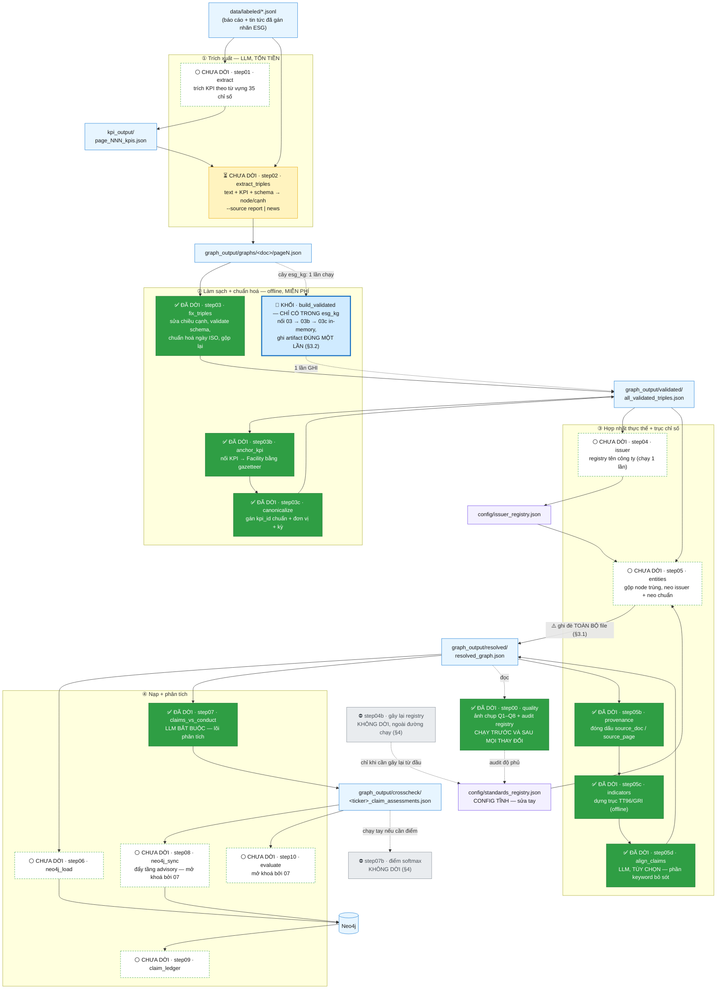
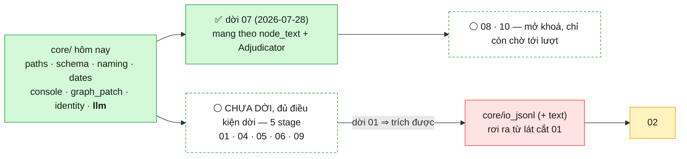
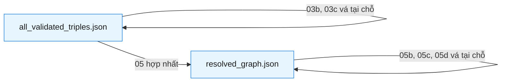
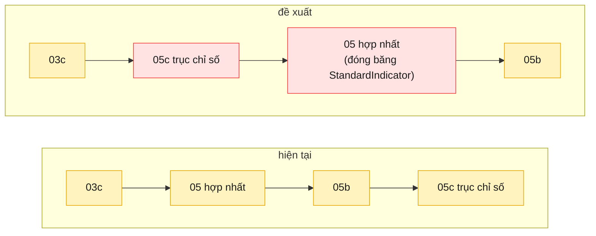

# Pipeline của đợt refactor — `src/` → `src_module/esg_kg/`

Bản đồ **chỉ của stage C** (JSONL đã gán nhãn → đồ thị tri thức thời gian), tức đúng
phần đang được refactor. Không vẽ crawl, phân loại ESG, hay UI — xem `CLAUDE.md` cho
bức tranh toàn hệ thống.

Nguồn sự thật của thứ tự chạy là [`esg_kg/pipeline.py`](esg_kg/pipeline.py); file này
là bản vẽ của cùng dữ liệu đó. `python src_module/run.py --list` luôn nói thật về tiến độ.

**Trạng thái (2026-07-28): 8/16 stage đã dời** — `00 quality`, `03 fix_triples`,
`03b anchor_kpi`, `03c canonicalize`, `05b provenance`, `05c indicators`,
`05d align_claims`, `07 claims_vs_conduct`; 2 stage cố ý không dời (§4).
`05b` là stage đầu tiên dời được mà **không phải trích thêm module `core/` nào** — lần dời
`03b` đã lifted sẵn cả 4 symbol nó cần. `03` là stage thứ hai, `05d` là stage thứ ba —
lát cắt `05c` đã đẩy `GraphPatch`/`temporal_md` lên kernel *chính vì* `05d` đang import
chúng từ một stage, nên tới lượt nó thì không còn gì phải trích. **`07` là stage thứ
tám** (2026-07-28) và đòn bẩy lớn nhất trong cả đợt: nó là stage DUY NHẤT còn chặn ai đó
(`08` chờ `node_text`, `10` chờ `Adjudicator`) — dời nó là mở khoá cả hai cùng lúc. Nó
cũng là lượt import NGƯỢC đầu tiên: `_Provider`/`_OpenAIProvider` giờ lấy từ `core.llm`,
đúng hai lớp mà kernel đó đã trích TỪ CHÍNH file `step07` một ngày trước.

**8 stage còn lại VẪN CHẠY BẰNG `src/`**: `01`, `02`, `04`, `05`, `06`, `08`, `09`, `10`.
Trong sơ đồ §1, ô viền đứt là **chưa dời**, không phải đã xong; chỉ ô nền xanh
đặc gắn `✅ ĐÃ DỜI` mới là đã refactor.

**Ngoài 7 stage đó, `esg_kg` còn có 1 KHỐI: `build_validated` = `03 → 03b → 03c`** nối chuỗi
in-memory, ghi `all_validated_triples.json` **đúng một lần** (§3.2). Khối **không phải một
stage** nên không tính vào mẫu số `7/16` — nó là một **entrypoint thêm**, và cả ba stage thành
viên vẫn chạy lẻ được.

**`03` đã dời (2026-07-28) → `esg_kg/graph/fix_triples.py`.** Nó *trông* như hub — **7 stage
`src/` import từ nó** — nhưng mọi symbol chúng lấy đều đã được các lát cắt trước rút vào
`core/` rồi (`ISO_DATE_RE`/`normalize_date_string`/`date_start_key` → `core/dates`;
`load_schema_sets`/`validate_triple` → `core/schema`), còn phần stage-local thì **không ai
import**. Nên phần "hub" đã tan từ trước, và luật DESIGN.md §4 (*"chỉ xét symbol NÓ import"*)
cho phép dời ngay. Diff 45 thêm / 212 xoá; đối chiếu bằng AST: **10 hàm chung, 0 hàm khác
một byte**, 4 hàm bị xoá đúng là 4 hàm đã có trong `core/`, 0 hàm bịa thêm. Test:
`test/test_esg_kg_fix_triples.py` (13 nhóm).

**`core/llm.py` đã xong (2026-07-27)** — `DEFAULT_RATE_LIMIT` + `RateLimiter` (từ `step02`)
và `_Provider` + `_OpenAIProvider` (từ `step07`), trích **verbatim**, 0 dòng logic đổi.
Nó **không dời stage nào** (lúc đó vẫn 5/16) nhưng **mở khoá 4 stage cùng lúc**, nên số stage
đủ điều kiện nhảy từ 4 lên **8**: `01`, `03`, `04`, `05`, `05d`, `06`, `07`, `09`. Chỉ còn
**ba** stage thật sự bị chặn: `02` (cần `core/io_jsonl`), `08` và `10` (cả hai chờ `step07`
dời — xem §2.1). Test: `test/test_esg_kg_llm.py`.

**`03` rồi `05d` rồi `07` đã dùng suất đó (2026-07-28), nên đòn bẩy `core/llm` đã hiện
thành stage thật: 5/16 → 6/16 → 7/16 → 8/16.** Cùng commit với `03` là khối
`build_validated` đầu tiên (§3.2). `07` là lượt cuối cùng dùng suất này — nó cũng là
stage đã TẠO RA `_Provider`/`_OpenAIProvider` cho `core/llm`, nên đây là lần đầu tiên
kernel "trả" symbol lại đúng nơi sinh ra nó. Còn **5** stage đủ điều kiện chưa dời từ
kernel: `01`, `04`, `05`, `06`, `09` — cộng **`08`** và **`10`**, hai stage `07` vừa
tự mình mở khoá (chúng chờ `node_text`/`Adjudicator` từ `07`, không chờ `core/`).

🔑 **Bài học lớn nhất của lát cắt `05d`, và nó đổi thứ tự làm phần còn lại: "stage trả tiền"
KHÔNG còn là lý do hoãn.** `05d` bắt buộc phải có LLM (`--dry-run` return *trước* khi provider
được dựng, nên arm chỉ-dry-run gần như không chứng minh gì). Cách xử: **tiêm một provider giả
đè lên `_OpenAIProvider` ở cả hai cây** — đúng kỹ thuật pha 2 của `03` — trả lời tất định theo
CRC của prompt, nên hai cây nhận **cùng** câu trả lời và so được toàn bộ đường chạy đắt tiền
mà **không tốn một xu**. Kỹ thuật này đã dùng lại được hai lần, tức nó là **khuôn chung**, không
phải mẹo riêng cho một stage. Hệ quả: `01` và `07` không còn "đắt nên để sau" — xem mục 1 dưới.

Hai commit `docs`/`fix` trước đó vẫn đáng đọc, vì chúng là **khuôn thứ tự** cho các stage sau,
không phải chuyện đã xong:

- `046e572` — **guard pha 2 của `step03`** (`preserve_property_values`): LLM được phép sửa
  *hình dạng* một triple (`class`, `predicate`, `temporal_metadata`, `valid_from`/`valid_to`/
  `is_current`), **không được sửa giá trị** của bất kỳ thuộc tính nào khác. Trước đó
  `BATCH_FIX_PROMPT` bảo model *"Fix typos/synonyms"* mà không giới hạn trường, còn
  `validate_triple` thì **không hề kiểm giá trị** — nên pha 2 tự do viết lại mọi property.
  Cố ý làm **trước** khi `03` dời, để chỉ phải sửa **một** cây thay vì hai (DESIGN.md §5.3).
  **Khuôn này đã được nghiệm thu**: `03` dời sau đó một ngày và guard chỉ phải viết một lần —
  arm pha 2 trong `test/test_esg_kg_fix_triples.py` chứng minh nó có mặt ở **cả hai** cây.
- `b542fb5` — **DESIGN.md §5.6**: `step02` sẽ xuất `name`/`title` bằng **tiếng Việt có dấu**
  (issue #6). Hôm nay `step02` không có *một dòng nào* hướng dẫn về ngôn ngữ, nên LLM đã tự
  dịch **52,7%** số tên sang tiếng Anh; mà `normalize_name` gộp được mọi cách viết tiếng Việt
  lại đẩy bản dịch sang một khoá khác ⇒ bản dịch **không gây lỗi**, nó **tách một pháp nhân
  thành hai** ở Stage A của `step05`. Đây là quyết định phải chốt *trước* lần trích lại
  (§5.4), không phải thứ ứng biến lúc ngồi sửa prompt. **Việc này CHƯA làm** — và theo đúng
  khuôn `046e572` ở trên, nó phải land trong `src/` **trước** khi `02` dời (§2.1, cuối mục).

Hai cái này ăn khớp với nhau chứ không rời rạc: §5.6 là lý do guard pha 2 phải có trước —
giao một `name` tiếng Việt cho một prompt viết bằng tiếng Anh ra lệnh "sửa typo" thì model
rất dễ "sửa" thành bản dịch hoặc bản khử dấu, và không có gì ở hạ nguồn báo động.

---

## 1. Toàn cảnh



**Chú giải màu**

> ⚠️ **Chỉ ô nền xanh ĐẶC, chữ trắng, gắn nhãn `✅ ĐÃ DỜI` mới là đã refactor.**
> Ô viền đứt gắn `⚪ CHƯA DỜI` nghĩa là **vẫn đang chạy bằng `src/`** — nó mới chỉ *đủ điều
> kiện* để dời. Cụm `03` nay đã dời **trọn** (`03`+`03b`+`03c`); chỗ còn **khác trạng thái
> ngay cạnh nhau** là cụm `05`: `05b`/`05c`/`05d` đã dời, chỉ còn `05` là chưa. `07` cũng đã
> dời — và vì nó là stage duy nhất từng chặn `08`/`10`, hai ô đó đổi từ `⏳` (chờ stage khác)
> sang `⚪` (chỉ còn chờ tới lượt dời) ngay khi `07` xong, không cần đụng tới `core/` nào
> thêm. Nghi ngờ thì hỏi `python src_module/run.py --list`, đừng đọc màu.

| Nhãn trong ô | Màu | Nghĩa |
|---|---|---|
| `✅ ĐÃ DỜI` | 🟩 xanh **đặc**, chữ trắng | đã dời sang `esg_kg` — chạy bằng `python src_module/run.py <tên>` |
| `🧱 KHỐI` | 🟦 xanh dương **viền đậm** | **không phải stage** và **không có bản `src/`** — nhiều stage gộp thành một đơn vị ghi artifact 1 lần (§3.2). Không tính vào mẫu số `7/16` |
| `⚪ CHƯA DỜI` | ⬜ nền trắng, viền xanh đứt | **vẫn chạy bằng `src/`**; chỉ là mọi symbol nó cần đã có trong `core/` → dời được ngay (§2.1) |
| `⏳ CHƯA DỜI` | 🟨 vàng | vẫn chạy bằng `src/` **và còn bị chặn** — chờ một stage khác dời (§2.1) |
| `⛔` | 🩶 xám | **cố ý không dời** (§4), vẫn còn file trong `src/` |
| — | 🟦 xanh dương | dữ liệu sinh ra (git-ignored, ship qua HF) |
| — | 🟪 tím | config (tracked trong Git) |

---

## 2. Bảng stage: vào gì → ra gì

| # | Tên | LLM? | Input chính | Output chính | Trạng thái |
|---|---|---|---|---|---|
| 00 | `quality` | — | `resolved_graph.json` | `quality/quality_report_<label>.{json,md}` | ✅ **đã dời** |
| 01 | `extract` | 💰 | JSONL đã gán nhãn | `kpi_output/…_kpis.json` | ⚪ **chưa dời** — đủ điều kiện (hub, §2.1) |
| 02 | `extract_triples` | 💰 | JSONL + KPI + `schema.json` | `graphs/<doc>/pageN.json` | ⏳ chờ `core/io_jsonl` ⚠️ sắp đổi hành vi (§5.6) |
| 03 | `fix_triples` | 💰 (chỉ pha 2) | các file page | `all_validated_triples.json` | ✅ **đã dời** · pha 2 có guard giá trị |
| 03b | `anchor_kpi` | — | validated + JSONL | vá tại chỗ + `anchor_patch_stats.json` | ✅ **đã dời** |
| 03c | `canonicalize` | — | validated + `kpi_type_aliases.json` | vá tại chỗ + `kpi_canonical_stats.json` | ✅ **đã dời** |
| 🧱 | `build_validated` **(KHỐI)** | 💰 chỉ pha 2, **có cache** | các file page (như `03`) | `all_validated_triples.json` — **ghi 1 lần** | ✅ **chỉ có trong `esg_kg`**, không có bản `src/` (§3.2) |
| 04 | `issuer` | — | validated | `config/issuer_registry.json` | ⚪ **chưa dời** — đủ điều kiện, **hub đã tan** (§2.1) |
| 04b | — | — | ~~resolved~~ | ~~`standards_registry.json`~~ | ⛔ **ngoài đường chạy** |
| 05 | `entities` | 💰 (tùy chọn) | validated + 2 registry | `resolved_graph.json` | ⚪ **chưa dời** — đủ điều kiện ⚠️ §3.1 |
| 05b | `provenance` | — | resolved + các file page | vá tại chỗ | ✅ **đã dời** |
| 05c | `indicators` | — | resolved + `kpi_definitions` + crosswalk + `gri_catalog` | vá tại chỗ | ✅ **đã dời** |
| 05d | `align_claims` | 💰 tùy chọn | resolved | vá tại chỗ | ✅ **đã dời** · nhánh trả tiền có arm bằng LLM giả |
| 06 | `neo4j_load` | — | resolved | Neo4j | ⚪ **chưa dời** — đủ điều kiện |
| 07 | `claims_vs_conduct` | 💰 **bắt buộc** | resolved | `<ticker>_claim_assessments.json` | ✅ **đã dời** (2026-07-28) — mở khoá `08`/`10` |
| 07b | — | — | dossier | dossier (thêm điểm) | ⛔ **không dời** |
| 08 | `neo4j_sync` | — | dossier | Neo4j (tầng advisory) | ⚪ **chưa dời** — mở khoá bởi `07` (§2.1) |
| 09 | `claim_ledger` | — | **chỉ Neo4j** | `<ticker>_claim_ledger.md` | ⚪ **chưa dời** — đủ điều kiện |
| 10 | `evaluate` | 💰 1 nhánh 30 ca | dossier + stats | `<ticker>_evaluation_report.md` | ⚪ **chưa dời** — mở khoá bởi `07` (§2.1) |

💰 = tốn tiền. Đây là lý do mọi test đều offline và mọi stage đắt đều có `--dry-run`.

### 2.1 Cái thật sự quyết định thứ tự dời: phụ thuộc **symbol**, không phải thứ tự chạy

Sơ đồ §1 vẽ **dữ liệu chảy đi đâu**. Nó KHÔNG phải thứ tự được phép dời. Luật ở
DESIGN.md là: *một stage chỉ dời được khi **mọi symbol NÓ import** đã nằm trong
`esg_kg.core`* — nên thứ tự dời do đồ thị import quyết định, và đồ thị đó chạy **ngược**
chiều pipeline (stage sau import helper của stage trước).

Bảng dưới là kết quả grep toàn bộ import chéo trong `src/` đối chiếu với `core/`, **chạy lại
2026-07-28** sau khi `03` dời — cột cuối là **thứ duy nhất còn thiếu**:

| # | Symbol nó import từ cây `src/` | Còn thiếu gì trong `core/` |
|---|---|---|
| 01 | *(không import stage nào — `REPO_ROOT` là do **nó** định nghĩa, `step01:36`)* | — 🟢 **đủ symbol, nhưng VẪN CHƯA DỜI**. `core/io_jsonl` KHÔNG phải điều kiện của `01`: nó là điều kiện của `02`, và nó **rơi ra từ chính lát cắt `01`** (đúng kiểu `03b` → `core/identity.py`) |
| 02 | 5 helper JSONL của `01` + `REPO_ROOT` | `core/io_jsonl` — và xem lưu ý §5.6 ngay dưới bảng: `02` còn một thay đổi hành vi **đang xếp hàng** |
| 03 | `REPO_ROOT`, `RateLimiter` | ✅ **đã dời** (2026-07-28) — không phải viết thêm `core/` nào, y như `05b` |
| 03b | `REPO_ROOT`, `load_schema_sets`, `validate_triple`, `normalize_name` | ✅ **đã dời** (2026-07-27) |
| 04 | `REPO_ROOT` (`step04:49`) | — 🟢 **đủ symbol, nhưng VẪN CHƯA DỜI**. ✅ **Hub đã tan** — kiểm lại 2026-07-28 theo bài học (a): 6 stage import nó, nhưng cả 3 symbol chúng lấy (`normalize_name`, `name_tokens`, `merge_preserving_edits`) đã nằm trong `core/naming.py`; phần stage-local **không ai import** |
| 05 | `date_start_key`, `load_schema_sets`, `normalize_name` (đã ở `core/`) + `RateLimiter` | — 🟢 **đủ symbol, nhưng VẪN CHƯA DỜI** (`core/llm` xong) — nhưng đọc §3.1 trước khi dời |
| 05b | `get_identity_keys`, `PROVENANCE_CLASSES`, `get_stable_entity_id`, `parse_source_id` | ✅ **đã dời** (2026-07-27) — không phải viết thêm `core/` nào |
| 05d | `load_schema_sets`, `GraphPatch`, `temporal_md` (đã ở `core/`) + `_OpenAIProvider` | ✅ **đã dời** (2026-07-28) — không phải viết thêm `core/` nào, cây thứ ba làm được. `RateLimiter` trong `import` cũ là **rác**: không chỗ nào dùng |
| 06 | `REPO_ROOT`, `load_schema_sets` | — 🟢 **đủ symbol, nhưng VẪN CHƯA DỜI** |
| 07 | `load_schema_sets`, `normalize_name`, `name_tokens` (đã ở `core/`) + `_Provider`/`_OpenAIProvider` | ✅ **đã dời** (2026-07-28) — không phải viết thêm `core/` nào; `RateLimiter` trong import cũ là **rác** (chỉ `_OpenAIProvider.__init__` cần, và lớp đó nay tới sẵn từ `core.llm`), y hệt phát hiện ở `05d` |
| 08 | `node_text` (của `step07`) | **`step07` đã dời (2026-07-28)** — `08` giờ chỉ còn chờ tới lượt dời chính nó, không chờ ai khác. `node_text` KHÔNG vào `core/llm` (xem cảnh báo dưới), nó ở lại `esg_kg.crosscheck.claims_vs_conduct` cùng stage |
| 09 | *(không import stage nào)* | — 🟢 **đủ symbol, nhưng VẪN CHƯA DỜI** |
| 10 | `Adjudicator` (import **lười** trong `try`, `step10:368`) | **`step07` đã dời (2026-07-28)** — `10` giờ chỉ còn chờ tới lượt dời chính nó. `Adjudicator` là logic stage, cố ý KHÔNG vào `core/llm`; hỏng thì **im lặng**, không lỗi — điều đó không đổi chỉ vì `07` đã dời |



Từ 2026-07-27 **không còn module `core/` nào là điều kiện chặn**: cả ba stage còn lại đều
chờ một *stage khác* dời, không chờ kernel. `02` chờ `core/io_jsonl` — nhưng module đó rơi
ra từ lát cắt `01`, và `01` thì đã đủ điều kiện.

**Đọc ra được ba điều, cả ba đều đổi thứ tự làm:**

1. **Kernel đã hết đường chặn.** Sau `core/llm.py` (2026-07-27) có 8/11 stage chưa dời đủ
   điều kiện; `03` rồi `05d` rồi `07` đã dùng suất đó ngày 2026-07-28, còn lại **5**: `01`,
   `04`, `05`, `06`, `09`. Việc còn lại không phải "viết thêm `core/`" nữa mà là **chọn
   stage nào dời trước**, và tiêu chí bây giờ là *arm tương đương mạnh tới đâu*, không còn
   là *symbol đã sẵn chưa*:
   - **~~`03` — mạnh nhất~~ → ĐÃ DỜI (2026-07-28).** Lý do nó được chọn vẫn đáng đọc, vì nó
     là khuôn cho các lần sau: pha 1 + pha 1.5 offline nên chạy được trên corpus thật miễn
     phí, còn **pha 2 (trả tiền) được lái bằng một LLM giả** nên nhánh đắt vẫn có arm. Kết
     quả: arm ở **cả ba pha**, so `14 492` triple + `1 036` unfixable ở hai cây.
     Hai điều đã học được, dùng lại cho lần sau:
     - **"Hub" phải kiểm bằng chiều import, không bằng số người import.** `03` bị 7 stage
       import nên trông như phải làm cuối, nhưng mọi symbol chúng lấy đã nằm trong `core/`
       từ các lát cắt trước ⇒ nó thực chất là **leaf**. Trước khi xếp lịch một stage vào
       "lô hub", hãy grep xem phần bị import còn nằm ở stage hay đã lên kernel.
     - **Hằng số trùng tên không được import cho tiện.** `DEFAULT_RATE_LIMIT` có ở cả
       `step03` lẫn `core/llm` và **cùng bằng 10**, nên import từ kernel sẽ "đúng" hôm nay
       và âm thầm chỉnh throttle của `03` vào ngày ai đó sửa cho `02`. Chỉ `RateLimiter`
       được dùng chung; hằng số ở lại module.
   - **~~`05d` — nhỏ nhất, ứng viên kế tiếp~~ → ĐÃ DỜI (2026-07-28).** Đúng như dự đoán về
     kích thước, nhưng **sai về lý do**: cái tưởng làm nó dễ là `--dry-run`, hoá ra
     `--dry-run` `return` *trước khi* provider được dựng, nên nó gần như không phủ được gì.
     Thứ thật sự làm arm mạnh là **provider giả** (xem 🔑 ở đầu file). Ghi lại vì nó đảo
     tiêu chí chọn stage: **có `--dry-run` ≠ dễ test**; cái đáng hỏi là *nhánh đắt tiền có
     tiêm được stub không*.
   - **~~`07` — đòn bẩy lớn nhất còn lại~~ → ĐÃ DỜI (2026-07-28).** Nó là stage duy nhất
     từng chặn ai đó: `08` chờ `node_text`, `10` chờ `Adjudicator` — dời nó mở nốt **hai**
     stage cuối cùng đang bị chặn, cùng một lượt. Rào cản cũ "trả tiền" đã bị gỡ đúng như
     dự đoán: `03` pha 2 và `05d` đã chứng minh hai lần rằng stub provider cho arm thật
     miễn phí, và `07` là lần thứ ba — cộng thêm một điểm mới, `--dry-run` ở đây KHÔNG
     `return` trước khi dựng provider (chỉ bỏ ghi file cuối), nên khác `05d`, arm dry-run
     ở đây tự nó đã là một phép kiểm tương đương thật. Bẫy `node_text` (ngay dưới) đã được
     giữ đúng: `esg_kg.crosscheck.claims_vs_conduct.node_text` (nhận NODE, rẽ theo class) và
     `esg_kg.resolve.align_claims.node_text` (nhận dict thuộc tính) là hai hàm khác nhau,
     pin bằng test hai chiều trong cả hai file test tương đương. Phát hiện thêm một khiếm
     khuyết cùng dạng bug đã sửa ở `05d` (`a308608`): `_parse_verdict` cũng gọi `.get()`
     trên JSON hợp lệ nhưng sai hình dạng — bán kính nhỏ hơn (bị `try/except` của
     `Adjudicator.adjudicate` nuốt, chỉ mất một verdict chứ không mất cả lượt chạy), sửa ở
     commit riêng theo §5.3, không nhét vào commit dời stage này.
   - **`04` — đã kiểm lại theo bài học (a) ngày 2026-07-28: hub của nó cũng đã tan.**
     Đúng như nghi ngờ ghi ở lần trước. 6 stage `src/` import `step04`
     (`00`, `03b`, `04b`, `05`, `05c`, `07`) nhưng tất cả chỉ lấy `normalize_name` /
     `name_tokens` / `merge_preserving_edits` — **cả ba đã ở `core/naming.py`** — còn bản
     thân `step04` chỉ import đúng `REPO_ROOT`. Vậy nó là **leaf**, không phải hub, và
     không còn lý do xếp nó vào "lô cuối". Cái quyết định thứ tự giờ chỉ còn là **sức mạnh
     của arm**: `04` đọc thêm `config/company_annual_report.xlsx` (cần `pandas`) và ghi
     `config/issuer_registry.json` — một file **tracked trong Git** và có **sửa tay của
     người** (`merge_preserving_edits`), nên arm phải chạy trên workspace tạm, đừng đụng
     bản thật.
   - `06`/`09` đọc Neo4j; `01` là stage trả tiền; `05` **không được dời nếu chưa xử
     §3.1** (nó ghi đè cả ba bản vá) — và §3.2 nay là câu trả lời mặc định cho §3.1.
2. **~~`core/llm.py` là đòn bẩy lớn nhất~~ → ĐÃ XONG (2026-07-27).** Đúng như dự đoán: nó
   mở khoá 4 stage cùng lúc (`03`, `05`, `07`, `05d`). Lát cắt gồm `DEFAULT_RATE_LIMIT` +
   `RateLimiter` (từ `step02`) và `_Provider` + `_OpenAIProvider` (từ `step07`) — bốn symbol
   **buộc phải đi cùng nhau** vì `_OpenAIProvider.__init__` *khởi tạo* một `RateLimiter`,
   tức `step07` đang với UP sang `step02` để lấy tiện ích. `Adjudicator` **cố ý ở lại**
   `step07` (là logic stage: prompt + parse verdict + cascade). ~~`08`/`10` vẫn chưa được
   mở~~ → **đã mở (2026-07-28)**, cùng ngày `step07` dời: chúng chờ chính stage đó, không
   chờ kernel, và stage đó nay đã dời.
3. **`01` là hub cuối cùng còn lại — và sau lần kiểm `04` ở trên thì đây không còn là phỏng
   đoán, nó là hub DUY NHẤT.** `03` và `04` đều đã tan; `01` thì **không**, vì nó là stage
   duy nhất còn bị import phần *stage-local* (5 helper JSONL dưới đây) chứ không phải phần
   đã lên kernel — đúng cái phép thử "kiểm bằng chiều import" của bài học (a).
   **Nhưng hub ≠ bị chặn.** Nó không import ai, nên
   theo đúng luật thì dời được ngay; thứ xếp nó xuống cuối là **thứ tự hub-làm-cuối** của
   DESIGN.md §4 chứ không phải một module `core/` còn thiếu. Chiều phụ thuộc là chiều
   ngược lại: `02` cần 5 helper JSONL **của nó** (`build_page_text`,
   `load_pages_from_jsonl`, `page_has_esg`, `select_documents`,
   `parse_company_year_from_filename`) → nên `core/io_jsonl` không phải việc phải làm
   *trước* `01`, mà là thứ **rơi ra từ lát cắt `01`**, y như `core/identity.py` rơi ra từ
   lát cắt `03b`. Điểm hay: cả 5 helper đó đều **thuần và offline**, nên riêng phần
   `core/io_jsonl` có arm tương đương mạnh chạy trên corpus thật, dù bản thân stage `01`
   là stage trả tiền.

✅ **Cái bẫy của lần dời `step07` đã tránh được, không phải của `core/llm`:** có **hai** hàm
tên `node_text` và chúng **không** trùng nhau — `esg_kg.resolve.align_claims.node_text`
nhận *dict thuộc tính*, `esg_kg.crosscheck.claims_vs_conduct.node_text` (cũ: `step07:133`)
nhận *node* rồi rẽ theo class. Gộp chung sẽ **âm thầm viết lại prompt LLM đã trả tiền** của
một trong hai stage. Giữ hai tên khác nhau — cả hai file test tương đương
(`test_esg_kg_align_claims.py` và `test_esg_kg_crosscheck.py`) đều pin sự khác biệt này từ
phía của mình, nên bẫy bị bắt ở cả hai hướng. `core/llm.py` **cố ý không đụng** vào
`node_text` — nó ở lại đúng stage sinh ra nó, không lên kernel.

📌 **Lưu ý thứ tự cho `02` — thay đổi hành vi đi TRƯỚC lần dời, không đi sau.** DESIGN.md
§5.6 đã chốt `step02` sẽ xuất `name`/`title` tiếng Việt (issue #6). Theo §5.3 mọi thay đổi
hành vi phải land ở **cả hai cây**, nên nếu `02` dời trước thì cùng một sửa đổi phải làm hai
lần và phải giữ hai bản prompt đồng bộ. Guard pha 2 của `03` (`046e572`) đã áp đúng logic này
và commit message nói thẳng lý do: *"deliberately BEFORE step03 migrates — one tree to edit
now instead of two later"*. Với `02` thì sức nặng còn lớn hơn, vì nó bị chặn bởi
`core/io_jsonl` nên **đằng nào cũng chưa dời được** — cứ làm §5.6 trong `src/` trước.

✅ **Lát cắt `core/llm` đã tránh được bẫy tương tự.** Thứ nó bảo vệ là **hình dạng request
đã trả tiền**: `temperature=0` và `response_format={"type": "json_object"}` không phải
chuyện style — adjudicator parse phản hồi thành JSON và cả pipeline giả định tính tất định.
Bỏ một trong hai thì lúc chạy **vẫn "chạy được"** nhưng mọi verdict đổi âm thầm.
`test/test_esg_kg_llm.py` ghim nguyên hình dạng request bằng một client giả (kèm thứ tự
`wait_if_needed` → `create`), nên bắt được hồi quy đó mà **không tốn một xu**.

---

## 3. Ba khối lặp lại trên vòng đời một node

> ⚠️ **Đọc mục này kèm §3.2.** Từ 2026-07-28, cụm `03/03b/03c` trong `esg_kg` **không còn
> vá tại chỗ nữa** — nó là một khối ghi artifact đúng một lần. Mọi mô tả "vá tại chỗ" dưới
> đây vẫn đúng cho **`src/`** và cho cụm `05` (chưa dời), nhưng với cây mới thì cụm `03` đã
> hết. Luật §3 vẫn cần đọc: nó là thứ giải thích **vì sao** phải gộp khối.

Cái làm pipeline trông rối là **vá tại chỗ**: nhiều stage đọc và ghi *cùng một file*.
Ba khối dưới đây giải thích vì sao.



- **Trước hợp nhất** (`all_validated_triples.json`): node còn trùng lặp, mỗi lần nhắc
  một node. 03b/03c làm giàu **từng node** — không cần biết node nào là node nào.
- **Sau hợp nhất** (`resolved_graph.json`): mỗi thực thể một node. 05b/05c/05d cần
  điều đó, hoặc cần vị trí node ổn định.
- **Đóng băng vị trí**: step06 khoá Neo4j theo *chỉ số mảng* và dossier step07 trỏ node
  theo *vị trí* — nên 05c bắt buộc **chỉ được nối thêm vào cuối**, không sắp xếp lại.

**Hệ quả cho MỌI test của stage vá tại chỗ** (đã dính hai lần, nên ghi ra thành luật):
file trên đĩa **đã bị chính stage đó vá rồi**. Nhưng hậu quả thì tuỳ stage, và phải hỏi
đúng **một** câu để biết là hậu quả nào:

> Gặp lại phần nó tự sinh, stage **bỏ qua** (`continue`) hay **tính lại từ đầu**?

| Stage | Tàn dư của chính nó trong file | Gặp lại thì làm gì | Cách dựng lại input trước khi vá |
|---|---|---|---|
| `05c` | 67 `StandardIndicator` + 4 nhãn cạnh trục | **bỏ qua** ⇒ arm rỗng | `strip_axis()` — xoá node + cạnh trục, remap chỉ số mảng |
| `03b` | **95/306** cạnh `observedAtFacility` có `anchor_method=offline_gazetteer` | **bỏ qua** ⇒ arm rỗng | `strip_anchors()` — xoá đúng 95 cái đó, **giữ 211 cạnh do extraction sinh** |
| `05b` | **6 258/10 425** node có `source_doc`/`source_page` | **tính lại** ⇒ arm KHÔNG rỗng | `strip_provenance()` — xoá 4 tier, **giữ node `provenance_method=extraction`** |
| `03` | *(không có — nó đọc `graphs/` của `02`, ghi ra file khác)* | **không bao giờ gặp** ⇒ arm KHÔNG rỗng | không cần strip; chạy thẳng trên corpus thật |
| `05d` | **0** cạnh `alignment_method=llm` — stage chưa từng chạy trên snapshot này (cả 639 cạnh `alignsWithIndicator` đều là `keyword` của `05c`) | **bỏ qua** — nhưng **chưa có gì để bỏ qua** ⇒ arm KHÔNG rỗng, *tạm thời* | `strip_llm_alignments()` viết sẵn, hôm nay xoá **0** cạnh |

**Luật 1 — strip đúng phần stage tự sinh, không strip theo nhãn/tên key.** 211 cạnh
`observedAtFacility` kia có từ trước, xoá nhầm là đo sai; với `05b` cũng vậy, node đóng dấu
`extraction` là output của `step02` chứ không phải của `05b`, phải giữ nguyên.

**Luật 1b — hỏi câu đó TRƯỚC, đừng mặc định phải viết `strip_*`.** `03` là ca đầu tiên mà
câu trả lời là *"không gặp bao giờ"*: đường chính của nó đọc `graph_output/graphs/` (output
của `02`) và ghi ra một file **khác**, nên arm corpus thật không rỗng mà chẳng cần fixture
nào. Chỉ `--renormalize` mới đọc lại chính `all_validated_triples.json` — và đó mới là chỗ
đáng đặt arm **idempotency** (chạy pha 1.5 lần hai trên ngày đã ISO phải là no-op; nếu không,
mỗi lần chạy lại sẽ âm thầm viết lại đồ thị).

**Luật 1c — "hôm nay chưa rỗng" KHÔNG phải "sẽ không rỗng".** `05d` là ca đầu tiên mà câu trả
lời là *"bỏ qua, nhưng chưa có gì để bỏ qua"*: nó **có** cùng hình dạng nguy hiểm như
`05c`/`03b` (node đã có cạnh `alignsWithIndicator` thì bị loại khỏi `candidates`), chỉ là
artifact sống chưa chứa tàn dư của nó vì stage chưa từng chạy. Nghĩa là arm hôm nay không rỗng
**do dữ liệu**, không phải do thiết kế — chạy `05d` thật một lần là arm bắt đầu teo dần mà vẫn
in PASS. Nên `strip_llm_alignments()` vẫn được viết và vẫn được gọi dù hôm nay xoá 0 cạnh: chi
phí bằng không, và nó là thứ duy nhất giữ arm trung thực về sau. Lưu ý strip **chỉ** lấy đúng
cạnh `alignment_method=llm` — 639 cạnh `keyword` là output của `05c`, và việc `05d` bỏ qua
chúng chính là **thiết kế** (nó chỉ xử phần còn lại), không phải tự-đọc-output.

**Luật 2 — "vá tại chỗ" KHÔNG tự động nghĩa là "arm sẽ rỗng".** `05b` chỉ `continue` đúng
một trường hợp (`provenance_method == "extraction"`, hiện **0 node** trong đồ thị thật);
mọi node còn lại nó khớp lại và đóng dấu lại từ đầu. Nên arm chạy trên file sống vẫn so
**6 258 dấu** thật ở cả hai cây — không cần strip để cứu. Đừng suy diễn từ `05c`/`03b` sang
mọi stage vá tại chỗ: kiểm cái `continue` trước.

**Vậy strip để làm gì với `05b`?** Để chứng minh một tính chất *mạnh hơn* mà hai stage kia
không có: **stage không bao giờ ĐỌC output của chính nó.** Không key nào nó ghi
(`source_doc`, `source_page`, `provenance_method`, `source_pages`, 3 field tin tức) nằm
trong `identity_keys` của bất kỳ lớp nào thuộc `PROVENANCE_CLASSES` — đã đối chiếu với
`config/schema.json` — nên `get_stable_entity_id` (tier 3) không thể nhìn thấy chúng, và
strip xong dựng lại **phải ra y hệt**. Nếu một sửa đổi tương lai làm một key đóng dấu quay
vào vòng khớp, đồ thị sẽ **trôi dần sau mỗi lần chạy lại** mà không có dấu hiệu nào khác —
arm này là thứ duy nhất bắt được.

Và kết quả rỗng đừng vứt đi: với `03b` nó được giữ lại thành arm **idempotency** (chạy lại
không nhân bản anchor), vì CLAUDE.md bảo chạy `03b` trước `05` trên corpus vốn đã vá — nên
đó mới là tính chất thật sự đang được dựa vào. Guard chống rỗng của arm đó **ngược lại**:
nó khẳng định input *đã* được vá.

**Nhánh sống mà dữ liệu thật không bao giờ chạm** thì phải có fixture tổng hợp, cả bốn stage
đều đã cần: `05c` nhánh `Penalty` phạt tiền, `03b` guard hub `cap=1`, `05b` nhánh bỏ qua
`provenance_method="extraction"` (0 node hôm nay — nó tồn tại cho output `step02` *sau* lần
trích lại đã lên lịch ở DESIGN.md §5.4), và `05d` **ba** nhánh: abort sau 3 lỗi liên tiếp với
0 lần thành công, một `id` có trong từ vựng nhưng **không có node** `StandardIndicator` tương
ứng, và chính phép thử "chạy lại có bỏ qua không". Cái thứ ba **buộc** phải tổng hợp: chỉ đồ
thị nhỏ mới có ngân sách phủ hết ứng viên — trên file thật, lần chạy thứ hai chỉ đi tiếp trong
hàng đợi 1 810 phần tử nên **không chứng minh được gì** về việc bỏ qua.

### 3.1 Chuỗi vá `05 → 05b → 05c` là BẮT BUỘC nhưng KHÔNG có gì bảo vệ

Chỉ tồn tại **một** file `graph_output/resolved/resolved_graph.json`. `05b`/`05c`/`05d`
đều ghi ngược lại đúng đường dẫn đó, còn `step05:655` ghi đè **toàn bộ** — không merge,
không cảnh báo. **Chạy lại `step05` là xoá sạch cả ba bản vá**, và không có dấu hiệu nào
báo điều đó đã xảy ra:

| Chỗ | Bảo vệ hiện có | Hậu quả khi thiếu bản vá |
|---|---|---|
| `step05:655` | **không có** | ghi đè, mất `provenance_method` + trục chỉ số + align |
| `step06:365` | chỉ `logger.warning` | vẫn nạp Neo4j, đồ thị thiếu `StandardIndicator` |
| `step07:703` | **không có** (chỉ kiểm file tồn tại) | index trục chỉ số rỗng ⇒ retrieval tier-1 đóng góp **0**, tụt về token overlap. Không lỗi, không cảnh báo; dấu vết duy nhất là `indicator_tier_pairs: 0` trong file stats |

Thứ đang giữ chuỗi này chạy đúng chỉ là ba dòng log cuối stage (đều nói *"Next: step06
--clear"*) — **hợp đồng bằng trí nhớ**. Khi `step05` được dời, bản `esg_kg` **không được**
mang khiếm khuyết này sang; ba phương án đang cân + ràng buộc: DESIGN.md §5.5.

### 3.2 KHỐI: `03 → 03b → 03c` ghi artifact ĐÚNG MỘT LẦN (làm 2026-07-28)

Đây là **luật chung cho mọi cụm về sau**, không phải xử lý riêng cụm 03 — chi tiết và lý lẽ
ở DESIGN.md **§5.7**. `esg_kg` chỉ đổi **thời điểm ghi file**, không đổi **nội dung**.

**Luật.** Khi N stage cùng đọc *và* ghi **một** artifact, chúng không phải N stage — chúng
là **một khối**: chạy chuỗi **in-memory**, ghi file **một lần ở cuối**.

**Cái giá đã đo được của việc không làm vậy** (chính là bảng phân rã ở §3.1 nhưng cho file
sớm hơn):

```
14 492  ← 03 pha 1, offline        → dựng lại MIỄN PHÍ
+   90  ← 03 pha 2, LLM            → ĐÃ TRẢ TIỀN, không tất định
+   95  ← 03b anchor               → dựng lại miễn phí
= 14 677  triple  (+ 683 lượt kpi_id của 03c)
```

Chạy lại `03` một mình ⇒ `write_text()` đè cả file ⇒ mất **toàn bộ phần dưới**, không cảnh
báo. Đúng hình dạng lỗi của `step05:655` ở §3.1, chỉ sớm hơn một file.

**Ranh giới quan trọng nhất — đừng gộp nhầm hai khái niệm:**

| | Trả lời câu gì | Xử lý |
|---|---|---|
| **Artifact trung gian** | "pipeline chạy tới đâu rồi?" | trạng thái nội bộ ⇒ **bỏ** |
| **Cache kết quả đã trả tiền** | "cái gì đã tốn tiền/thời gian?" | không tái tạo miễn phí ⇒ **giữ** |

Bỏ nhầm cái thứ hai là **làm pipeline tệ đi**: mỗi lần chạy khối lại trả tiền pha 2, mà LLM
không tất định nên kết quả còn khác nhau giữa các lần. Hôm nay `03b`/`03c` chạy lại miễn phí
*chính vì* chúng đọc file đã đóng băng — tính chất đó phải sống sót. Nên pha 2 ghi ra
**`phase2_repairs.json`**, khoá theo **nội dung** triple (không theo vị trí — ranh giới batch
đổi là đưa nhầm bản sửa cho triple khác). Cache lưu **phản hồi thô** của model, còn
`preserve_property_values` áp lúc *lấy ra* — nên guard vẫn là code của mình và cải tiến guard
thì áp luôn cho các bản sửa cũ.

**Cách chạy:**

```bash
python src_module/run.py build_validated --dry-run   # 03+03b+03c offline, không ghi gì
python src_module/run.py build_validated             # ghi all_validated_triples.json MỘT lần
```

**Cái KHÔNG bị mất** — khối là **thêm** một entrypoint, không phải xoá ba cái cũ:
`run.py fix_triples`, `run.py anchor_kpi`, `run.py canonicalize` vẫn chạy được (mất khả năng
chạy lẻ là mất luôn khả năng chẩn đoán), và `anchor_patch_stats.json` /
`kpi_canonical_stats.json` vẫn được ghi — chúng là **dữ liệu chẩn đoán**, không phải artifact
trung gian.

**Vì sao vẫn còn lưới an toàn dù `src/` không đổi.** Thay đổi chỉ đụng *thời điểm ghi*, nên
`src/` vẫn làm **oracle** được: chạy chuỗi `src/` `03→03b→03c` trên bản copy, chạy khối, **kết
quả cuối phải bằng nhau**. Arm đó đang so **14 584 triple / 92 anchor / 679 `kpi_id`** trên
corpus thật, miễn phí. Kèm một arm ngược để arm kia không rỗng: chuỗi `src/` phải ghi artifact
**đúng 3 lần**, khối phải ghi **đúng 1 lần**. Đã mutation-check cả hai chiều.
Test: `test/test_esg_kg_validated_block.py` (9 nhóm).

⚠️ **Ngày nào một refactor làm mất tính chất "cùng nội dung, khác thời điểm ghi" thì DỪNG
lại bàn** — lúc đó không còn oracle nào nữa, và đó là loại rủi ro khác hẳn.

**Cụm 05 sẽ theo đúng luật này** — xem DESIGN.md §5.7 phần cuối: đó là **phương án thứ tư**
cho bảng ở §5.5 và là mặc định mới, thay cho ba dòng trong bảng đó.

---

## 4. Hai stage cố ý KHÔNG dời

Không phải "chưa làm" — là **quyết định**. `run.py --list` in `(not ported)` và loại
khỏi mẫu số; nếu tính vào thì tiến độ migrate vĩnh viễn không thể đạt 100%.
Cả hai **vẫn còn file trong `src/`**.

| Stage | Vì sao loại | Chi tiết |
|---|---|---|
| **04b** `build_standards_registry` | Nó đọc `resolved_graph.json` = **output của step05**, trong khi step05 đọc registry là output của nó → **vòng lặp**, bare clone không chạy được. Và lần quét đồ thị đóng góp **0**: cả 10 alias đều là seed hard-code. → registry thành **config tĩnh**, phần quét thành **audit trong step00**. | DESIGN.md §4.2 |
| **07b** `enrich_dossiers` | Bề mặt giao (`frontend/` + `api/`) **không đọc** điểm softmax; cả step08 lẫn step09 đều chịu được khi thiếu. Muốn có điểm thì chạy tay. | DESIGN.md §4.1 |

---

## 5. Đề xuất đang cân nhắc — CHƯA LÀM

> ⚠️ Phần này mô tả **thay đổi được đề xuất**, không phải hiện trạng. Đừng đọc như tài liệu code đang chạy.

Chuyển **05c lên trước 05**, để trục chỉ số thành một phần của việc *dựng* đồ thị thay vì
bản vá dán lên sau:



**Vì sao**: gần như toàn bộ cạnh của 05c **không cần đồ thị đã hợp nhất** — `measuredUnder`
đọc `kpi_id` từng node, `equivalentTo` thuần config, `alignsWithIndicator` khớp text từng
node. Chỉ mỗi việc chọn *đích* của `partOf` là cần. Chuyển lên sớm thì riêng `05c`
**bỏ được cơ chế APPEND-ONLY** (`GraphPatch.assert_append_only`).

⚠️ **Sửa 2026-07-27, cập nhật 2026-07-28:** bản đầu viết cơ chế này "đang chặn việc dời
`step05d`" — sai, và chỗ sai đổi hẳn sức nặng của đề xuất. `GraphPatch` đã lên
`core/graph_patch.py`, `core/llm.py` cũng xong, và **`05d` nay đã dời hẳn** — nên nó chưa bao
giờ bị chặn bởi cơ chế này. Quan trọng hơn và vẫn đúng nguyên: **`05d` vẫn vá
`resolved_graph.json` tại chỗ sau `step05`**, nên append-only sống tiếp dù đề xuất này có
được làm hay không. Đó là lý lẽ *ủng hộ* việc `GraphPatch` lên `core/`, không phải lý lẽ
chống lại — và đề xuất này giờ chỉ còn hứa được phần gọn của `05c`, không còn hứa xoá được
một cơ chế.

**Rủi ro phải xử lý**: 67 node `StandardIndicator` sẽ đi qua Stage B/C của step05.
`identity_keys=['id']` nên Stage A an toàn, nhưng embedding rất dễ gộp nhầm
`TT96-6.3.1 Tiêu thụ năng lượng` với `TT96-6.3.2 Tiết kiệm năng lượng` → phải **đóng băng**
`StandardIndicator` y như neo issuer và neo chuẩn.

**Cách kiểm**: đối chiếu với **bản dựng sạch**, KHÔNG phải với file đang nằm trên đĩa —
xem cảnh báo ngay dưới bảng. Mốc đo lại ngày 2026-07-27 trên đồ thị 10 425 node /
14 402 cạnh (snapshot HF `09cfe062`), cột "dựng sạch" là kết quả chạy `05c` trên chính
đồ thị đó sau khi **strip trục chỉ số**:

| | Trong file | Dựng sạch hôm nay |
|---|---|---|
| `StandardIndicator` | **67** (Môi trường 31 · Xã hội 22 · Quản trị 14) | **67** ✅ |
| `measuredUnder` | **641** | **641** ✅ |
| `equivalentTo` | **26** | **26** ✅ |
| `partOf` **của trục** | **55** | **55** ✅ |
| `alignsWithIndicator` | **639** | **624** ⚠️ |
| *tổng cạnh trục* | *1 361* | *1 346* |

⚠️ **Hai cái bẫy trong bảng này, cả hai đều từng làm bản trước sai:**

1. **`partOf` trong đồ thị là 102, nhưng chỉ 55 thuộc trục chỉ số.** 47 cạnh còn lại là
   `Facility --partOf--> Organization` do extraction sinh, không liên quan gì tới `05c`.
   Đừng lấy 102 làm mốc. (`strip_axis()` trong test cũng xoá luôn 47 cạnh này vì nó lọc
   theo *nhãn* cạnh — chấp nhận được với vai trò fixture, nhưng khiến `edges_added` của
   arm nhỏ hơn tổng cạnh trục thật.)
2. **File hiện tại KHÔNG dựng lại được bằng code hôm nay.** Nó thừa **15 cạnh
   `alignsWithIndicator`** (11 cặp phân biệt, dồn vào `TT96-6.7.2` và `SSCIFC-S6` — các
   node `Initiative`/`Goal` kiểu "Quỹ từ thiện", "Charity Fund"). Đây là **tàn dư của luật
   khớp cũ**: `match_keyword` nay là *"phrase dài nhất thắng"*, còn `05c` thì
   **APPEND-ONLY** — nó chỉ nối thêm, **không bao giờ gỡ**. Nên mỗi lần đổi hành vi khớp,
   file chỉ phình ra, cạnh cũ ở lại vĩnh viễn. Chiều lệch luôn là một phía: bản dựng sạch
   là **tập con thật sự** của file (rebuild-only = 0).

Hệ quả cho đề xuất này: tiêu chí nghiệm thu là **so hai bản dựng sạch với nhau**
(trước/sau khi đổi thứ tự), chứ không phải khớp lại con số trong file — nếu lấy file làm
mốc thì sẽ thấy "hụt 15 cạnh" và tưởng là hồi quy do mình gây ra. Đây cũng chính là một
lý do nữa cho lần trích lại đã lên lịch ở DESIGN.md §5.4: chỉ lần đó mới dọn được tàn dư.

Chụp `step00 --label before/after` để đối chiếu. *(Bản trước ghi 749 cạnh / 73
`alignsWithIndicator` / 35 chỉ số — số của thời trục chỉ số còn là no-op, trước khi
`config/standard_crosswalk.json` được duyệt và `config/gri_catalog.json` xuất hiện.)*

---

## 6. Đọc tiếp

| Cần gì | Đọc file nào |
|---|---|
| Luật refactor (Model A, TDD, vá ở stage sớm nhất) | [`esg_kg/DESIGN.md`](esg_kg/DESIGN.md) §4–§5 |
| Ba phương án cho việc `step05` không được ghi đè (§3.1) | DESIGN.md §5.5 — **đã bị §5.7 thay bằng phương án khối** |
| Luật KHỐI: N stage cùng đọc-ghi một artifact ⇒ gộp làm một, ghi 1 lần | DESIGN.md §5.7 (tóm tắt ở §3.2) |
| Vì sao corpus AAA sẽ được trích lại và điều đó đổi những gì | DESIGN.md §5.4 |
| Phạm vi + ranh giới của việc `step02` xuất tiếng Việt (issue #6) | DESIGN.md §5.6 |
| Thứ tự chạy dạng dữ liệu (nguồn sự thật) | [`esg_kg/pipeline.py`](esg_kg/pipeline.py) |
| Cách chạy + trạng thái từng phần | [`README.md`](README.md) |
| Chi tiết từng stage, cờ dòng lệnh | `CLAUDE.md` mục "Pipeline architecture" |
