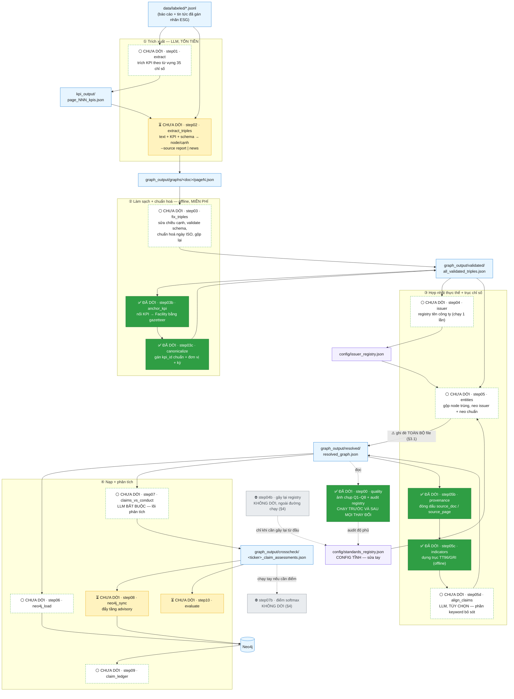
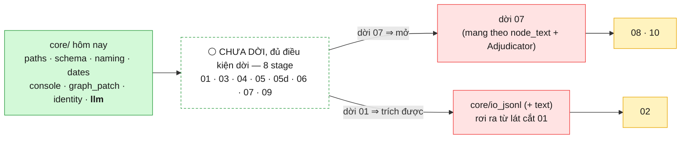
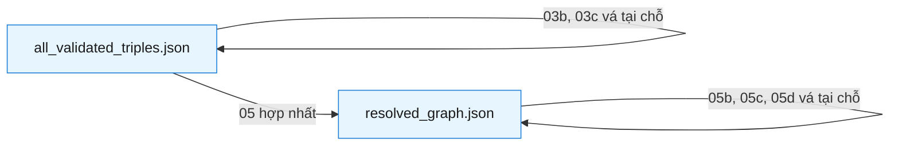
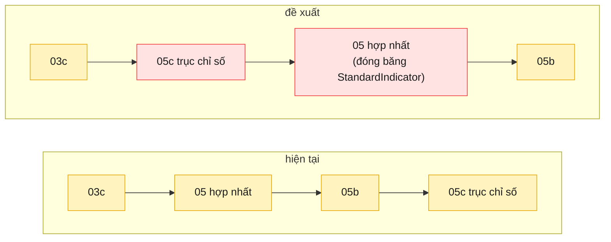

# Pipeline của đợt refactor — `src/` → `src_module/esg_kg/`

Bản đồ **chỉ của stage C** (JSONL đã gán nhãn → đồ thị tri thức thời gian), tức đúng
phần đang được refactor. Không vẽ crawl, phân loại ESG, hay UI — xem `CLAUDE.md` cho
bức tranh toàn hệ thống.

Nguồn sự thật của thứ tự chạy là [`esg_kg/pipeline.py`](esg_kg/pipeline.py); file này
là bản vẽ của cùng dữ liệu đó. `python src_module/run.py --list` luôn nói thật về tiến độ.

**Trạng thái (2026-07-27): 5/16 stage đã dời** — `00 quality`, `03c canonicalize`,
`05c indicators`, `03b anchor_kpi`, `05b provenance`; 2 stage cố ý không dời (§4).
`05b` là stage đầu tiên dời được mà **không phải trích thêm module `core/` nào** — lần dời
`03b` đã lifted sẵn cả 4 symbol nó cần.

**11 stage còn lại VẪN CHẠY BẰNG `src/`**: `01`, `02`, **`03`**, `04`, `05`, `05d`, `06`,
`07`, `08`, `09`, `10`. Chú ý `03` ≠ `03b`/`03c` — hai cái sau đã dời, **`03` thì chưa**
(chưa có `esg_kg/graph/fix_triples.py`). Trong sơ đồ §1, ô viền đứt là **chưa dời**, không
phải đã xong; chỉ ô nền xanh đặc gắn `✅ ĐÃ DỜI` mới là đã refactor.

**`core/llm.py` đã xong (2026-07-27)** — `DEFAULT_RATE_LIMIT` + `RateLimiter` (từ `step02`)
và `_Provider` + `_OpenAIProvider` (từ `step07`), trích **verbatim**, 0 dòng logic đổi.
Nó **không dời stage nào** (vẫn 5/16) nhưng **mở khoá 4 stage cùng lúc**, nên số stage đủ
điều kiện nhảy từ 4 lên **8**: `01`, `03`, `04`, `05`, `05d`, `06`, `07`, `09`. Chỉ còn
**ba** stage thật sự bị chặn: `02` (cần `core/io_jsonl`), `08` và `10` (cả hai chờ `step07`
dời — xem §2.1). Test: `test/test_esg_kg_llm.py`.

---

## 1. Toàn cảnh

**Chú giải màu**

> ⚠️ **Chỉ ô nền xanh ĐẶC, chữ trắng, gắn nhãn `✅ ĐÃ DỜI` mới là đã refactor.**
> Ô viền đứt gắn `⚪ CHƯA DỜI` nghĩa là **vẫn đang chạy bằng `src/`** — nó mới chỉ *đủ điều
> kiện* để dời. Ba stage `03`, `03b`, `03c` nằm cạnh nhau nhưng **khác trạng thái**: `03b`
> và `03c` đã dời, `03` thì chưa. Nghi ngờ thì hỏi `python src_module/run.py --list`, đừng
> đọc màu.

| Nhãn trong ô | Màu | Nghĩa |
|---|---|---|
| `✅ ĐÃ DỜI` | 🟩 xanh **đặc**, chữ trắng | đã dời sang `esg_kg` — chạy bằng `python src_module/run.py <tên>` |
| `⚪ CHƯA DỜI` | ⬜ nền trắng, viền xanh đứt | **vẫn chạy bằng `src/`**; chỉ là mọi symbol nó cần đã có trong `core/` → dời được ngay (§2.1) |
| `⏳ CHƯA DỜI` | 🟨 vàng | vẫn chạy bằng `src/` **và còn bị chặn** — chờ một stage khác dời (§2.1) |
| `⛔` | 🩶 xám | **cố ý không dời** (§4), vẫn còn file trong `src/` |
| — | 🟦 xanh dương | dữ liệu sinh ra (git-ignored, ship qua HF) |
| — | 🟪 tím | config (tracked trong Git) |

---

## 2. Bảng stage: vào gì → ra gì

| # | Tên | LLM? | Input chính | Output chính | Trạng thái |
|---|---|---|---|---|---|
| 00 | `quality` | — | `resolved_graph.json` | `quality/quality_report_<label>.{json,md}` | ✅ **đã dời** |
| 01 | `extract` | 💰 | JSONL đã gán nhãn | `kpi_output/…_kpis.json` | ⚪ **chưa dời** — đủ điều kiện (hub, §2.1) |
| 02 | `extract_triples` | 💰 | JSONL + KPI + `schema.json` | `graphs/<doc>/pageN.json` | ⏳ chờ `core/io_jsonl` |
| 03 | `fix_triples` | 💰 (chỉ pha 2) | các file page | `all_validated_triples.json` | ⚪ **chưa dời** — đủ điều kiện |
| 03b | `anchor_kpi` | — | validated + JSONL | vá tại chỗ + `anchor_patch_stats.json` | ✅ **đã dời** |
| 03c | `canonicalize` | — | validated + `kpi_type_aliases.json` | vá tại chỗ + `kpi_canonical_stats.json` | ✅ **đã dời** |
| 04 | `issuer` | — | validated | `config/issuer_registry.json` | ⚪ **chưa dời** — đủ điều kiện |
| 04b | — | — | ~~resolved~~ | ~~`standards_registry.json`~~ | ⛔ **ngoài đường chạy** |
| 05 | `entities` | 💰 (tùy chọn) | validated + 2 registry | `resolved_graph.json` | ⚪ **chưa dời** — đủ điều kiện ⚠️ §3.1 |
| 05b | `provenance` | — | resolved + các file page | vá tại chỗ | ✅ **đã dời** |
| 05c | `indicators` | — | resolved + `kpi_definitions` + crosswalk + `gri_catalog` | vá tại chỗ | ✅ **đã dời** |
| 05d | `align_claims` | 💰 tùy chọn | resolved | vá tại chỗ | ⚪ **chưa dời** — đủ điều kiện |
| 06 | `neo4j_load` | — | resolved | Neo4j | ⚪ **chưa dời** — đủ điều kiện |
| 07 | `claims_vs_conduct` | 💰 **bắt buộc** | resolved | `<ticker>_claim_assessments.json` | ⚪ **chưa dời** — đủ điều kiện ⚠️ bẫy `node_text` |
| 07b | — | — | dossier | dossier (thêm điểm) | ⛔ **không dời** |
| 08 | `neo4j_sync` | — | dossier | Neo4j (tầng advisory) | ⏳ chờ `07` |
| 09 | `claim_ledger` | — | **chỉ Neo4j** | `<ticker>_claim_ledger.md` | ⚪ **chưa dời** — đủ điều kiện |
| 10 | `evaluate` | 💰 1 nhánh 30 ca | dossier + stats | `<ticker>_evaluation_report.md` | ⏳ chờ `07` |

💰 = tốn tiền. Đây là lý do mọi test đều offline và mọi stage đắt đều có `--dry-run`.

### 2.1 Cái thật sự quyết định thứ tự dời: phụ thuộc **symbol**, không phải thứ tự chạy

Sơ đồ §1 vẽ **dữ liệu chảy đi đâu**. Nó KHÔNG phải thứ tự được phép dời. Luật ở
DESIGN.md là: *một stage chỉ dời được khi **mọi symbol NÓ import** đã nằm trong
`esg_kg.core`* — nên thứ tự dời do đồ thị import quyết định, và đồ thị đó chạy **ngược**
chiều pipeline (stage sau import helper của stage trước).

Bảng dưới là kết quả grep toàn bộ import chéo trong `src/` đối chiếu với `core/` hôm nay
(2026-07-27) — cột cuối là **thứ duy nhất còn thiếu**:

| # | Symbol nó import từ cây `src/` | Còn thiếu gì trong `core/` |
|---|---|---|
| 01 | *(không import stage nào — `REPO_ROOT` là do **nó** định nghĩa, `step01:36`)* | — 🟢 **đủ symbol, nhưng VẪN CHƯA DỜI**. `core/io_jsonl` KHÔNG phải điều kiện của `01`: nó là điều kiện của `02`, và nó **rơi ra từ chính lát cắt `01`** (đúng kiểu `03b` → `core/identity.py`) |
| 02 | 5 helper JSONL của `01` + `REPO_ROOT` | `core/io_jsonl` |
| 03 | `REPO_ROOT`, `RateLimiter` | — 🟢 **đủ symbol, nhưng VẪN CHƯA DỜI** (`core/llm` xong 2026-07-27) |
| 03b | `REPO_ROOT`, `load_schema_sets`, `validate_triple`, `normalize_name` | ✅ **đã dời** (2026-07-27) |
| 04 | `REPO_ROOT` | — 🟢 **đủ symbol, nhưng VẪN CHƯA DỜI** |
| 05 | `date_start_key`, `load_schema_sets`, `normalize_name` (đã ở `core/`) + `RateLimiter` | — 🟢 **đủ symbol, nhưng VẪN CHƯA DỜI** (`core/llm` xong) — nhưng đọc §3.1 trước khi dời |
| 05b | `get_identity_keys`, `PROVENANCE_CLASSES`, `get_stable_entity_id`, `parse_source_id` | ✅ **đã dời** (2026-07-27) — không phải viết thêm `core/` nào |
| 05d | `load_schema_sets`, `GraphPatch`, `temporal_md` (đã ở `core/`) + `_OpenAIProvider`, `RateLimiter` | — 🟢 **đủ symbol, nhưng VẪN CHƯA DỜI** (`core/llm` xong) |
| 06 | `REPO_ROOT`, `load_schema_sets` | — 🟢 **đủ symbol, nhưng VẪN CHƯA DỜI** |
| 07 | `load_schema_sets`, `normalize_name`, `name_tokens` (đã ở `core/`) + `RateLimiter` | — 🟢 **đủ symbol, nhưng VẪN CHƯA DỜI** (`core/llm` xong) — bẫy `node_text` ở dưới |
| 08 | `node_text` (của `step07`) | **chờ `step07` dời** — `node_text` KHÔNG vào `core/llm` (xem cảnh báo dưới) |
| 09 | *(không import stage nào)* | — 🟢 **đủ symbol, nhưng VẪN CHƯA DỜI** |
| 10 | `Adjudicator` (import **lười** trong `try`, `step10:368`) | **chờ `step07` dời** — `Adjudicator` là logic stage, cố ý KHÔNG vào `core/llm`; hỏng thì **im lặng**, không lỗi |

Từ 2026-07-27 **không còn module `core/` nào là điều kiện chặn**: cả ba stage còn lại đều
chờ một *stage khác* dời, không chờ kernel. `02` chờ `core/io_jsonl` — nhưng module đó rơi
ra từ lát cắt `01`, và `01` thì đã đủ điều kiện.

**Đọc ra được ba điều, cả ba đều đổi thứ tự làm:**

1. **Kernel đã hết đường chặn.** Sau `core/llm.py` (2026-07-27) có **8/11** stage chưa dời
   đủ điều kiện: `01`, `03`, `04`, `05`, `05d`, `06`, `07`, `09`. Việc còn lại không phải
   "viết thêm `core/`" nữa mà là **chọn stage nào dời trước**, và tiêu chí bây giờ là
   *arm tương đương mạnh tới đâu*, không còn là *symbol đã sẵn chưa*:
   - **`03` — mạnh nhất.** Pha 1 (sửa chiều cạnh + validate) và pha 1.5 (chuẩn hoá ngày
     ISO) đều **offline**, chỉ pha 2 mới gọi LLM; và `test/test_temporal_invariants.py`
     đã phủ sẵn đúng phần offline đó. Chạy được trên corpus thật, miễn phí.
   - **`05d` — nhỏ nhất.** Đúng cái vừa được `core/llm` mở khoá, lại có `--dry-run`.
   - `06`/`09` đọc Neo4j; `01`/`07` là stage trả tiền; `04` thuộc lô hub làm cuối; `05`
     **không được dời nếu chưa xử §3.1** (nó ghi đè cả ba bản vá).
2. **~~`core/llm.py` là đòn bẩy lớn nhất~~ → ĐÃ XONG (2026-07-27).** Đúng như dự đoán: nó
   mở khoá 4 stage cùng lúc (`03`, `05`, `07`, `05d`). Lát cắt gồm `DEFAULT_RATE_LIMIT` +
   `RateLimiter` (từ `step02`) và `_Provider` + `_OpenAIProvider` (từ `step07`) — bốn symbol
   **buộc phải đi cùng nhau** vì `_OpenAIProvider.__init__` *khởi tạo* một `RateLimiter`,
   tức `step07` đang với UP sang `step02` để lấy tiện ích. `Adjudicator` **cố ý ở lại**
   `step07` (là logic stage: prompt + parse verdict + cascade), nên `08`/`10` **vẫn chưa**
   được mở — chúng chờ chính `step07` dời, chứ không chờ kernel.
3. **`01` là hub cuối cùng còn lại — nhưng nó KHÔNG bị chặn.** Nó không import ai, nên
   theo đúng luật thì dời được ngay; thứ xếp nó xuống cuối là **thứ tự hub-làm-cuối** của
   DESIGN.md §4 chứ không phải một module `core/` còn thiếu. Chiều phụ thuộc là chiều
   ngược lại: `02` cần 5 helper JSONL **của nó** (`build_page_text`,
   `load_pages_from_jsonl`, `page_has_esg`, `select_documents`,
   `parse_company_year_from_filename`) → nên `core/io_jsonl` không phải việc phải làm
   *trước* `01`, mà là thứ **rơi ra từ lát cắt `01`**, y như `core/identity.py` rơi ra từ
   lát cắt `03b`. Điểm hay: cả 5 helper đó đều **thuần và offline**, nên riêng phần
   `core/io_jsonl` có arm tương đương mạnh chạy trên corpus thật, dù bản thân stage `01`
   là stage trả tiền.

⚠️ **Cái bẫy — nay là bẫy của lần dời `step07`, không phải của `core/llm`:** có **hai** hàm
tên `node_text` và chúng **không** trùng nhau — `step05d:63` nhận *dict thuộc tính*,
`step07:133` nhận *node* rồi rẽ theo class. Gộp chung là **âm thầm viết lại prompt LLM đã
trả tiền của `step07`**. Giữ hai tên khác nhau. (DESIGN.md ghi đây là lỗi trong chính nó,
chưa gấp lại.) `core/llm.py` **cố ý không đụng** vào `node_text` — đó là lý do `08` (chỉ
import đúng `node_text`) vẫn nằm trong nhóm chờ.

✅ **Lát cắt `core/llm` đã tránh được bẫy tương tự.** Thứ nó bảo vệ là **hình dạng request
đã trả tiền**: `temperature=0` và `response_format={"type": "json_object"}` không phải
chuyện style — adjudicator parse phản hồi thành JSON và cả pipeline giả định tính tất định.
Bỏ một trong hai thì lúc chạy **vẫn "chạy được"** nhưng mọi verdict đổi âm thầm.
`test/test_esg_kg_llm.py` ghim nguyên hình dạng request bằng một client giả (kèm thứ tự
`wait_if_needed` → `create`), nên bắt được hồi quy đó mà **không tốn một xu**.

---

## 3. Ba khối lặp lại trên vòng đời một node

Cái làm pipeline trông rối là **vá tại chỗ**: nhiều stage đọc và ghi *cùng một file*.
Ba khối dưới đây giải thích vì sao.

- **Trước hợp nhất** (`all_validated_triples.json`): node còn trùng lặp, mỗi lần nhắc
  một node. 03b/03c làm giàu **từng node** — không cần biết node nào là node nào.
- **Sau hợp nhất** (`resolved_graph.json`): mỗi thực thể một node. 05b/05c/05d cần
  điều đó, hoặc cần vị trí node ổn định.
- **Đóng băng vị trí**: step06 khoá Neo4j theo *chỉ số mảng* và dossier step07 trỏ node
  theo *vị trí* — nên 05c bắt buộc **chỉ được nối thêm vào cuối**, không sắp xếp lại.

**Hệ quả cho MỌI test của stage vá tại chỗ** (đã dính hai lần, nên ghi ra thành luật):
file trên đĩa **đã bị chính stage đó vá rồi**. Nhưng hậu quả thì tuỳ stage, và phải hỏi
đúng **một** câu để biết là hậu quả nào:

> Gặp lại phần nó tự sinh, stage **bỏ qua** (`continue`) hay **tính lại từ đầu**?

| Stage | Tàn dư của chính nó trong file | Gặp lại thì làm gì | Cách dựng lại input trước khi vá |
|---|---|---|---|
| `05c` | 67 `StandardIndicator` + 4 nhãn cạnh trục | **bỏ qua** ⇒ arm rỗng | `strip_axis()` — xoá node + cạnh trục, remap chỉ số mảng |
| `03b` | **95/306** cạnh `observedAtFacility` có `anchor_method=offline_gazetteer` | **bỏ qua** ⇒ arm rỗng | `strip_anchors()` — xoá đúng 95 cái đó, **giữ 211 cạnh do extraction sinh** |
| `05b` | **6 258/10 425** node có `source_doc`/`source_page` | **tính lại** ⇒ arm KHÔNG rỗng | `strip_provenance()` — xoá 4 tier, **giữ node `provenance_method=extraction`** |

**Luật 1 — strip đúng phần stage tự sinh, không strip theo nhãn/tên key.** 211 cạnh
`observedAtFacility` kia có từ trước, xoá nhầm là đo sai; với `05b` cũng vậy, node đóng dấu
`extraction` là output của `step02` chứ không phải của `05b`, phải giữ nguyên.

**Luật 2 — "vá tại chỗ" KHÔNG tự động nghĩa là "arm sẽ rỗng".** `05b` chỉ `continue` đúng
một trường hợp (`provenance_method == "extraction"`, hiện **0 node** trong đồ thị thật);
mọi node còn lại nó khớp lại và đóng dấu lại từ đầu. Nên arm chạy trên file sống vẫn so
**6 258 dấu** thật ở cả hai cây — không cần strip để cứu. Đừng suy diễn từ `05c`/`03b` sang
mọi stage vá tại chỗ: kiểm cái `continue` trước.

**Vậy strip để làm gì với `05b`?** Để chứng minh một tính chất *mạnh hơn* mà hai stage kia
không có: **stage không bao giờ ĐỌC output của chính nó.** Không key nào nó ghi
(`source_doc`, `source_page`, `provenance_method`, `source_pages`, 3 field tin tức) nằm
trong `identity_keys` của bất kỳ lớp nào thuộc `PROVENANCE_CLASSES` — đã đối chiếu với
`config/schema.json` — nên `get_stable_entity_id` (tier 3) không thể nhìn thấy chúng, và
strip xong dựng lại **phải ra y hệt**. Nếu một sửa đổi tương lai làm một key đóng dấu quay
vào vòng khớp, đồ thị sẽ **trôi dần sau mỗi lần chạy lại** mà không có dấu hiệu nào khác —
arm này là thứ duy nhất bắt được.

Và kết quả rỗng đừng vứt đi: với `03b` nó được giữ lại thành arm **idempotency** (chạy lại
không nhân bản anchor), vì CLAUDE.md bảo chạy `03b` trước `05` trên corpus vốn đã vá — nên
đó mới là tính chất thật sự đang được dựa vào. Guard chống rỗng của arm đó **ngược lại**:
nó khẳng định input *đã* được vá.

**Nhánh sống mà dữ liệu thật không bao giờ chạm** thì phải có fixture tổng hợp, cả ba stage
đều đã cần: `05c` nhánh `Penalty` phạt tiền, `03b` guard hub `cap=1`, `05b` nhánh bỏ qua
`provenance_method="extraction"` (0 node hôm nay — nó tồn tại cho output `step02` *sau* lần
trích lại đã lên lịch ở DESIGN.md §5.4).

### 3.1 Chuỗi vá `05 → 05b → 05c` là BẮT BUỘC nhưng KHÔNG có gì bảo vệ

Chỉ tồn tại **một** file `graph_output/resolved/resolved_graph.json`. `05b`/`05c`/`05d`
đều ghi ngược lại đúng đường dẫn đó, còn `step05:655` ghi đè **toàn bộ** — không merge,
không cảnh báo. **Chạy lại `step05` là xoá sạch cả ba bản vá**, và không có dấu hiệu nào
báo điều đó đã xảy ra:

| Chỗ | Bảo vệ hiện có | Hậu quả khi thiếu bản vá |
|---|---|---|
| `step05:655` | **không có** | ghi đè, mất `provenance_method` + trục chỉ số + align |
| `step06:365` | chỉ `logger.warning` | vẫn nạp Neo4j, đồ thị thiếu `StandardIndicator` |
| `step07:703` | **không có** (chỉ kiểm file tồn tại) | index trục chỉ số rỗng ⇒ retrieval tier-1 đóng góp **0**, tụt về token overlap. Không lỗi, không cảnh báo; dấu vết duy nhất là `indicator_tier_pairs: 0` trong file stats |

Thứ đang giữ chuỗi này chạy đúng chỉ là ba dòng log cuối stage (đều nói *"Next: step06
--clear"*) — **hợp đồng bằng trí nhớ**. Khi `step05` được dời, bản `esg_kg` **không được**
mang khiếm khuyết này sang; ba phương án đang cân + ràng buộc: DESIGN.md §5.5.

---

## 4. Hai stage cố ý KHÔNG dời

Không phải "chưa làm" — là **quyết định**. `run.py --list` in `(not ported)` và loại
khỏi mẫu số; nếu tính vào thì tiến độ migrate vĩnh viễn không thể đạt 100%.
Cả hai **vẫn còn file trong `src/`**.

| Stage | Vì sao loại | Chi tiết |
|---|---|---|
| **04b** `build_standards_registry` | Nó đọc `resolved_graph.json` = **output của step05**, trong khi step05 đọc registry là output của nó → **vòng lặp**, bare clone không chạy được. Và lần quét đồ thị đóng góp **0**: cả 10 alias đều là seed hard-code. → registry thành **config tĩnh**, phần quét thành **audit trong step00**. | DESIGN.md §4.2 |
| **07b** `enrich_dossiers` | Bề mặt giao (`frontend/` + `api/`) **không đọc** điểm softmax; cả step08 lẫn step09 đều chịu được khi thiếu. Muốn có điểm thì chạy tay. | DESIGN.md §4.1 |

---

## 5. Đề xuất đang cân nhắc — CHƯA LÀM

> ⚠️ Phần này mô tả **thay đổi được đề xuất**, không phải hiện trạng. Đừng đọc như tài liệu code đang chạy.

Chuyển **05c lên trước 05**, để trục chỉ số thành một phần của việc *dựng* đồ thị thay vì
bản vá dán lên sau:

**Vì sao**: gần như toàn bộ cạnh của 05c **không cần đồ thị đã hợp nhất** — `measuredUnder`
đọc `kpi_id` từng node, `equivalentTo` thuần config, `alignsWithIndicator` khớp text từng
node. Chỉ mỗi việc chọn *đích* của `partOf` là cần. Chuyển lên sớm thì riêng `05c`
**bỏ được cơ chế APPEND-ONLY** (`GraphPatch.assert_append_only`).

⚠️ **Sửa 2026-07-27:** bản trước viết cơ chế này "đang chặn việc dời `step05d`" — không còn
đúng, và chỗ sai đổi hẳn sức nặng của đề xuất. `GraphPatch` nay ở `core/graph_patch.py`, nên
`05d` không còn vướng ở đây; nó vướng `core/llm.py` (`step05d:35` import
`_OpenAIProvider`/`RateLimiter` từ `step07`). Quan trọng hơn: **`05d` vẫn vá
`resolved_graph.json` tại chỗ sau `step05`**, nên append-only sống tiếp dù đề xuất này có
được làm hay không. Đó là lý lẽ *ủng hộ* việc `GraphPatch` lên `core/`, không phải lý lẽ
chống lại — và đề xuất này giờ chỉ còn hứa được phần gọn của `05c`, không còn hứa xoá được
một cơ chế.

**Rủi ro phải xử lý**: 67 node `StandardIndicator` sẽ đi qua Stage B/C của step05.
`identity_keys=['id']` nên Stage A an toàn, nhưng embedding rất dễ gộp nhầm
`TT96-6.3.1 Tiêu thụ năng lượng` với `TT96-6.3.2 Tiết kiệm năng lượng` → phải **đóng băng**
`StandardIndicator` y như neo issuer và neo chuẩn.

**Cách kiểm**: đối chiếu với **bản dựng sạch**, KHÔNG phải với file đang nằm trên đĩa —
xem cảnh báo ngay dưới bảng. Mốc đo lại ngày 2026-07-27 trên đồ thị 10 425 node /
14 402 cạnh (snapshot HF `09cfe062`), cột "dựng sạch" là kết quả chạy `05c` trên chính
đồ thị đó sau khi **strip trục chỉ số**:

| | Trong file | Dựng sạch hôm nay |
|---|---|---|
| `StandardIndicator` | **67** (Môi trường 31 · Xã hội 22 · Quản trị 14) | **67** ✅ |
| `measuredUnder` | **641** | **641** ✅ |
| `equivalentTo` | **26** | **26** ✅ |
| `partOf` **của trục** | **55** | **55** ✅ |
| `alignsWithIndicator` | **639** | **624** ⚠️ |
| *tổng cạnh trục* | *1 361* | *1 346* |

⚠️ **Hai cái bẫy trong bảng này, cả hai đều từng làm bản trước sai:**

1. **`partOf` trong đồ thị là 102, nhưng chỉ 55 thuộc trục chỉ số.** 47 cạnh còn lại là
   `Facility --partOf--> Organization` do extraction sinh, không liên quan gì tới `05c`.
   Đừng lấy 102 làm mốc. (`strip_axis()` trong test cũng xoá luôn 47 cạnh này vì nó lọc
   theo *nhãn* cạnh — chấp nhận được với vai trò fixture, nhưng khiến `edges_added` của
   arm nhỏ hơn tổng cạnh trục thật.)
2. **File hiện tại KHÔNG dựng lại được bằng code hôm nay.** Nó thừa **15 cạnh
   `alignsWithIndicator`** (11 cặp phân biệt, dồn vào `TT96-6.7.2` và `SSCIFC-S6` — các
   node `Initiative`/`Goal` kiểu "Quỹ từ thiện", "Charity Fund"). Đây là **tàn dư của luật
   khớp cũ**: `match_keyword` nay là *"phrase dài nhất thắng"*, còn `05c` thì
   **APPEND-ONLY** — nó chỉ nối thêm, **không bao giờ gỡ**. Nên mỗi lần đổi hành vi khớp,
   file chỉ phình ra, cạnh cũ ở lại vĩnh viễn. Chiều lệch luôn là một phía: bản dựng sạch
   là **tập con thật sự** của file (rebuild-only = 0).

Hệ quả cho đề xuất này: tiêu chí nghiệm thu là **so hai bản dựng sạch với nhau**
(trước/sau khi đổi thứ tự), chứ không phải khớp lại con số trong file — nếu lấy file làm
mốc thì sẽ thấy "hụt 15 cạnh" và tưởng là hồi quy do mình gây ra. Đây cũng chính là một
lý do nữa cho lần trích lại đã lên lịch ở DESIGN.md §5.4: chỉ lần đó mới dọn được tàn dư.

Chụp `step00 --label before/after` để đối chiếu. *(Bản trước ghi 749 cạnh / 73
`alignsWithIndicator` / 35 chỉ số — số của thời trục chỉ số còn là no-op, trước khi
`config/standard_crosswalk.json` được duyệt và `config/gri_catalog.json` xuất hiện.)*

---

## 6. Đọc tiếp

| Cần gì | Đọc file nào |
|---|---|
| Luật refactor (Model A, TDD, vá ở stage sớm nhất) | [`esg_kg/DESIGN.md`](esg_kg/DESIGN.md) §4–§5 |
| Ba phương án cho việc `step05` không được ghi đè (§3.1) | DESIGN.md §5.5 |
| Vì sao corpus AAA sẽ được trích lại và điều đó đổi những gì | DESIGN.md §5.4 |
| Thứ tự chạy dạng dữ liệu (nguồn sự thật) | [`esg_kg/pipeline.py`](esg_kg/pipeline.py) |
| Cách chạy + trạng thái từng phần | [`README.md`](README.md) |
| Chi tiết từng stage, cờ dòng lệnh | `CLAUDE.md` mục "Pipeline architecture" |
