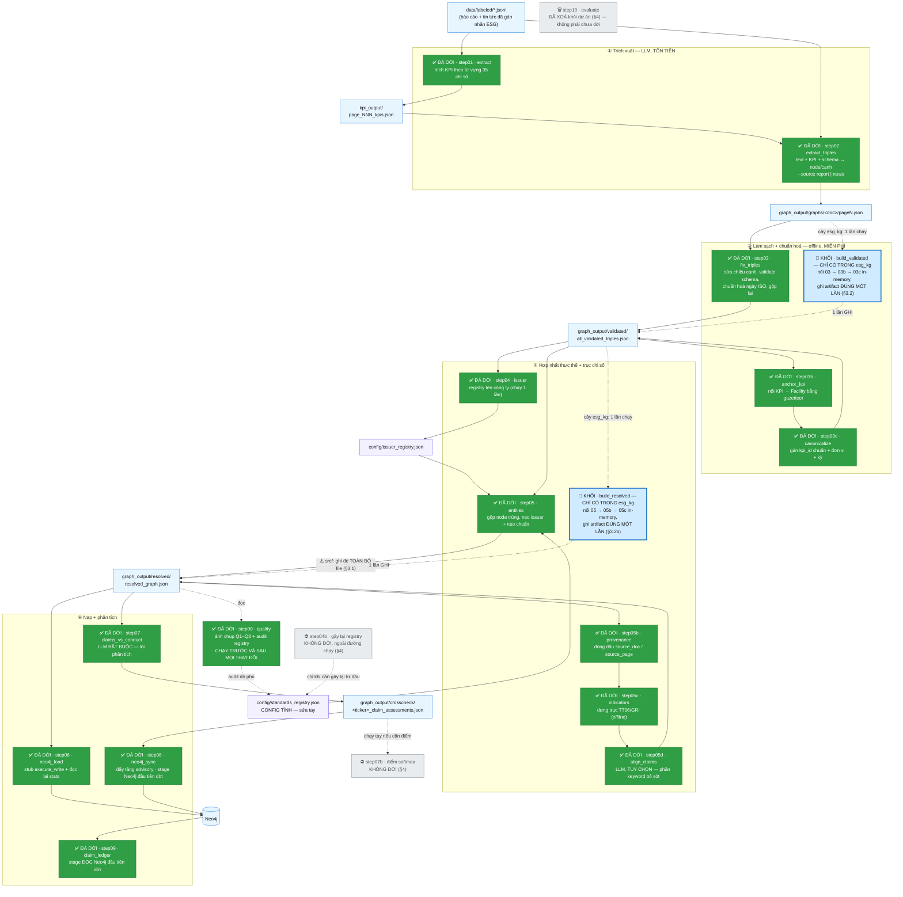
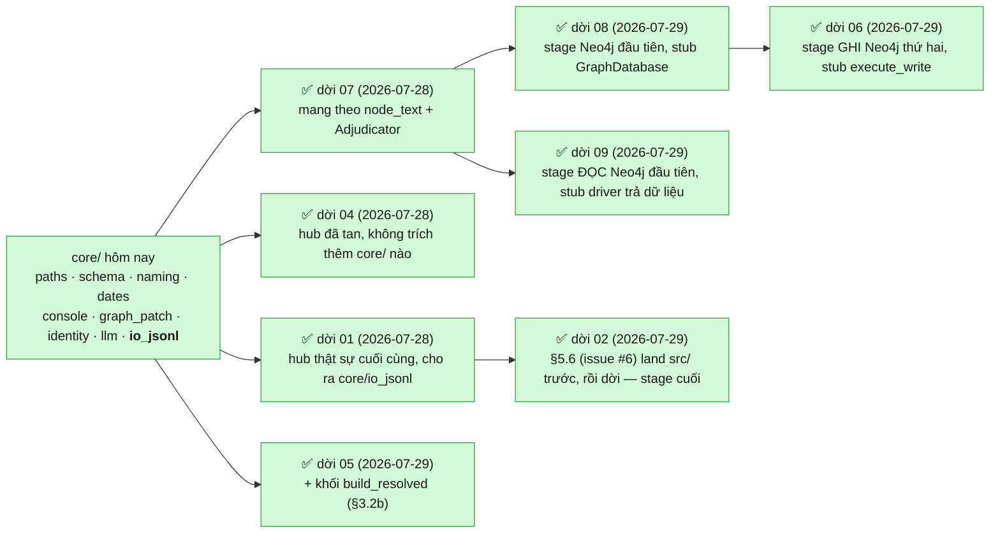
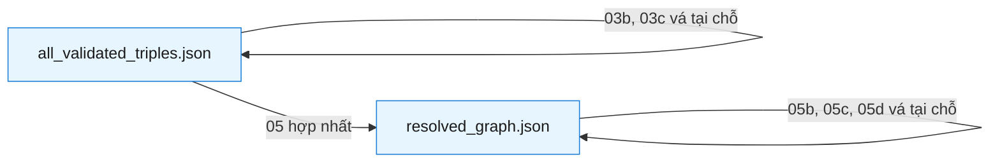
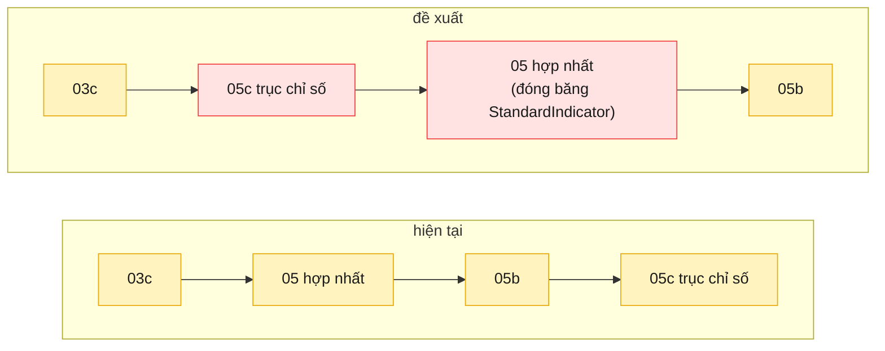

# Pipeline của đợt refactor — `src/` → `src_module/esg_kg/`

Bản đồ **chỉ của stage C** (JSONL đã gán nhãn → đồ thị tri thức thời gian), tức đúng
phần đang được refactor. Không vẽ crawl, phân loại ESG, hay UI — xem `CLAUDE.md` cho
bức tranh toàn hệ thống.

Nguồn sự thật của thứ tự chạy là [`esg_kg/pipeline.py`](esg_kg/pipeline.py); file này
là bản vẽ của cùng dữ liệu đó. `python src_module/run.py --list` luôn nói thật về tiến độ.

**Trạng thái (2026-07-29): 15/15 stage đã dời — ĐỢT REFACTOR HOÀN TẤT** — `00 quality`,
`01 extract`, `02 extract_triples`, `03 fix_triples`, `03b anchor_kpi`, `03c canonicalize`,
`04 issuer`, `05 entities`, `05b provenance`, `05c indicators`, `05d align_claims`,
`06 neo4j_load`, `07 claims_vs_conduct`, `08 neo4j_sync`, `09 claim_ledger`; 2 stage cố ý
không dời (§4). Cùng ngày (05), dời kèm một KHỐI thứ hai: `build_resolved` =
`05 → 05b → 05c` (`esg_kg/resolve/build_resolved.py`, DESIGN.md §5.7), đúng khuôn
`build_validated` đã làm cho cụm 03 — xem đoạn "**`05` là stage thứ mười bốn**" bên dưới
và §3.2b. `02` — dời cùng ngày, xem đoạn "**`02` là stage thứ mười lăm**" — là stage
`src/` cuối cùng, khép lại đợt refactor: không còn stage nào ở `src/` mà đủ điều kiện và
chưa dời.
Mẫu số đổi từ 16 xuống 15 cùng ngày vì **`step10` bị xoá hẳn khỏi dự án** (không phải hoãn
dời — quyết định 2026-07-28, xem §4 và `esg_kg/DESIGN.md` §4.3): người dùng chốt bỏ hẳn kiểu
đo P6 (coverage/case-study/ablation không có ground truth) khỏi danh sách sản phẩm giao, không
phải vì có cơ chế khác thay thế. Khác `04b`/`07b` (vẫn còn file `src/`, chỉ loại khỏi phạm vi
refactor), `step10` không còn dòng nào trong `pipeline.py::STAGES` và không còn
`src/step10_evaluate.py` — không có gì để mà "dời" nữa.

**`05` là stage thứ mười bốn** (`esg_kg/resolve/entities.py`, 2026-07-29) và stage cuối
cùng còn lại từng bị coi là "khó dời" trong cả đợt — không phải vì thiếu symbol (đúng
luật §2.1: mọi thứ nó import — `REPO_ROOT`/`load_env`, `RateLimiter`, `date_start_key`,
`normalize_name` — đã ở `core/` từ trước, một dead import `load_schema_sets` bị bỏ, cùng
hình dạng "rác" đã thấy ở `05d`/`07`), mà vì nó ngồi giữa chuỗi vá `05 → 05b → 05c` mà
§3.1 mô tả: `step05:655` ghi đè TOÀN BỘ `resolved_graph.json`, xoá sạch bản vá của 05b/05c
nếu chạy lại một mình. §5.7 đã chốt phương án khối từ 2026-07-28 (đọc "Áp cho cụm 05"
trong DESIGN.md §5.7); lượt dời này là lúc phương án đó THÀNH CODE, không còn là quyết
định trên giấy. Hai điều khác mọi lần dời stage trước:
- **`resolve()` được tách làm hai NGAY LÚC DỜI**, không phải như một việc làm thêm sau khi
  khối đã tồn tại (khác `fix_triples`/`run_phases`, tách sau khi khối 03 đã quyết định
  cần nó): `resolve_graph(triples, idkeys, ...) -> (resolved, stats)` là hàm thuần, không
  I/O, không tự dựng client — để khối gọi thẳng nó và nối luôn với 05b/05c trong bộ nhớ;
  `main()` giữ nguyên hành vi CLI/ghi file của bản `src/` cho `run.py entities` chạy lẻ.
- **Cache pha trả tiền CHỈ áp cho Stage C** (`llm_same_entity`, gemini-2.5-flash), không
  áp cho Stage B (`gemini-embedding-001`). Đây là quyết định phạm vi, không phải thiếu
  sót: Stage C là bản sao đúng nghĩa của pha 2 khối 03 (LLM, không tất định, tốn tiền);
  Stage B tốn tiền nhưng tất định theo phiên bản model, và theo CLAUDE.md pipeline hôm
  nay (và tương lai đã ghi) chạy bằng `--no-llm` nên Stage B/C **không hề chạy trong
  pipeline sống** — viết cache cho Stage B lúc này là làm việc đầu cơ cho một nhánh đang
  ngủ đông. `AdjudicationCache` (trong `build_resolved.py`, khoá theo nội dung cặp node,
  giống hệt `RepairCache` của khối 03) chỉ bọc quanh Stage C; Stage B để lại một dòng
  TODO nếu sau này billing được mở lại và Stage B quay lại dùng thường xuyên.
- **`indicators.py` (05c) được sửa THÊM một lần nữa**, cùng khuôn `fix_triples`/
  `run_phases`: thân `run()` cũ được tách thành `link_indicator_axis(graph, defs,
  crosswalk, catalog, ...)` — hàm thuần, không đọc/ghi file — rồi `run()` chỉ còn
  argparse + I/O + gọi hàm đó. Trích nguyên văn, **0 dòng logic đổi**: `test/
  test_indicator_axis.py` (15 nhóm) và phần indicator-axis trong `test_esg_kg_
  equivalence.py` xanh không cần sửa gì, và `run.py indicators --dry-run` in ra hệt như
  trước. `esg_kg/resolve/provenance.py` (05b) thì KHÔNG cần sửa gì — `stamp_graph()` đã
  là hàm thuần từ lúc dời (2026-07-27), khối gọi thẳng.
Kết quả kiểm: arm oracle chạy chuỗi thật `src/` `step05(--no-llm) → step05b → step05c`
trên corpus thật (14 677 triple đã validate) và so với khối — **10 425 node / 14 387
cạnh giống hệt tuyệt đối**, cộng arm "ghi đúng 1 lần" (chuỗi `src/` ghi 3 lần, khối ghi 1
lần) và arm cache (chạy khối 2 lần với client giả trên fixture VN/EN đồng nghĩa quen
thuộc — lần hai gọi `generate_content` **0 lần**, artifact giống hệt lần một). Nhánh trả
tiền (Stage B/C) được kiểm bằng đúng kỹ thuật đã dùng cho `03`/`05d`/`07`/`01`: stub tiêm
thẳng lên `google.genai.Client` (không có `_Provider` đứng trước Gemini, y hệt `01`), trả
lời tất định theo CRC. Test: `test/test_esg_kg_entities.py` (7 nhóm) +
`test/test_esg_kg_resolve_block.py` (5 nhóm, gồm cả arm khói cho `05d` chạy trên output
của khối để chắc nó vẫn nhận input đúng hình dạng). Chi tiết đầy đủ: §3.2b.
`05b` là stage đầu tiên dời được mà **không phải trích thêm module `core/` nào** — lần dời
`03b` đã lifted sẵn cả 4 symbol nó cần. `03` là stage thứ hai, `05d` là stage thứ ba —
lát cắt `05c` đã đẩy `GraphPatch`/`temporal_md` lên kernel *chính vì* `05d` đang import
chúng từ một stage, nên tới lượt nó thì không còn gì phải trích. **`07` là stage thứ
tám** (2026-07-28) và đòn bẩy lớn nhất trong cả đợt: nó là stage DUY NHẤT còn chặn ai đó
(`08` chờ `node_text`, `10` chờ `Adjudicator`) — dời nó là mở khoá cả hai cùng lúc. Nó
cũng là lượt import NGƯỢC đầu tiên: `_Provider`/`_OpenAIProvider` giờ lấy từ `core.llm`,
đúng hai lớp mà kernel đó đã trích TỪ CHÍNH file `step07` một ngày trước.

**`04` là stage thứ chín** (2026-07-28), dời cùng ngày với `07`. Nó *trông* như hub —
6 stage `src/` import `step04` — nhưng đúng luật kiểm bằng CHIỀU import (bài học của
`03`/`05` bên dưới): cả ba symbol chúng lấy (`normalize_name`, `name_tokens`,
`merge_preserving_edits`) đã ở `core/naming.py` từ trước, còn bản thân `step04` chỉ
import `REPO_ROOT`. Hub đã tan, dời được ngay như một leaf. AST-diff xác nhận: **11 hàm
chung, 0 hàm khác một byte**; `main()` chỉ đổi đúng một dòng thông báo lỗi (trỏ sang
`build_validated` thay vì `step03_fix_invalid_triplets.py`, vì §3.2 đã đổi tên bước tạo
input của nó); 3 hàm bị xoá đúng là 3 hàm giờ import từ `core/naming`. Điểm khác các lần
trước: `04` hoàn toàn offline (không LLM, không Neo4j) NHƯNG ghi
`config/issuer_registry.json` — một file **tracked trong Git và có sửa tay của người**
(chính là lý do `merge_preserving_edits` tồn tại). Mọi arm gọi `build()` phải ghi ra
workspace tạm, không bao giờ đọc/ghi bản thật; test có hẳn một arm riêng khẳng định điều
đó (`test_build_never_touches_the_real_tracked_registry`) cộng một arm mô phỏng người
di chuyển một mục `needs_review` sang `exclusions` rồi chạy lại — đúng kịch bản thật mà
`merge_preserving_edits` được viết ra để phục vụ. Test: `test/test_esg_kg_issuer.py`
(12 nhóm).

Một commit riêng theo sau, cùng khuôn `a308608`/`95360c2`: `build()` từng có một nhánh
`if isinstance(data, dict) and "nodes" in data and "edges" in data: …` sniff hai định
dạng — DESIGN.md §5.2 đã ghi sẵn từ 2026-07-25 đây là **code chết**, vì nguồn ghi input
DUY NHẤT của `04` (`step03`/`build_validated`) luôn xuất `List[Dict]`, và `step05` đọc
đúng file đó mà không sniff gì cả — cùng lịch hẹn "xoá khi dời step04, đọc theo đúng một
hợp đồng". Xoá **trong CẢ HAI cây** cùng một lúc, red-first: viết test trước, thấy cả hai
cây đều "im lặng chấp nhận" một input dạng `{nodes,edges}` (hành vi SAI đang tồn tại ở cả
hai, không phải một cây lệch cây kia), rồi xoá nhánh, thấy cả hai chuyển sang từ chối bằng
`AttributeError` — đúng như DESIGN.md muốn: một hợp đồng, sai thì báo lỗi rõ chứ không âm
thầm "hiểu nhầm" dữ liệu.

**`01` là stage thứ mười** (2026-07-28), và stage HUB THẬT SỰ CUỐI CÙNG (PIPELINE.md
§2.1 điểm 3 đã dự đoán đúng: sau `03`/`04` tan thành leaf, `01` là hub duy nhất còn lại,
vì nó là stage duy nhất còn bị import phần *stage-local* — không phải phần đã lên
kernel). Nó không dùng `_Provider`/`_OpenAIProvider` (không có Gemini provider để trích —
`core/llm.py` đã ghi rõ dự án đứng sau `GEMINI_API_KEY` bị 403 vĩnh viễn), nên
`KPIExtractor`, prompt, JSON schema và `normalize_kpi_response` ở lại stage nguyên vẹn;
chỉ 5 helper JSONL thuần (`load_pages_from_jsonl`, `build_page_text`, `page_has_esg`,
`select_documents`, `parse_company_year_from_filename`) dời sang **`core/io_jsonl.py`
(module `core/` mới)** — đúng 5 symbol mà `step02:43-50` đang import từ nó, nên
`core/io_jsonl` là điều kiện `02` đang chờ, không phải điều kiện đứng trước `01`.
Nhánh trả tiền được kiểm bằng stub tiêm thẳng lên `google.genai.Client` (không có
`_Provider` để đứng trước, nên stub thế chỗ chính `Client`), trả lời tất định theo CRC
của prompt — cùng kỹ thuật đã dùng cho `03`/`05d`/`07`, áp lần thứ tư. Arm mạnh nhất
chạy `load_pages_from_jsonl` + `build_page_text`/`page_has_esg` trên corpus thật
(13 tài liệu / 1 356 trang) và `process_document` trên fixture tổng hợp qua cả hai cây,
gồm cả tính idempotency ("output đã tồn tại" phải bỏ qua, không gọi lại client). Test:
`test/test_esg_kg_extract.py` (10 nhóm).

**`08` là stage thứ mười một** (`esg_kg/load/neo4j_sync.py`, 2026-07-29) — leaf ngay từ
đầu (chỉ import `REPO_ROOT`, do chính nó định nghĩa, và `node_text` của `step07`, dời hôm
trước), nhưng là **stage NEO4J đầu tiên** dời trong cả đợt. Mọi lát cắt trả tiền trước đó
che được nhánh mạng bằng cách tiêm stub NGAY DƯỚI lớp `_Provider`/`google.genai.Client` —
`08` không có lớp trung gian nào kiểu vậy trước driver Neo4j thật (`from neo4j import
GraphDatabase`, import cục bộ bên trong `run()`, chỉ chạy sau `--dry-run`), nên stub thế
chỗ thẳng thuộc tính `GraphDatabase` của package `neo4j` đã cài — đúng kỹ thuật đã dùng cho
`google.genai.Client` ở lát cắt `01` khi không có `_Provider` để đứng trước. Driver giả chỉ
GHI LẠI mọi câu Cypher + tham số, không thực thi gì, nên arm so **5 lệnh Neo4j giống hệt
byte-for-byte giữa hai cây** trên corpus thật (1 093 dossier / đồ thị 10 425 node), không
cần Neo4j sống, không cần mock phức tạp — vì mọi câu Cypher là f-string tĩnh và mọi tham số
là hàm thuần của dossier + đồ thị (không có trường non-deterministic kiểu `recorded_at` của
`07`, nên không cần mask gì). Diff thân hàm so `src/`: đúng import block (`REPO_ROOT` +
`node_text` từ `core`/`crosscheck`) và 2 dòng comment/log trỏ sang `run.py`/`esg_kg.load.
neo4j_load` thay vì tên file `src/` cũ — 0 dòng logic đổi. Bẫy `node_text` (đã ghi ở §2.1)
được giữ đúng lần thứ ba: `esg_kg.load.neo4j_sync.node_text is esg_kg.crosscheck.
claims_vs_conduct.node_text`, pin bằng test. Test: `test/test_esg_kg_neo4j_sync.py` (8
nhóm, gồm cả arm `--clear-advisory`, arm graph thiếu (positional-only fallback), và arm
thoát `sys.exit(1)` khi thiếu dossier).

**`06` và `09` là stage thứ mười hai và mười ba** (`esg_kg/load/neo4j_load.py` +
`esg_kg/report/claim_ledger.py`, cùng ngày 2026-07-29, ngay sau `08`) — cả hai đã được xác
nhận leaf từ trước qua bảng symbol ở §2.1 (`06` chỉ cần `REPO_ROOT` + `load_schema_sets`,
cả hai đã ở `core/`; `09` không import stage nào cả), nên không có gì phải trích thêm vào
`core/`. Điểm mới của cặp này nằm ở CÁCH kiểm nhánh Neo4j, không phải ở symbol:

- **`06` là stage GHI Neo4j thứ hai**, nhưng client surface rộng hơn `08` — `ingest_nodes` /
  `ingest_data_edges` / `ingest_supersedes` đều đi qua `session.execute_write(lambda tx:
  tx.run(cypher, rows=...).consume())` thay vì `session.run()` trần, và `print_graph_stats`
  còn ĐỌC LẠI (`.single()`, duyệt lặp). Stub `neo4j.GraphDatabase` của `08` không đủ; fake
  session/tx ở đây phải đỡ được cả hai hình dạng gọi lẫn hình dạng đọc, nhưng vẫn chỉ GHI
  LẠI `(cypher, params)` chứ không thực thi gì — cùng nguyên lý, chỉ rộng hơn. Arm mạnh nhất:
  `build_payload()` thuần hàm trên corpus thật (10 425 node / 14 402 cạnh, khớp cả `counts`
  lẫn nội dung `nodes_by_label`/`edges_by_pred`/`supersedes_edges`) cộng một arm ingestion
  qua stub so **76 lệnh Neo4j giống hệt byte-for-byte** giữa hai cây trên cùng corpus đó.
  Test: `test/test_esg_kg_neo4j_load.py` (5 nhóm, gồm `--clear` và `--dry-run`).
- **`09` là stage ĐỌC Neo4j ĐẦU TIÊN dời** — khác hẳn `06`/`08` vốn chỉ ghi. `load_from_
  neo4j()` thật sự XỬ LÝ dữ liệu Neo4j trả về (dựng dict dossier từ `.single()`/`list(...)`
  /vòng lặp), nên fake driver kiểu "chỉ ghi lại lời gọi" của `06`/`08` sẽ cho arm RỖNG — nó
  phải TRẢ DỮ LIỆU GIẢ THẬT, và hai cây phải nhận CÙNG một hàng đợi dữ liệu giả (4 bộ, đúng
  thứ tự 4 lần `s.run()`: tên tổ chức → claim → cạnh advisory → conduct pool) để so được cả
  câu Cypher lẫn dossier dựng ra. Cũng là stage đầu tiên KHÔNG có arm corpus thật trên đĩa —
  luật CLAUDE.md "test phải offline, không Neo4j sống" không cho một live-DB arm, và stage
  này không đọc file JSON nào (đúng luật xưa nay: mọi stage trước có ít nhất một file trên
  đĩa để chạy arm miễn phí). Arm mạnh nhất thay vào đó là các hàm trình bày/sắp xếp thuần
  (`build_header`, `render_header_text`, `render_entry_text`, `render_markdown`, `_sort_key`,
  `is_review_queue`, …) — phần lớn logic thật của stage này — cộng arm driver-giả-có-dữ-liệu
  ở trên. Một khác biệt cố ý, không phải lỗi: dòng "how to refresh" trong
  `render_header_text` và thông báo lỗi thiếu claim đổi từ trỏ `src/step08_sync_crosscheck_
  to_neo4j.py` sang `src_module/run.py neo4j_sync` — đúng khuôn đổi 1 dòng thông báo mà
  `04`/`06`/`08` đã làm; test mask riêng khác biệt này (`_norm()`) thay vì coi là hồi quy.
  Test: `test/test_esg_kg_claim_ledger.py` (10 nhóm).

**`02` là stage thứ mười lăm và CUỐI CÙNG** (`esg_kg/graph/extract_triples.py`,
2026-07-29, cùng ngày `05`) — khép lại đợt refactor. Hai commit riêng, đúng thứ tự
"hành vi thay đổi land ở `src/` trước, dời thuần túy sau" (§5.3, cùng khuôn `046e572`
đã dùng cho `03`):
- **Sửa prompt trước (issue #6)**: `TEMPORAL_GRAPH_PROMPT_TEMPLATE` và
  `NEWS_GRAPH_PROMPT_TEMPLATE` không hề hướng dẫn ngôn ngữ output, nên LLM dịch ~52,7%
  tên entity sang tiếng Anh — `normalize_name` (step05) gửi một cách viết tiếng Việt và
  bản dịch tiếng Anh của nó sang hai khoá khác nhau, nên bản dịch không gây lỗi, nó âm
  thầm tách một pháp nhân thành hai node. Thêm mục `## OUTPUT LANGUAGE` vào cả hai
  template (tiếng Việt có dấu cho `name`/`title`/`description`/văn bản tự do; loại trừ
  tường minh ngày/`class`/`predicate`/id/boolean/unit) và sửa lại ví dụ mẫu của cả hai
  template — chính các ví dụ đó cũng đang mô hình hoá lỗi (`"Acme Corp"`/
  `"Acme Hanoi Plant"`; template tin tức có `"CTCP Nhua An Phat Xanh"` khử dấu ×3, một
  `description` tiếng Anh, và một câu lợi nhuận khử dấu). KHÔNG thêm guard runtime ở
  step02 — khác `preserve_property_values` của step03 (`046e572`), step02 là nơi các
  giá trị này SINH RA lần đầu, không phải bước sửa so với một bản trước đó, nên không có
  gì để so sánh; guard cho hậu quả của việc LLM hạ nguồn "sửa" một tên tiếng Việt đã có
  sẵn ở step03. Test: `test/test_step02_language_guard.py` (6 nhóm, đỏ trên prompt chưa
  sửa, xanh sau khi sửa) — chỉ pin nội dung prompt; theo đúng luật CLAUDE.md "không bao
  giờ verify bằng cách chạy lại một stage trả tiền", 4 tiêu chí nghiệm thu của issue #6
  (tỷ lệ dấu, `dates_unparseable`, số Organization giảm sau step05, diff
  `step00 --label`) KHÔNG được đo ở đây — cần chạy lại thật trên toàn corpus, để dành cho
  lần trích lại toàn corpus đã lên lịch (DESIGN.md §5.4), và lần đó còn cần issue #2
  (claim_id tất định) xong trước.
- **Dời sau**: leaf xác nhận — mọi symbol nó import đã có sẵn trong `core/` (5 helper
  JSONL → `core/io_jsonl`, `RateLimiter`/`DEFAULT_RATE_LIMIT` → `core/llm`,
  `get_identity_keys` → `core/schema`, `get_stable_entity_id`/`PROVENANCE_CLASSES` →
  `core/identity`). Hàm trùng lặp duy nhất ở stage, `schema_sets(schema) ->
  (classes, edges)`, bị **xoá** thay vì giữ lại: hai giá trị trả về đầu của nó giống hệt
  hai giá trị đầu của `core.schema.load_schema_sets(schema) -> (classes, edges,
  edge_directions)`, nên mọi nơi gọi giờ tách 3-tuple và bỏ `edge_directions` (step02
  không validate chiều cạnh — đó là việc của step03) — đúng tiền lệ "xoá hàm trùng khi
  kernel đã có bản tương đương" của step03/step04. Khác `KPIExtractor` của step01, step02
  không tự dựng client — `call_llm`/`process_page`/`process_document` đều nhận `client`
  như một tham số thuần, nên stub của nhánh trả tiền trong test tương đương là một object
  client giả truyền thẳng vào, không phải monkeypatch `genai.Client`; `_response_to_text`
  cũng chỉ đọc `.candidates` khi là instance thật của `GenerateContentResponse`, nên
  response giả ở đây trả lời qua `__str__`, không có nhánh `finish_reason` nào để giả.
  Test: `test/test_esg_kg_extract_triples.py` (12 nhóm): kiểm identity tái dùng kernel,
  chứng minh việc xoá `schema_sets` tương đương trên schema thật, arm corpus thật (13 tài
  liệu), pin cả hai prompt template byte-for-byte (mang theo bản sửa ngôn ngữ),
  `build_page_prompt` so cho cả `--source report` lẫn `--source news`, và nhánh trả tiền
  qua client giả với 4 hình dạng trả lời tất định.

**Không còn stage nào chạy bằng `src/` mà chưa dời — `02` (dời cùng ngày, xem đoạn "`02`
là stage thứ mười lăm" bên dưới) là stage cuối cùng.** Trong sơ đồ §1, ô viền đứt là
**chưa dời**; nay mọi ô stage đều là nền xanh đặc `✅ ĐÃ DỜI`. (`step10` không nằm trong
mẫu số này — nó không "chưa dời", nó đã bị **xoá khỏi dự án**, xem §4.)

**Ngoài 15 stage đó, `esg_kg` còn có 2 KHỐI: `build_validated` = `03 → 03b → 03c`** nối chuỗi
in-memory, ghi `all_validated_triples.json` **đúng một lần** (§3.2), **và `build_resolved`
= `05 → 05b → 05c`** nối chuỗi in-memory, ghi `resolved_graph.json` **đúng một lần** (§3.2b,
2026-07-29). Khối **không phải một stage** nên không tính vào mẫu số `15/15` — mỗi khối là
một **entrypoint thêm**, và mọi stage thành viên (cả 6) vẫn chạy lẻ được.

**`03` đã dời (2026-07-28) → `esg_kg/graph/fix_triples.py`.** Nó *trông* như hub — **7 stage
`src/` import từ nó** — nhưng mọi symbol chúng lấy đều đã được các lát cắt trước rút vào
`core/` rồi (`ISO_DATE_RE`/`normalize_date_string`/`date_start_key` → `core/dates`;
`load_schema_sets`/`validate_triple` → `core/schema`), còn phần stage-local thì **không ai
import**. Nên phần "hub" đã tan từ trước, và luật DESIGN.md §4 (*"chỉ xét symbol NÓ import"*)
cho phép dời ngay. Diff 45 thêm / 212 xoá; đối chiếu bằng AST: **10 hàm chung, 0 hàm khác
một byte**, 4 hàm bị xoá đúng là 4 hàm đã có trong `core/`, 0 hàm bịa thêm. Test:
`test/test_esg_kg_fix_triples.py` (13 nhóm).

**`core/llm.py` đã xong (2026-07-27)** — `DEFAULT_RATE_LIMIT` + `RateLimiter` (từ `step02`)
và `_Provider` + `_OpenAIProvider` (từ `step07`), trích **verbatim**, 0 dòng logic đổi.
Nó **không dời stage nào** (lúc đó vẫn 5/16) nhưng **mở khoá 4 stage cùng lúc**, nên số stage
đủ điều kiện nhảy từ 4 lên **8**: `01`, `03`, `04`, `05`, `05d`, `06`, `07`, `09`. Chỉ còn
**ba** stage thật sự bị chặn: `02` (cần `core/io_jsonl`), `08` và `10` (cả hai chờ `step07`
dời — xem §2.1). Test: `test/test_esg_kg_llm.py`.

**`03` rồi `05d` rồi `07` đã dùng suất đó (2026-07-28), nên đòn bẩy `core/llm` đã hiện
thành stage thật: 5/16 → 6/16 → 7/16 → 8/16.** Cùng commit với `03` là khối
`build_validated` đầu tiên (§3.2). `07` là lượt cuối cùng dùng suất này — nó cũng là
stage đã TẠO RA `_Provider`/`_OpenAIProvider` cho `core/llm`, nên đây là lần đầu tiên
kernel "trả" symbol lại đúng nơi sinh ra nó. **`04` dời cùng ngày (→ 9/16) nhưng KHÔNG
dùng suất này** — nó chưa từng cần `core/llm`, hub của nó tan nhờ `core/naming` (đã xong
từ trước cả `core/llm`); được nêu ở đây chỉ để không ai tưởng nhầm nó là stage thứ 5 dùng
suất `core/llm`. Còn **4** stage đủ điều kiện chưa dời từ kernel: `01`, `05`, `06`, `09`
— cộng **`08`** và **`10`**, hai stage `07` vừa tự mình mở khoá (chúng chờ
`node_text`/`Adjudicator` từ `07`, không chờ `core/`).

**`01` đã dùng suất của chính nó ngay hôm sau (2026-07-28 → 10/16)** — không phải suất
`core/llm` (nó không dùng `_Provider`/`_OpenAIProvider`), mà là hub cuối cùng tan theo
đúng luật "kiểm bằng chiều import" (§2.1 điểm 3 dưới). Còn lại **3**: `05`, `06`, `09`.

🔑 **Bài học lớn nhất của lát cắt `05d`, và nó đổi thứ tự làm phần còn lại: "stage trả tiền"
KHÔNG còn là lý do hoãn.** `05d` bắt buộc phải có LLM (`--dry-run` return *trước* khi provider
được dựng, nên arm chỉ-dry-run gần như không chứng minh gì). Cách xử: **tiêm một provider giả
đè lên `_OpenAIProvider` ở cả hai cây** — đúng kỹ thuật pha 2 của `03` — trả lời tất định theo
CRC của prompt, nên hai cây nhận **cùng** câu trả lời và so được toàn bộ đường chạy đắt tiền
mà **không tốn một xu**. Kỹ thuật này đã dùng lại được hai lần, tức nó là **khuôn chung**, không
phải mẹo riêng cho một stage. Hệ quả: `01` và `07` không còn "đắt nên để sau" — xem mục 1 dưới.

Hai commit `docs`/`fix` trước đó vẫn đáng đọc, vì chúng là **khuôn thứ tự** cho các stage sau,
không phải chuyện đã xong:

- `046e572` — **guard pha 2 của `step03`** (`preserve_property_values`): LLM được phép sửa
  *hình dạng* một triple (`class`, `predicate`, `temporal_metadata`, `valid_from`/`valid_to`/
  `is_current`), **không được sửa giá trị** của bất kỳ thuộc tính nào khác. Trước đó
  `BATCH_FIX_PROMPT` bảo model *"Fix typos/synonyms"* mà không giới hạn trường, còn
  `validate_triple` thì **không hề kiểm giá trị** — nên pha 2 tự do viết lại mọi property.
  Cố ý làm **trước** khi `03` dời, để chỉ phải sửa **một** cây thay vì hai (DESIGN.md §5.3).
  **Khuôn này đã được nghiệm thu**: `03` dời sau đó một ngày và guard chỉ phải viết một lần —
  arm pha 2 trong `test/test_esg_kg_fix_triples.py` chứng minh nó có mặt ở **cả hai** cây.
- `b542fb5` — **DESIGN.md §5.6**: `step02` sẽ xuất `name`/`title` bằng **tiếng Việt có dấu**
  (issue #6). Hôm nay `step02` không có *một dòng nào* hướng dẫn về ngôn ngữ, nên LLM đã tự
  dịch **52,7%** số tên sang tiếng Anh; mà `normalize_name` gộp được mọi cách viết tiếng Việt
  lại đẩy bản dịch sang một khoá khác ⇒ bản dịch **không gây lỗi**, nó **tách một pháp nhân
  thành hai** ở Stage A của `step05`. Đây là quyết định phải chốt *trước* lần trích lại
  (§5.4), không phải thứ ứng biến lúc ngồi sửa prompt. **Việc này CHƯA làm** — và theo đúng
  khuôn `046e572` ở trên, nó phải land trong `src/` **trước** khi `02` dời (§2.1, cuối mục).

Hai cái này ăn khớp với nhau chứ không rời rạc: §5.6 là lý do guard pha 2 phải có trước —
giao một `name` tiếng Việt cho một prompt viết bằng tiếng Anh ra lệnh "sửa typo" thì model
rất dễ "sửa" thành bản dịch hoặc bản khử dấu, và không có gì ở hạ nguồn báo động.

---

## 1. Toàn cảnh



**Chú giải màu**

> ⚠️ **Chỉ ô nền xanh ĐẶC, chữ trắng, gắn nhãn `✅ ĐÃ DỜI` mới là đã refactor.**
> Ô viền đứt gắn `⚪ CHƯA DỜI` nghĩa là **vẫn đang chạy bằng `src/`** — nó mới chỉ *đủ điều
> kiện* để dời. Cụm `03` đã dời **trọn** (`03`+`03b`+`03c`) từ 2026-07-28; **cụm `05` nay
> cũng đã dời trọn** (`05`+`05b`+`05c`+`05d`, 2026-07-29) — `05` chính nó (thứ mười bốn)
> cộng khối `build_resolved` mới (`BLK2`, §3.2b) đúng khuôn `build_validated`. `04` tuy
> nằm trong subgraph ③ cùng `05` nhưng dời độc lập từ trước, vì nó không đọc
> `resolved_graph.json` (chỉ ghi `config/issuer_registry.json` từ `all_validated_triples.json`).
> `07` cũng đã dời — và vì nó từng là stage duy nhất chặn `08` (và, tới trước khi bị xoá,
> cũng chặn `10`), ô `08` đổi từ `⏳` (chờ stage khác) sang `⚪` (chỉ còn chờ tới lượt dời)
> ngay khi `07` xong, không cần đụng tới `core/` nào thêm. **`01` cũng đã dời** (2026-07-28)
> — nó là hub thật sự cuối cùng (§2.1 điểm 3), mở khoá `core/io_jsonl`. **`08` đã dời hẳn**
> (2026-07-29) — ô đó tới lượt nó đổi từ `⚪` sang xanh đặc `✅ ĐÃ DỜI`, và là stage NEO4J
> đầu tiên trong toàn bộ đợt refactor. **`06` và `09` đã dời hẳn cùng ngày** — cả hai
> chuyển từ `⚪` sang xanh đặc; `06` là stage GHI Neo4j thứ hai, `09` là stage ĐỌC Neo4j
> đầu tiên (khác hẳn `06`/`08` vốn chỉ ghi). **`05` rồi `02` đã dời hẳn cùng ngày
> (2026-07-29)** — `02` land §5.6 (issue #6) trong `src/` trước, rồi mới dời; đó là ô cuối
> cùng còn `⚪` trong toàn sơ đồ, nên nay **không còn ô `⚪`/`⏳` nào cả — đợt refactor
> hoàn tất, 15/15**.
> Nghi ngờ thì hỏi `python src_module/run.py --list`, đừng đọc màu.

| Nhãn trong ô | Màu | Nghĩa |
|---|---|---|
| `✅ ĐÃ DỜI` | 🟩 xanh **đặc**, chữ trắng | đã dời sang `esg_kg` — chạy bằng `python src_module/run.py <tên>` |
| `🧱 KHỐI` | 🟦 xanh dương **viền đậm** | **không phải stage** và **không có bản `src/`** — nhiều stage gộp thành một đơn vị ghi artifact 1 lần (§3.2, §3.2b). Không tính vào mẫu số `15/15` |
| `⚪ CHƯA DỜI` | ⬜ nền trắng, viền xanh đứt | **vẫn chạy bằng `src/`**; chỉ là mọi symbol nó cần đã có trong `core/` → dời được ngay (§2.1) |
| `⏳ CHƯA DỜI` | 🟨 vàng | vẫn chạy bằng `src/` **và còn bị chặn** — chờ một stage khác dời (§2.1) |
| `⛔` | 🩶 xám | **cố ý không dời** (§4), vẫn còn file trong `src/` |
| `🗑️` | — | **đã bị xoá khỏi dự án** (§4) — không phải "chưa dời", không còn file `src/` để mà dời |
| — | 🟦 xanh dương | dữ liệu sinh ra (git-ignored, ship qua HF) |
| — | 🟪 tím | config (tracked trong Git) |

---

## 2. Bảng stage: vào gì → ra gì

| # | Tên | LLM? | Input chính | Output chính | Trạng thái |
|---|---|---|---|---|---|
| 00 | `quality` | — | `resolved_graph.json` | `quality/quality_report_<label>.{json,md}` | ✅ **đã dời** |
| 01 | `extract` | 💰 | JSONL đã gán nhãn | `kpi_output/…_kpis.json` | ✅ **đã dời** (2026-07-28) — hub thật sự cuối cùng, cho ra `core/io_jsonl` |
| 02 | `extract_triples` | 💰 | JSONL + KPI + `schema.json` | `graphs/<doc>/pageN.json` | ✅ **đã dời** (2026-07-29) — stage cuối cùng; prompt fix issue #6 land ở `src/` trước |
| 03 | `fix_triples` | 💰 (chỉ pha 2) | các file page | `all_validated_triples.json` | ✅ **đã dời** · pha 2 có guard giá trị |
| 03b | `anchor_kpi` | — | validated + JSONL | vá tại chỗ + `anchor_patch_stats.json` | ✅ **đã dời** |
| 03c | `canonicalize` | — | validated + `kpi_type_aliases.json` | vá tại chỗ + `kpi_canonical_stats.json` | ✅ **đã dời** |
| 🧱 | `build_validated` **(KHỐI)** | 💰 chỉ pha 2, **có cache** | các file page (như `03`) | `all_validated_triples.json` — **ghi 1 lần** | ✅ **chỉ có trong `esg_kg`**, không có bản `src/` (§3.2) |
| 04 | `issuer` | — | validated | `config/issuer_registry.json` | ✅ **đã dời** (2026-07-28) · ghi file **tracked + sửa tay**, arm dùng workspace tạm |
| 04b | — | — | ~~resolved~~ | ~~`standards_registry.json`~~ | ⛔ **ngoài đường chạy** |
| 05 | `entities` | 💰 (tùy chọn) | validated + 2 registry | `resolved_graph.json` | ✅ **đã dời** (2026-07-29) — stage thứ mười bốn |
| 05b | `provenance` | — | resolved + các file page | vá tại chỗ | ✅ **đã dời** |
| 05c | `indicators` | — | resolved + `kpi_definitions` + crosswalk + `gri_catalog` | vá tại chỗ | ✅ **đã dời** · `link_indicator_axis()` tách khỏi `run()` cho khối gọi |
| 🧱 | `build_resolved` **(KHỐI)** | 💰 chỉ Stage C, **có cache** | validated + registry + page files + defs/crosswalk/catalog | `resolved_graph.json` — **ghi 1 lần** | ✅ **chỉ có trong `esg_kg`**, không có bản `src/` (§3.2b) |
| 05d | `align_claims` | 💰 tùy chọn | resolved | vá tại chỗ | ✅ **đã dời** · nhánh trả tiền có arm bằng LLM giả · NGOÀI khối (§3.2b) |
| 06 | `neo4j_load` | — | resolved | Neo4j | ✅ **đã dời** (2026-07-29) · stage GHI Neo4j thứ hai, stub `execute_write` + đọc lại |
| 07 | `claims_vs_conduct` | 💰 **bắt buộc** | resolved | `<ticker>_claim_assessments.json` | ✅ **đã dời** (2026-07-28) — mở khoá `08` |
| 07b | — | — | dossier | dossier (thêm điểm) | ⛔ **không dời** |
| 08 | `neo4j_sync` | — | dossier | Neo4j (tầng advisory) | ✅ **đã dời** (2026-07-29) — stage Neo4j đầu tiên |
| 09 | `claim_ledger` | — | **chỉ Neo4j** | `<ticker>_claim_ledger.md` | ✅ **đã dời** (2026-07-29) · stage ĐỌC Neo4j đầu tiên, không có arm corpus thật |
| 10 | `evaluate` | — | — | — | 🗑️ **đã XOÁ khỏi dự án** (2026-07-28) — không phải "chưa dời"; xem §4 |

💰 = tốn tiền. Đây là lý do mọi test đều offline và mọi stage đắt đều có `--dry-run`.

### 2.1 Cái thật sự quyết định thứ tự dời: phụ thuộc **symbol**, không phải thứ tự chạy

Sơ đồ §1 vẽ **dữ liệu chảy đi đâu**. Nó KHÔNG phải thứ tự được phép dời. Luật ở
DESIGN.md là: *một stage chỉ dời được khi **mọi symbol NÓ import** đã nằm trong
`esg_kg.core`* — nên thứ tự dời do đồ thị import quyết định, và đồ thị đó chạy **ngược**
chiều pipeline (stage sau import helper của stage trước).

Bảng dưới là kết quả grep toàn bộ import chéo trong `src/` đối chiếu với `core/`, **chạy lại
2026-07-28** sau khi `04`/`07` dời — cột cuối là **thứ duy nhất còn thiếu**:

| # | Symbol nó import từ cây `src/` | Còn thiếu gì trong `core/` |
|---|---|---|
| 01 | *(không import stage nào — `REPO_ROOT` là do **nó** định nghĩa, `step01:36`)* | ✅ **đã dời** (2026-07-28) — hub thật sự cuối cùng của cả đợt (không ai chặn NÓ, mà chính NÓ giữ 5 helper JSONL mà `02` cần); dời ra `core/io_jsonl` đúng kiểu `03b` → `core/identity.py` |
| 02 | 5 helper JSONL của `01` (nay `core/io_jsonl`) + `REPO_ROOT` | ✅ **đã dời** (2026-07-29) — §5.6 land trong `src/` trước (issue #6), rồi mới dời; không phải viết thêm `core/` nào, `schema_sets()` bị xoá thay bằng `core.schema.load_schema_sets` |
| 03 | `REPO_ROOT`, `RateLimiter` | ✅ **đã dời** (2026-07-28) — không phải viết thêm `core/` nào, y như `05b` |
| 03b | `REPO_ROOT`, `load_schema_sets`, `validate_triple`, `normalize_name` | ✅ **đã dời** (2026-07-27) |
| 04 | `REPO_ROOT` (`step04:49`) | ✅ **đã dời** (2026-07-28) — hub đã tan (kiểm theo bài học (a): 6 stage import nó nhưng cả 3 symbol chúng lấy — `normalize_name`, `name_tokens`, `merge_preserving_edits` — đã ở `core/naming.py`; phần stage-local không ai import), nên không phải viết thêm `core/` nào |
| 05 | `date_start_key`, `load_schema_sets`, `normalize_name` (đã ở `core/`) + `RateLimiter` | — 🟢 **đủ symbol, nhưng VẪN CHƯA DỜI** (`core/llm` xong) — nhưng đọc §3.1 trước khi dời |
| 05b | `get_identity_keys`, `PROVENANCE_CLASSES`, `get_stable_entity_id`, `parse_source_id` | ✅ **đã dời** (2026-07-27) — không phải viết thêm `core/` nào |
| 05d | `load_schema_sets`, `GraphPatch`, `temporal_md` (đã ở `core/`) + `_OpenAIProvider` | ✅ **đã dời** (2026-07-28) — không phải viết thêm `core/` nào, cây thứ ba làm được. `RateLimiter` trong `import` cũ là **rác**: không chỗ nào dùng |
| 06 | `REPO_ROOT`, `load_schema_sets` | ✅ **đã dời** (2026-07-29) — không phải viết thêm `core/` nào; client surface rộng hơn `08` (`execute_write` + đọc lại stats) nên fake driver cần mạnh hơn, không phải vì thiếu symbol |
| 07 | `load_schema_sets`, `normalize_name`, `name_tokens` (đã ở `core/`) + `_Provider`/`_OpenAIProvider` | ✅ **đã dời** (2026-07-28) — không phải viết thêm `core/` nào; `RateLimiter` trong import cũ là **rác** (chỉ `_OpenAIProvider.__init__` cần, và lớp đó nay tới sẵn từ `core.llm`), y hệt phát hiện ở `05d` |
| 08 | `node_text` (của `step07`) | ✅ **đã dời** (2026-07-29) — `node_text` KHÔNG vào `core/llm` (xem cảnh báo dưới), nó ở lại `esg_kg.crosscheck.claims_vs_conduct` cùng stage; `08` chỉ import nó |
| 09 | *(không import stage nào)* | ✅ **đã dời** (2026-07-29) — chưa từng là hub, chỉ đổi `REPO_ROOT` tự định nghĩa sang `core.paths` cho nhất quán; stage ĐỌC Neo4j đầu tiên nên arm cần fake driver TRẢ DỮ LIỆU, không chỉ ghi lại lời gọi |
| 10 | *(đã bị xoá khỏi dự án 2026-07-28, không còn là một stage — xem §4)* | 🗑️ — |



Từ 2026-07-27 **không còn module `core/` nào là điều kiện chặn**: mọi stage chưa dời đều
chờ một *stage khác* dời, không chờ kernel. `02` chờ `core/io_jsonl` — module đó rơi ra từ
lát cắt `01` (2026-07-28), và `01` đã dời, nên `02` chỉ còn chờ tới lượt chính nó cộng
quyết định lịch trình §5.6. `05` đã dùng suất còn lại của mình ngày 2026-07-29 (điểm 1
dưới), rồi `02` dùng suất cuối cùng cùng ngày, nên **không còn stage `src/` nào nữa —
đợt refactor hoàn tất**.

**Đọc ra được ba điều, cả ba đều đổi thứ tự làm:**

1. **Kernel đã hết đường chặn.** Sau `core/llm.py` (2026-07-27) có 8/11 stage chưa dời đủ
   điều kiện; `03` rồi `05d` rồi `07` rồi `04` rồi `01` đã dùng suất đó ngày 2026-07-28, rồi
   `08` rồi `06`/`09` rồi **`05`** rồi **`02`** ngày 2026-07-29 — **0** stage còn lại ở
   `src/`. Việc cuối cùng không phải "viết thêm `core/`" nữa mà là **chọn stage nào dời
   trước**, và tiêu chí bây giờ là *arm tương đương mạnh tới đâu*, không còn là *symbol đã
   sẵn chưa*:
   - **~~`03` — mạnh nhất~~ → ĐÃ DỜI (2026-07-28).** Lý do nó được chọn vẫn đáng đọc, vì nó
     là khuôn cho các lần sau: pha 1 + pha 1.5 offline nên chạy được trên corpus thật miễn
     phí, còn **pha 2 (trả tiền) được lái bằng một LLM giả** nên nhánh đắt vẫn có arm. Kết
     quả: arm ở **cả ba pha**, so `14 492` triple + `1 036` unfixable ở hai cây.
     Hai điều đã học được, dùng lại cho lần sau:
     - **"Hub" phải kiểm bằng chiều import, không bằng số người import.** `03` bị 7 stage
       import nên trông như phải làm cuối, nhưng mọi symbol chúng lấy đã nằm trong `core/`
       từ các lát cắt trước ⇒ nó thực chất là **leaf**. Trước khi xếp lịch một stage vào
       "lô hub", hãy grep xem phần bị import còn nằm ở stage hay đã lên kernel.
     - **Hằng số trùng tên không được import cho tiện.** `DEFAULT_RATE_LIMIT` có ở cả
       `step03` lẫn `core/llm` và **cùng bằng 10**, nên import từ kernel sẽ "đúng" hôm nay
       và âm thầm chỉnh throttle của `03` vào ngày ai đó sửa cho `02`. Chỉ `RateLimiter`
       được dùng chung; hằng số ở lại module.
   - **~~`05d` — nhỏ nhất, ứng viên kế tiếp~~ → ĐÃ DỜI (2026-07-28).** Đúng như dự đoán về
     kích thước, nhưng **sai về lý do**: cái tưởng làm nó dễ là `--dry-run`, hoá ra
     `--dry-run` `return` *trước khi* provider được dựng, nên nó gần như không phủ được gì.
     Thứ thật sự làm arm mạnh là **provider giả** (xem 🔑 ở đầu file). Ghi lại vì nó đảo
     tiêu chí chọn stage: **có `--dry-run` ≠ dễ test**; cái đáng hỏi là *nhánh đắt tiền có
     tiêm được stub không*.
   - **~~`07` — đòn bẩy lớn nhất còn lại~~ → ĐÃ DỜI (2026-07-28).** Nó là stage duy nhất
     từng chặn ai đó: `08` chờ `node_text`, `10` chờ `Adjudicator` — dời nó mở nốt **hai**
     stage cuối cùng đang bị chặn, cùng một lượt. Rào cản cũ "trả tiền" đã bị gỡ đúng như
     dự đoán: `03` pha 2 và `05d` đã chứng minh hai lần rằng stub provider cho arm thật
     miễn phí, và `07` là lần thứ ba — cộng thêm một điểm mới, `--dry-run` ở đây KHÔNG
     `return` trước khi dựng provider (chỉ bỏ ghi file cuối), nên khác `05d`, arm dry-run
     ở đây tự nó đã là một phép kiểm tương đương thật. Bẫy `node_text` (ngay dưới) đã được
     giữ đúng: `esg_kg.crosscheck.claims_vs_conduct.node_text` (nhận NODE, rẽ theo class) và
     `esg_kg.resolve.align_claims.node_text` (nhận dict thuộc tính) là hai hàm khác nhau,
     pin bằng test hai chiều trong cả hai file test tương đương. Phát hiện thêm một khiếm
     khuyết cùng dạng bug đã sửa ở `05d` (`a308608`): `_parse_verdict` cũng gọi `.get()`
     trên JSON hợp lệ nhưng sai hình dạng — bán kính nhỏ hơn (bị `try/except` của
     `Adjudicator.adjudicate` nuốt, chỉ mất một verdict chứ không mất cả lượt chạy), sửa ở
     commit riêng theo §5.3, không nhét vào commit dời stage này.
   - **~~`04` — hub của nó cũng đã tan~~ → ĐÃ DỜI (2026-07-28).** Kiểm lại theo bài học
     (a): 6 stage `src/` import `step04` (`00`, `03b`, `04b`, `05`, `05c`, `07`) nhưng tất
     cả chỉ lấy `normalize_name` / `name_tokens` / `merge_preserving_edits` — **cả ba đã ở
     `core/naming.py`** — còn bản thân `step04` chỉ import đúng `REPO_ROOT`. Vậy nó là
     **leaf**, không phải hub, dời được ngay như một stage bình thường. AST-diff xác nhận
     đúng dự đoán: **11 hàm chung, 0 hàm khác một byte**, đúng 3 hàm bị xoá là 3 hàm giờ
     import từ `core/naming`; `main()` chỉ đổi 1 dòng thông báo lỗi. Cái mới, không đoán
     trước được từ bảng symbol: `04` đọc thêm `config/company_annual_report.xlsx` (cần
     `pandas`) và ghi `config/issuer_registry.json` — một file **tracked trong Git** và có
     **sửa tay của người** (`merge_preserving_edits`), nên MỌI arm gọi `build()` phải chạy
     trên workspace tạm, không bao giờ đụng bản thật; test thêm hẳn một arm khẳng định điều
     đó và một arm mô phỏng một người sửa tay rồi chạy lại để chứng minh bản sửa sống sót
     giống hệt ở cả hai cây. Test: `test/test_esg_kg_issuer.py` (12 nhóm, gồm cả arm cho
     bản sửa DESIGN.md §5.2 bên dưới).
   - **~~`01` — hub thật sự cuối cùng~~ → ĐÃ DỜI (2026-07-28).** Không dùng `_Provider`/
     `_OpenAIProvider` — không có Gemini provider để trích (`core/llm.py` đã ghi: dự án
     đứng sau `GEMINI_API_KEY` bị 403 vĩnh viễn) — nên `KPIExtractor`/prompt/JSON schema/
     `normalize_kpi_response` ở lại stage; chỉ 5 helper JSONL thuần dời sang
     **`core/io_jsonl.py` (module `core/` mới)**. Nhánh trả tiền dùng đúng kỹ thuật của
     `03`/`05d`/`07`: stub tiêm thẳng lên `google.genai.Client` (không có `_Provider` đứng
     trước Gemini), trả lời tất định theo CRC prompt. Arm mạnh nhất: `load_pages_from_jsonl`
     + `build_page_text`/`page_has_esg` trên corpus thật (13 tài liệu / 1 356 trang), cộng
     `process_document` qua fixture tổng hợp ở cả hai cây kèm arm idempotency (output đã
     tồn tại ⇒ không gọi lại client). Test: `test/test_esg_kg_extract.py` (10 nhóm).
   - **`08` — mở khoá bởi `07`, không còn bị chặn** → **ĐÃ DỜI (2026-07-29).** Leaf ngay từ
     đầu (chỉ `REPO_ROOT` tự định nghĩa + `node_text` của `07`), nhưng là **stage NEO4J đầu
     tiên** dời trong cả đợt — không có lớp `_Provider` nào đứng trước driver Neo4j thật để
     tiêm stub qua, nên stub thế chỗ thẳng thuộc tính `GraphDatabase` của package `neo4j` đã
     cài (đúng kỹ thuật đã dùng cho `google.genai.Client` ở `01` khi không có lớp trung gian).
     Driver giả chỉ GHI LẠI Cypher + tham số, không thực thi — arm so **5 lệnh giống hệt
     byte-for-byte** giữa hai cây trên corpus thật (1 093 dossier). 0 dòng logic đổi so với
     `src/`. Test: `test/test_esg_kg_neo4j_sync.py` (8 nhóm).
   - **`06` — mở khoá bởi `core/paths`+`core/schema`, chưa từng bị chặn** → **ĐÃ DỜI
     (2026-07-29), cùng ngày `08`.** Leaf từ trước (chỉ `REPO_ROOT` + `load_schema_sets`,
     cả hai đã ở `core/` từ 2026-07-28), nhưng client surface Neo4j **rộng hơn `08`**:
     `ingest_nodes`/`ingest_data_edges`/`ingest_supersedes` đi qua `session.execute_write
     (lambda tx: tx.run(...).consume())` chứ không phải `session.run()` trần, và
     `print_graph_stats` còn ĐỌC LẠI (`.single()`, duyệt lặp) — nên stub `GraphDatabase` của
     `08` không đủ, phải viết fake session/tx đỡ được cả hai hình dạng gọi lẫn hình dạng đọc.
     Arm mạnh nhất: `build_payload()` thuần hàm trên corpus thật (10 425 node, khớp
     `nodes_by_label`/`edges_by_pred`/`supersedes_edges`) cộng arm ingestion so **76 lệnh
     Neo4j giống hệt byte-for-byte** giữa hai cây. Test: `test/test_esg_kg_neo4j_load.py`
     (5 nhóm).
   - **`09` — mở khoá bởi `07` (qua §2 điểm 1 trên), stage ĐỌC Neo4j đầu tiên** → **ĐÃ DỜI
     (2026-07-29), cùng ngày `06`/`08`.** Không import stage nào (chưa từng là hub), chỉ đổi
     `REPO_ROOT` tự định nghĩa sang `core.paths` cho nhất quán. Khác hẳn `06`/`08`: đây là
     stage đầu tiên mà `load_from_neo4j()` thật sự XỬ LÝ dữ liệu Neo4j trả về (dựng dict
     dossier từ `.single()`/`list(...)`/vòng lặp) — một fake driver kiểu "chỉ ghi lại lời
     gọi" như `06`/`08` cho arm RỖNG, nên fake ở đây phải TRẢ DỮ LIỆU GIẢ THẬT, và cả hai cây
     nhận CÙNG một hàng đợi 4 bộ dữ liệu (đúng thứ tự 4 lần `s.run()`) để so được cả câu
     Cypher lẫn dossier dựng ra. Cũng là stage đầu tiên KHÔNG có arm corpus thật trên đĩa —
     stage chỉ đọc Neo4j, không có file JSON nào để chạy một arm miễn phí như mọi stage
     trước; arm mạnh nhất thay vào đó là các hàm trình bày/sắp xếp thuần (phần lớn logic
     thật của stage) cộng arm driver-giả-có-dữ-liệu. Một khác biệt cố ý (không phải hồi
     quy): dòng "how to refresh" đổi từ trỏ `src/step08_sync_crosscheck_to_neo4j.py` sang
     `src_module/run.py neo4j_sync`, đúng khuôn đổi 1 dòng thông báo mà `04`/`06`/`08` đã
     làm — test mask riêng khác biệt này thay vì coi là hồi quy. Test:
     `test/test_esg_kg_claim_ledger.py` (10 nhóm).
   - **~~`05` không được dời nếu chưa xử §3.1~~ → ĐÃ DỜI (2026-07-29), kèm khối
     `build_resolved`.** Đây là stage cuối cùng từng chờ một quyết định cấu trúc (không
     tính `02`, vốn chỉ chờ quyết định lịch trình §5.6) — và câu trả lời đúng như dự đoán
     là phương án khối của §3.2, áp cho `resolved_graph.json` thay vì
     `all_validated_triples.json`. Chi tiết đầy đủ: §3.2b và đoạn "`05` là stage thứ mười
     bốn" ở đầu file.
   - **~~`02` chờ quyết định lịch trình §5.6~~ → ĐÃ DỜI (2026-07-29), cùng ngày `05` — stage
     CUỐI CÙNG.** Quyết định lịch trình đó là chốt: sửa prompt (issue #6) trong `src/`
     trước, dời thuần túy sau, đúng khuôn `046e572`. Chi tiết đầy đủ: §3.2 (bảng) và đoạn
     "`02` là stage thứ mười lăm" ở đầu file.
2. **~~`core/llm.py` là đòn bẩy lớn nhất~~ → ĐÃ XONG (2026-07-27).** Đúng như dự đoán: nó
   mở khoá 4 stage cùng lúc (`03`, `05`, `07`, `05d`). Lát cắt gồm `DEFAULT_RATE_LIMIT` +
   `RateLimiter` (từ `step02`) và `_Provider` + `_OpenAIProvider` (từ `step07`) — bốn symbol
   **buộc phải đi cùng nhau** vì `_OpenAIProvider.__init__` *khởi tạo* một `RateLimiter`,
   tức `step07` đang với UP sang `step02` để lấy tiện ích. `Adjudicator` **cố ý ở lại**
   `step07` (là logic stage: prompt + parse verdict + cascade). ~~`08`/`10` vẫn chưa được
   mở~~ → **đã mở (2026-07-28)**, cùng ngày `step07` dời: chúng chờ chính stage đó, không
   chờ kernel, và stage đó nay đã dời.
3. **`01` từng là hub cuối cùng còn lại, và dự đoán đó đã đúng — nay nó đã dời (2026-07-28).**
   `03` và `04` đều đã tan trước đó; `01` thì **không**, vì nó là stage duy nhất còn bị
   import phần *stage-local* (5 helper JSONL) chứ không phải phần đã lên kernel — đúng cái
   phép thử "kiểm bằng chiều import" của bài học (a). Nhưng **hub ≠ bị chặn**: nó không
   import ai, nên dời được ngay theo đúng luật; cái xếp nó xuống gần cuối chỉ là **thứ tự
   hub-làm-cuối** của DESIGN.md §4, không phải một module `core/` còn thiếu. Chiều phụ thuộc
   là chiều ngược lại: `02` cần 5 helper JSONL **của `01`** (`build_page_text`,
   `load_pages_from_jsonl`, `page_has_esg`, `select_documents`,
   `parse_company_year_from_filename`) → nên `core/io_jsonl` không phải việc phải làm
   *trước* `01`, mà là thứ **rơi ra từ chính lát cắt `01`**, y như `core/identity.py` rơi ra
   từ lát cắt `03b`. Cả 5 helper đó đều **thuần và offline**, nên riêng phần `core/io_jsonl`
   có arm tương đương mạnh chạy trên corpus thật (1 356 trang), dù bản thân stage `01` là
   stage trả tiền — và nhánh trả tiền đó cũng có arm, bằng đúng kỹ thuật stub-theo-CRC đã
   dùng cho `03`/`05d`/`07` (điểm 1 ở trên). **Sau lượt này không còn stage nào là hub theo
   nghĩa "bị import phần stage-local"** — `06`/`09` rồi `05` (cùng khối `build_resolved`)
   rồi `02` đã dời tiếp ngay sau đó (2026-07-29, điểm 1 ở trên), khép lại đợt refactor
   15/15.

✅ **Cái bẫy của lần dời `step07` đã tránh được, không phải của `core/llm`:** có **hai** hàm
tên `node_text` và chúng **không** trùng nhau — `esg_kg.resolve.align_claims.node_text`
nhận *dict thuộc tính*, `esg_kg.crosscheck.claims_vs_conduct.node_text` (cũ: `step07:133`)
nhận *node* rồi rẽ theo class. Gộp chung sẽ **âm thầm viết lại prompt LLM đã trả tiền** của
một trong hai stage. Giữ hai tên khác nhau — cả hai file test tương đương
(`test_esg_kg_align_claims.py` và `test_esg_kg_crosscheck.py`) đều pin sự khác biệt này từ
phía của mình, nên bẫy bị bắt ở cả hai hướng. `core/llm.py` **cố ý không đụng** vào
`node_text` — nó ở lại đúng stage sinh ra nó, không lên kernel.

📌 **Lưu ý thứ tự cho `02` — thay đổi hành vi đi TRƯỚC lần dời, không đi sau.** DESIGN.md
§5.6 đã chốt `step02` sẽ xuất `name`/`title` tiếng Việt (issue #6). Theo §5.3 mọi thay đổi
hành vi phải land ở **cả hai cây**, nên nếu `02` dời trước thì cùng một sửa đổi phải làm hai
lần và phải giữ hai bản prompt đồng bộ. Guard pha 2 của `03` (`046e572`) đã áp đúng logic này
và commit message nói thẳng lý do: *"deliberately BEFORE step03 migrates — one tree to edit
now instead of two later"*. Với `02` thì sức nặng còn lớn hơn: trước 2026-07-28 nó **đằng
nào cũng chưa dời được** (chờ `core/io_jsonl`) nên làm §5.6 trước không mất gì; nay `01` đã
dời và `core/io_jsonl` đã có, `02` **đủ điều kiện dời ngay hôm nay** — nên lý do làm §5.6
trước không còn là "đằng nào cũng phải chờ" nữa, mà là **tránh sửa hai cây** một cách chủ
động: vẫn nên làm §5.6 trong `src/` trước khi dời `02`, chỉ là bây giờ đó là một lựa chọn
lịch trình, không phải một ràng buộc kỹ thuật.

✅ **Lát cắt `core/llm` đã tránh được bẫy tương tự.** Thứ nó bảo vệ là **hình dạng request
đã trả tiền**: `temperature=0` và `response_format={"type": "json_object"}` không phải
chuyện style — adjudicator parse phản hồi thành JSON và cả pipeline giả định tính tất định.
Bỏ một trong hai thì lúc chạy **vẫn "chạy được"** nhưng mọi verdict đổi âm thầm.
`test/test_esg_kg_llm.py` ghim nguyên hình dạng request bằng một client giả (kèm thứ tự
`wait_if_needed` → `create`), nên bắt được hồi quy đó mà **không tốn một xu**.

---

## 3. Ba khối lặp lại trên vòng đời một node

> ⚠️ **Đọc mục này kèm §3.2.** Từ 2026-07-28, cụm `03/03b/03c` trong `esg_kg` **không còn
> vá tại chỗ nữa** — nó là một khối ghi artifact đúng một lần. Mọi mô tả "vá tại chỗ" dưới
> đây vẫn đúng cho **`src/`** và cho cụm `05` (chưa dời), nhưng với cây mới thì cụm `03` đã
> hết. Luật §3 vẫn cần đọc: nó là thứ giải thích **vì sao** phải gộp khối.

Cái làm pipeline trông rối là **vá tại chỗ**: nhiều stage đọc và ghi *cùng một file*.
Ba khối dưới đây giải thích vì sao.



- **Trước hợp nhất** (`all_validated_triples.json`): node còn trùng lặp, mỗi lần nhắc
  một node. 03b/03c làm giàu **từng node** — không cần biết node nào là node nào.
- **Sau hợp nhất** (`resolved_graph.json`): mỗi thực thể một node. 05b/05c/05d cần
  điều đó, hoặc cần vị trí node ổn định.
- **Đóng băng vị trí**: step06 khoá Neo4j theo *chỉ số mảng* và dossier step07 trỏ node
  theo *vị trí* — nên 05c bắt buộc **chỉ được nối thêm vào cuối**, không sắp xếp lại.

**Hệ quả cho MỌI test của stage vá tại chỗ** (đã dính hai lần, nên ghi ra thành luật):
file trên đĩa **đã bị chính stage đó vá rồi**. Nhưng hậu quả thì tuỳ stage, và phải hỏi
đúng **một** câu để biết là hậu quả nào:

> Gặp lại phần nó tự sinh, stage **bỏ qua** (`continue`) hay **tính lại từ đầu**?

| Stage | Tàn dư của chính nó trong file | Gặp lại thì làm gì | Cách dựng lại input trước khi vá |
|---|---|---|---|
| `05c` | 67 `StandardIndicator` + 4 nhãn cạnh trục | **bỏ qua** ⇒ arm rỗng | `strip_axis()` — xoá node + cạnh trục, remap chỉ số mảng |
| `03b` | **95/306** cạnh `observedAtFacility` có `anchor_method=offline_gazetteer` | **bỏ qua** ⇒ arm rỗng | `strip_anchors()` — xoá đúng 95 cái đó, **giữ 211 cạnh do extraction sinh** |
| `05b` | **6 258/10 425** node có `source_doc`/`source_page` | **tính lại** ⇒ arm KHÔNG rỗng | `strip_provenance()` — xoá 4 tier, **giữ node `provenance_method=extraction`** |
| `03` | *(không có — nó đọc `graphs/` của `02`, ghi ra file khác)* | **không bao giờ gặp** ⇒ arm KHÔNG rỗng | không cần strip; chạy thẳng trên corpus thật |
| `05d` | **0** cạnh `alignment_method=llm` — stage chưa từng chạy trên snapshot này (cả 639 cạnh `alignsWithIndicator` đều là `keyword` của `05c`) | **bỏ qua** — nhưng **chưa có gì để bỏ qua** ⇒ arm KHÔNG rỗng, *tạm thời* | `strip_llm_alignments()` viết sẵn, hôm nay xoá **0** cạnh |

**Luật 1 — strip đúng phần stage tự sinh, không strip theo nhãn/tên key.** 211 cạnh
`observedAtFacility` kia có từ trước, xoá nhầm là đo sai; với `05b` cũng vậy, node đóng dấu
`extraction` là output của `step02` chứ không phải của `05b`, phải giữ nguyên.

**Luật 1b — hỏi câu đó TRƯỚC, đừng mặc định phải viết `strip_*`.** `03` là ca đầu tiên mà
câu trả lời là *"không gặp bao giờ"*: đường chính của nó đọc `graph_output/graphs/` (output
của `02`) và ghi ra một file **khác**, nên arm corpus thật không rỗng mà chẳng cần fixture
nào. Chỉ `--renormalize` mới đọc lại chính `all_validated_triples.json` — và đó mới là chỗ
đáng đặt arm **idempotency** (chạy pha 1.5 lần hai trên ngày đã ISO phải là no-op; nếu không,
mỗi lần chạy lại sẽ âm thầm viết lại đồ thị).

**Luật 1c — "hôm nay chưa rỗng" KHÔNG phải "sẽ không rỗng".** `05d` là ca đầu tiên mà câu trả
lời là *"bỏ qua, nhưng chưa có gì để bỏ qua"*: nó **có** cùng hình dạng nguy hiểm như
`05c`/`03b` (node đã có cạnh `alignsWithIndicator` thì bị loại khỏi `candidates`), chỉ là
artifact sống chưa chứa tàn dư của nó vì stage chưa từng chạy. Nghĩa là arm hôm nay không rỗng
**do dữ liệu**, không phải do thiết kế — chạy `05d` thật một lần là arm bắt đầu teo dần mà vẫn
in PASS. Nên `strip_llm_alignments()` vẫn được viết và vẫn được gọi dù hôm nay xoá 0 cạnh: chi
phí bằng không, và nó là thứ duy nhất giữ arm trung thực về sau. Lưu ý strip **chỉ** lấy đúng
cạnh `alignment_method=llm` — 639 cạnh `keyword` là output của `05c`, và việc `05d` bỏ qua
chúng chính là **thiết kế** (nó chỉ xử phần còn lại), không phải tự-đọc-output.

**Luật 2 — "vá tại chỗ" KHÔNG tự động nghĩa là "arm sẽ rỗng".** `05b` chỉ `continue` đúng
một trường hợp (`provenance_method == "extraction"`, hiện **0 node** trong đồ thị thật);
mọi node còn lại nó khớp lại và đóng dấu lại từ đầu. Nên arm chạy trên file sống vẫn so
**6 258 dấu** thật ở cả hai cây — không cần strip để cứu. Đừng suy diễn từ `05c`/`03b` sang
mọi stage vá tại chỗ: kiểm cái `continue` trước.

**Vậy strip để làm gì với `05b`?** Để chứng minh một tính chất *mạnh hơn* mà hai stage kia
không có: **stage không bao giờ ĐỌC output của chính nó.** Không key nào nó ghi
(`source_doc`, `source_page`, `provenance_method`, `source_pages`, 3 field tin tức) nằm
trong `identity_keys` của bất kỳ lớp nào thuộc `PROVENANCE_CLASSES` — đã đối chiếu với
`config/schema.json` — nên `get_stable_entity_id` (tier 3) không thể nhìn thấy chúng, và
strip xong dựng lại **phải ra y hệt**. Nếu một sửa đổi tương lai làm một key đóng dấu quay
vào vòng khớp, đồ thị sẽ **trôi dần sau mỗi lần chạy lại** mà không có dấu hiệu nào khác —
arm này là thứ duy nhất bắt được.

Và kết quả rỗng đừng vứt đi: với `03b` nó được giữ lại thành arm **idempotency** (chạy lại
không nhân bản anchor), vì CLAUDE.md bảo chạy `03b` trước `05` trên corpus vốn đã vá — nên
đó mới là tính chất thật sự đang được dựa vào. Guard chống rỗng của arm đó **ngược lại**:
nó khẳng định input *đã* được vá.

**Nhánh sống mà dữ liệu thật không bao giờ chạm** thì phải có fixture tổng hợp, cả bốn stage
đều đã cần: `05c` nhánh `Penalty` phạt tiền, `03b` guard hub `cap=1`, `05b` nhánh bỏ qua
`provenance_method="extraction"` (0 node hôm nay — nó tồn tại cho output `step02` *sau* lần
trích lại đã lên lịch ở DESIGN.md §5.4), và `05d` **ba** nhánh: abort sau 3 lỗi liên tiếp với
0 lần thành công, một `id` có trong từ vựng nhưng **không có node** `StandardIndicator` tương
ứng, và chính phép thử "chạy lại có bỏ qua không". Cái thứ ba **buộc** phải tổng hợp: chỉ đồ
thị nhỏ mới có ngân sách phủ hết ứng viên — trên file thật, lần chạy thứ hai chỉ đi tiếp trong
hàng đợi 1 810 phần tử nên **không chứng minh được gì** về việc bỏ qua.

### 3.1 Chuỗi vá `05 → 05b → 05c` trong `src/` là BẮT BUỘC nhưng KHÔNG có gì bảo vệ

⚠️ **Mục này mô tả `src/`, vẫn đúng nguyên vì `src/` không đổi (Model A).** Trong
`esg_kg` vấn đề này đã hết — xem §3.2b: khối `build_resolved` xoá hẳn khái niệm "trạng
thái đã vá ở giữa" thay vì canh gác nó, đúng phương án thứ tư mà đoạn cuối mục này từng
dự đoán.

Chỉ tồn tại **một** file `graph_output/resolved/resolved_graph.json`. `05b`/`05c`/`05d`
đều ghi ngược lại đúng đường dẫn đó, còn `step05:655` ghi đè **toàn bộ** — không merge,
không cảnh báo. **Chạy lại `step05` là xoá sạch cả ba bản vá**, và không có dấu hiệu nào
báo điều đó đã xảy ra:

| Chỗ | Bảo vệ hiện có | Hậu quả khi thiếu bản vá |
|---|---|---|
| `step05:655` | **không có** | ghi đè, mất `provenance_method` + trục chỉ số + align |
| `step06:365` | chỉ `logger.warning` | vẫn nạp Neo4j, đồ thị thiếu `StandardIndicator` |
| `step07:703` | **không có** (chỉ kiểm file tồn tại) | index trục chỉ số rỗng ⇒ retrieval tier-1 đóng góp **0**, tụt về token overlap. Không lỗi, không cảnh báo; dấu vết duy nhất là `indicator_tier_pairs: 0` trong file stats |

Thứ đang giữ chuỗi này chạy đúng chỉ là ba dòng log cuối stage (đều nói *"Next: step06
--clear"*) — **hợp đồng bằng trí nhớ**. Đây vẫn là sự thật của `src/` hôm nay; `esg_kg`
không mang khiếm khuyết này sang (§3.2b). Ba phương án từng cân nhắc + ràng buộc, giữ lại
để đối chiếu: DESIGN.md §5.5.

### 3.2 KHỐI: `03 → 03b → 03c` ghi artifact ĐÚNG MỘT LẦN (làm 2026-07-28)

Đây là **luật chung cho mọi cụm về sau**, không phải xử lý riêng cụm 03 — chi tiết và lý lẽ
ở DESIGN.md **§5.7**. `esg_kg` chỉ đổi **thời điểm ghi file**, không đổi **nội dung**.

**Luật.** Khi N stage cùng đọc *và* ghi **một** artifact, chúng không phải N stage — chúng
là **một khối**: chạy chuỗi **in-memory**, ghi file **một lần ở cuối**.

**Cái giá đã đo được của việc không làm vậy** (chính là bảng phân rã ở §3.1 nhưng cho file
sớm hơn):

```
14 492  ← 03 pha 1, offline        → dựng lại MIỄN PHÍ
+   90  ← 03 pha 2, LLM            → ĐÃ TRẢ TIỀN, không tất định
+   95  ← 03b anchor               → dựng lại miễn phí
= 14 677  triple  (+ 683 lượt kpi_id của 03c)
```

Chạy lại `03` một mình ⇒ `write_text()` đè cả file ⇒ mất **toàn bộ phần dưới**, không cảnh
báo. Đúng hình dạng lỗi của `step05:655` ở §3.1, chỉ sớm hơn một file.

**Ranh giới quan trọng nhất — đừng gộp nhầm hai khái niệm:**

| | Trả lời câu gì | Xử lý |
|---|---|---|
| **Artifact trung gian** | "pipeline chạy tới đâu rồi?" | trạng thái nội bộ ⇒ **bỏ** |
| **Cache kết quả đã trả tiền** | "cái gì đã tốn tiền/thời gian?" | không tái tạo miễn phí ⇒ **giữ** |

Bỏ nhầm cái thứ hai là **làm pipeline tệ đi**: mỗi lần chạy khối lại trả tiền pha 2, mà LLM
không tất định nên kết quả còn khác nhau giữa các lần. Hôm nay `03b`/`03c` chạy lại miễn phí
*chính vì* chúng đọc file đã đóng băng — tính chất đó phải sống sót. Nên pha 2 ghi ra
**`phase2_repairs.json`**, khoá theo **nội dung** triple (không theo vị trí — ranh giới batch
đổi là đưa nhầm bản sửa cho triple khác). Cache lưu **phản hồi thô** của model, còn
`preserve_property_values` áp lúc *lấy ra* — nên guard vẫn là code của mình và cải tiến guard
thì áp luôn cho các bản sửa cũ.

**Cách chạy:**

```bash
python src_module/run.py build_validated --dry-run   # 03+03b+03c offline, không ghi gì
python src_module/run.py build_validated             # ghi all_validated_triples.json MỘT lần
```

**Cái KHÔNG bị mất** — khối là **thêm** một entrypoint, không phải xoá ba cái cũ:
`run.py fix_triples`, `run.py anchor_kpi`, `run.py canonicalize` vẫn chạy được (mất khả năng
chạy lẻ là mất luôn khả năng chẩn đoán), và `anchor_patch_stats.json` /
`kpi_canonical_stats.json` vẫn được ghi — chúng là **dữ liệu chẩn đoán**, không phải artifact
trung gian.

**Vì sao vẫn còn lưới an toàn dù `src/` không đổi.** Thay đổi chỉ đụng *thời điểm ghi*, nên
`src/` vẫn làm **oracle** được: chạy chuỗi `src/` `03→03b→03c` trên bản copy, chạy khối, **kết
quả cuối phải bằng nhau**. Arm đó đang so **14 584 triple / 92 anchor / 679 `kpi_id`** trên
corpus thật, miễn phí. Kèm một arm ngược để arm kia không rỗng: chuỗi `src/` phải ghi artifact
**đúng 3 lần**, khối phải ghi **đúng 1 lần**. Đã mutation-check cả hai chiều.
Test: `test/test_esg_kg_validated_block.py` (9 nhóm).

⚠️ **Ngày nào một refactor làm mất tính chất "cùng nội dung, khác thời điểm ghi" thì DỪNG
lại bàn** — lúc đó không còn oracle nào nữa, và đó là loại rủi ro khác hẳn.

### 3.2b KHỐI: `05 → 05b → 05c` ghi artifact ĐÚNG MỘT LẦN (làm 2026-07-29)

Cùng luật §3.2, áp cho file thứ hai: `graph_output/resolved/resolved_graph.json`. Đây là
câu trả lời thật (không còn là dự định) cho §3.1 — DESIGN.md §5.7 đã chốt từ 2026-07-28
rằng cụm 05 sẽ theo đúng khuôn `build_validated`, và lượt dời `05` (2026-07-29) là lúc
điều đó thành code: `esg_kg/resolve/build_resolved.py`.

**`05d` KHÔNG nằm trong khối.** Đây là ràng buộc riêng của cụm này mà §5.7 đã ghi trước:
`05d` (`align_claims`) tuỳ chọn (budgeted LLM, `--max-llm-pairs`) và đã tự vá
`resolved_graph.json` sau `05c` từ trước tới giờ — không đổi gì. Khối phải ra một
`resolved_graph.json` đúng và đầy đủ dù `05d` hoàn toàn vắng mặt, và điều đó được kiểm
bằng chính arm oracle: `05d` không tham gia một bước nào của nó.

**Cache pha trả tiền — chỉ Stage C, không phải Stage B.** Ranh giới "artifact trung
gian" ≠ "cache kết quả đã trả tiền" của §3.2 áp lại y hệt, nhưng khoanh vùng hẹp hơn vì
cụm 05 có HAI nhánh tốn tiền, không phải một:

| Nhánh | Vai trò | Có cache? |
|---|---|---|
| Stage B (`gemini-embedding-001`, `embed_texts`) | tính cosine similarity để lọc ứng viên | **Không** — tốn tiền nhưng tất định theo phiên bản model, và theo CLAUDE.md pipeline hôm nay chạy `--no-llm` nên nhánh này **không hề chạy** trong pipeline sống |
| Stage C (`gemini-2.5-flash`, `llm_same_entity`) | phán quyết same_entity trên từng cặp | **Có** — bản sao đúng nghĩa của pha 2 khối 03: LLM, không tất định, tốn tiền |

`AdjudicationCache` (trong `build_resolved.py`, khoá theo nội dung cặp `(class,
non_temporal_props(a), non_temporal_props(b))`, cùng hình dạng `RepairCache`) chỉ bọc
quanh Stage C. Viết cache cho Stage B lúc này là việc đầu cơ cho một nhánh đang ngủ đông —
để lại làm follow-up nếu Stage B quay lại dùng thường xuyên, thay vì xây trước cho một
đường chạy hôm nay không ai đi.

**Cách chạy:**

```bash
python src_module/run.py build_resolved --dry-run   # 05+05b+05c offline, không ghi gì
python src_module/run.py build_resolved             # ghi resolved_graph.json MỘT lần
```

**Cái KHÔNG bị mất** — khối là **thêm** một entrypoint: `run.py entities`, `run.py
provenance`, `run.py indicators` vẫn chạy lẻ được, và `resolved_graph_stats.json` /
`provenance_patch_stats.json` / `indicator_axis_stats.json` vẫn được ghi (dữ liệu chẩn
đoán, không phải artifact trung gian). Việc "vá đồ thị đang có" (tương đương
`--renormalize` của khối 03) không cần cờ mới: `run.py provenance --dry-run` / `run.py
indicators --dry-run` đã làm đúng việc đó — đọc và vá lại `resolved_graph.json` đang có,
không đi qua khối.

**Vì sao vẫn còn lưới an toàn dù `src/` không đổi.** Chạy chuỗi `src/`
`step05(--no-llm) → step05b → step05c` trên bản copy, chạy khối, **kết quả cuối phải
bằng nhau**. Arm đó so **10 425 node / 14 387 cạnh giống hệt tuyệt đối** trên corpus thật
(14 677 triple đã validate), miễn phí — `no_llm=True` không phải một proxy yếu ở đây, nó
là **chế độ vận hành thật hôm nay** (Gemini bị billing-block, CLAUDE.md). Kèm arm ngược:
chuỗi `src/` ghi artifact **đúng 3 lần**, khối ghi **đúng 1 lần**. Nhánh trả tiền (Stage
B/C) được kiểm bằng đúng kỹ thuật đã dùng cho `03`/`05d`/`07`/`01`: stub tiêm thẳng lên
`google.genai.Client` (không có `_Provider` đứng trước Gemini, y hệt `01`), trả lời tất
định theo CRC — hai cây thấy đúng cùng phán quyết trên một fixture VN/EN đồng nghĩa quen
thuộc (`VN_NAME`/`EN_NAME`). Cache được kiểm bằng arm chạy khối 2 lần: lần hai gọi
`generate_content` **0 lần**, artifact giống hệt lần một.
Test: `test/test_esg_kg_entities.py` (7 nhóm, riêng cho lát cắt stage) +
`test/test_esg_kg_resolve_block.py` (5 nhóm, riêng cho khối — gồm cả arm khói chạy `05d`
trên chính output của khối để chắc nó vẫn nhận đúng hình dạng input).

---

## 4. Hai stage cố ý KHÔNG dời, một stage đã bị xoá hẳn

Không phải "chưa làm" — là **quyết định**, nhưng có **hai loại quyết định khác nhau**,
đừng gộp chung:

| Loại | Nghĩa | File `src/` |
|---|---|---|
| ⛔ **cố ý không dời** | ngoài **phạm vi refactor**; stage vẫn là sản phẩm giao, vẫn chạy tay được | **còn giữ** |
| 🗑️ **xoá khỏi dự án** | ngoài **phạm vi dự án**; không còn là sản phẩm giao nữa | **đã xoá** |

`run.py --list` in `(not ported)` cho loại ⛔ và loại khỏi mẫu số; loại 🗑️ không còn dòng
nào trong `pipeline.py::STAGES` để mà in ra — nếu tính cả hai loại vào mẫu số thì tiến độ
migrate vĩnh viễn không thể đạt 100%.

| Stage | Loại | Vì sao loại | Chi tiết |
|---|---|---|---|
| **04b** `build_standards_registry` | ⛔ | Nó đọc `resolved_graph.json` = **output của step05**, trong khi step05 đọc registry là output của nó → **vòng lặp**, bare clone không chạy được. Và lần quét đồ thị đóng góp **0**: cả 10 alias đều là seed hard-code. → registry thành **config tĩnh**, phần quét thành **audit trong step00**. | DESIGN.md §4.2 |
| **07b** `enrich_dossiers` | ⛔ | Bề mặt giao (`frontend/` + `api/`) **không đọc** điểm softmax; cả step08 lẫn step09 đều chịu được khi thiếu. Muốn có điểm thì chạy tay. | DESIGN.md §4.1 |
| **10** `evaluate` | 🗑️ | Quyết định 2026-07-28: bỏ hẳn kiểu đo P6 (coverage/case-study/ablation không có ground truth) khỏi danh sách sản phẩm giao — không phải vì bị thay thế bởi cơ chế khác, đơn giản là không cần đo kiểu này nữa. `src/step10_evaluate.py` và `docs/EVALUATION.md` đã bị xoá, khác `04b`/`07b` (giữ nguyên file). | DESIGN.md §4.3 |

---

## 5. Đề xuất đang cân nhắc — CHƯA LÀM

> ⚠️ Phần này mô tả **thay đổi được đề xuất**, không phải hiện trạng. Đừng đọc như tài liệu code đang chạy.

Chuyển **05c lên trước 05**, để trục chỉ số thành một phần của việc *dựng* đồ thị thay vì
bản vá dán lên sau:



**Vì sao**: gần như toàn bộ cạnh của 05c **không cần đồ thị đã hợp nhất** — `measuredUnder`
đọc `kpi_id` từng node, `equivalentTo` thuần config, `alignsWithIndicator` khớp text từng
node. Chỉ mỗi việc chọn *đích* của `partOf` là cần. Chuyển lên sớm thì riêng `05c`
**bỏ được cơ chế APPEND-ONLY** (`GraphPatch.assert_append_only`).

⚠️ **Sửa 2026-07-27, cập nhật 2026-07-28:** bản đầu viết cơ chế này "đang chặn việc dời
`step05d`" — sai, và chỗ sai đổi hẳn sức nặng của đề xuất. `GraphPatch` đã lên
`core/graph_patch.py`, `core/llm.py` cũng xong, và **`05d` nay đã dời hẳn** — nên nó chưa bao
giờ bị chặn bởi cơ chế này. Quan trọng hơn và vẫn đúng nguyên: **`05d` vẫn vá
`resolved_graph.json` tại chỗ sau `step05`**, nên append-only sống tiếp dù đề xuất này có
được làm hay không. Đó là lý lẽ *ủng hộ* việc `GraphPatch` lên `core/`, không phải lý lẽ
chống lại — và đề xuất này giờ chỉ còn hứa được phần gọn của `05c`, không còn hứa xoá được
một cơ chế.

**Rủi ro phải xử lý**: 67 node `StandardIndicator` sẽ đi qua Stage B/C của step05.
`identity_keys=['id']` nên Stage A an toàn, nhưng embedding rất dễ gộp nhầm
`TT96-6.3.1 Tiêu thụ năng lượng` với `TT96-6.3.2 Tiết kiệm năng lượng` → phải **đóng băng**
`StandardIndicator` y như neo issuer và neo chuẩn.

**Cách kiểm**: đối chiếu với **bản dựng sạch**, KHÔNG phải với file đang nằm trên đĩa —
xem cảnh báo ngay dưới bảng. Mốc đo lại ngày 2026-07-27 trên đồ thị 10 425 node /
14 402 cạnh (snapshot HF `09cfe062`), cột "dựng sạch" là kết quả chạy `05c` trên chính
đồ thị đó sau khi **strip trục chỉ số**:

| | Trong file | Dựng sạch hôm nay |
|---|---|---|
| `StandardIndicator` | **67** (Môi trường 31 · Xã hội 22 · Quản trị 14) | **67** ✅ |
| `measuredUnder` | **641** | **641** ✅ |
| `equivalentTo` | **26** | **26** ✅ |
| `partOf` **của trục** | **55** | **55** ✅ |
| `alignsWithIndicator` | **639** | **624** ⚠️ |
| *tổng cạnh trục* | *1 361* | *1 346* |

⚠️ **Hai cái bẫy trong bảng này, cả hai đều từng làm bản trước sai:**

1. **`partOf` trong đồ thị là 102, nhưng chỉ 55 thuộc trục chỉ số.** 47 cạnh còn lại là
   `Facility --partOf--> Organization` do extraction sinh, không liên quan gì tới `05c`.
   Đừng lấy 102 làm mốc. (`strip_axis()` trong test cũng xoá luôn 47 cạnh này vì nó lọc
   theo *nhãn* cạnh — chấp nhận được với vai trò fixture, nhưng khiến `edges_added` của
   arm nhỏ hơn tổng cạnh trục thật.)
2. **File hiện tại KHÔNG dựng lại được bằng code hôm nay.** Nó thừa **15 cạnh
   `alignsWithIndicator`** (11 cặp phân biệt, dồn vào `TT96-6.7.2` và `SSCIFC-S6` — các
   node `Initiative`/`Goal` kiểu "Quỹ từ thiện", "Charity Fund"). Đây là **tàn dư của luật
   khớp cũ**: `match_keyword` nay là *"phrase dài nhất thắng"*, còn `05c` thì
   **APPEND-ONLY** — nó chỉ nối thêm, **không bao giờ gỡ**. Nên mỗi lần đổi hành vi khớp,
   file chỉ phình ra, cạnh cũ ở lại vĩnh viễn. Chiều lệch luôn là một phía: bản dựng sạch
   là **tập con thật sự** của file (rebuild-only = 0).

Hệ quả cho đề xuất này: tiêu chí nghiệm thu là **so hai bản dựng sạch với nhau**
(trước/sau khi đổi thứ tự), chứ không phải khớp lại con số trong file — nếu lấy file làm
mốc thì sẽ thấy "hụt 15 cạnh" và tưởng là hồi quy do mình gây ra. Đây cũng chính là một
lý do nữa cho lần trích lại đã lên lịch ở DESIGN.md §5.4: chỉ lần đó mới dọn được tàn dư.

Chụp `step00 --label before/after` để đối chiếu. *(Bản trước ghi 749 cạnh / 73
`alignsWithIndicator` / 35 chỉ số — số của thời trục chỉ số còn là no-op, trước khi
`config/standard_crosswalk.json` được duyệt và `config/gri_catalog.json` xuất hiện.)*

---

## 6. Đọc tiếp

| Cần gì | Đọc file nào |
|---|---|
| Luật refactor (Model A, TDD, vá ở stage sớm nhất) | [`esg_kg/DESIGN.md`](esg_kg/DESIGN.md) §4–§5 |
| Ba phương án cho việc `step05` không được ghi đè (§3.1) | DESIGN.md §5.5 — **đã bị §5.7 thay bằng phương án khối** |
| Luật KHỐI: N stage cùng đọc-ghi một artifact ⇒ gộp làm một, ghi 1 lần | DESIGN.md §5.7 (tóm tắt ở §3.2) |
| Vì sao corpus AAA sẽ được trích lại và điều đó đổi những gì | DESIGN.md §5.4 |
| Phạm vi + ranh giới của việc `step02` xuất tiếng Việt (issue #6) | DESIGN.md §5.6 |
| Thứ tự chạy dạng dữ liệu (nguồn sự thật) | [`esg_kg/pipeline.py`](esg_kg/pipeline.py) |
| Cách chạy + trạng thái từng phần | [`README.md`](README.md) |
| Chi tiết từng stage, cờ dòng lệnh | `CLAUDE.md` mục "Pipeline architecture" |
