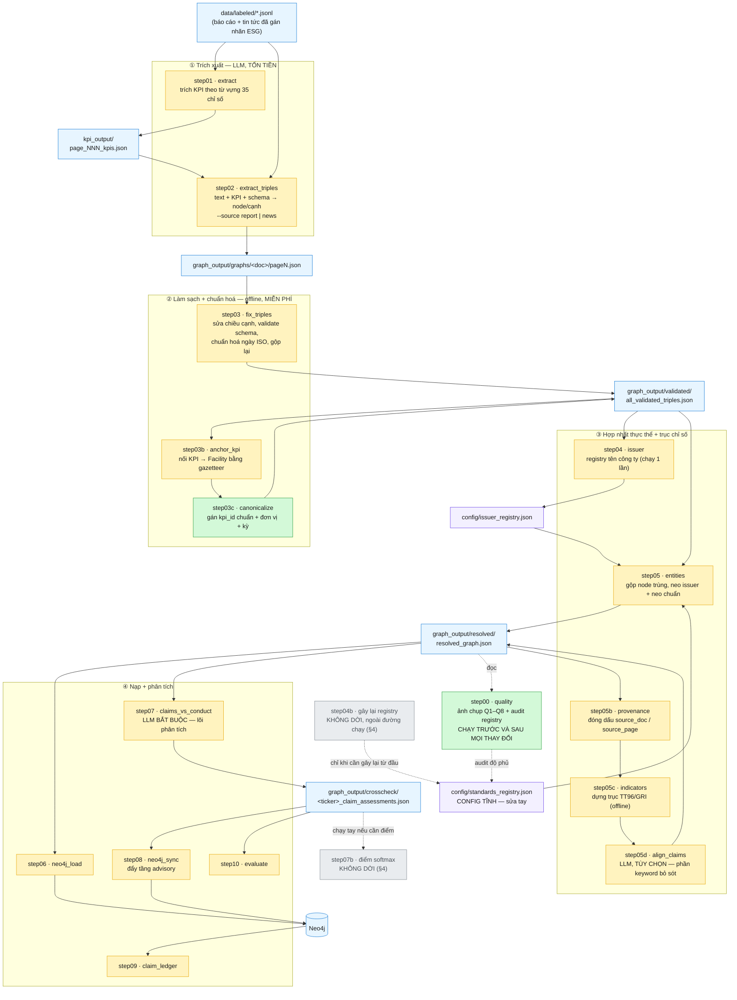
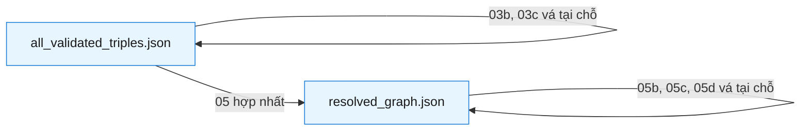
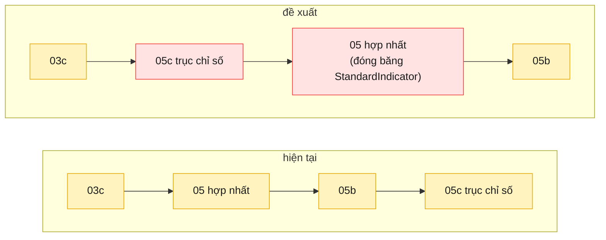

# Pipeline của đợt refactor — `src/` → `src_module/esg_kg/`

Bản đồ **chỉ của stage C** (JSONL đã gán nhãn → đồ thị tri thức thời gian), tức đúng
phần đang được refactor. Không vẽ crawl, phân loại ESG, hay UI — xem `CLAUDE.md` cho
bức tranh toàn hệ thống.

Nguồn sự thật của thứ tự chạy là [`esg_kg/pipeline.py`](esg_kg/pipeline.py); file này
là bản vẽ của cùng dữ liệu đó. `python src_module/run.py --list` luôn nói thật về tiến độ.

**Trạng thái: 2/16 stage đã dời** (2 stage cố ý không dời, xem §4).

---

## 1. Toàn cảnh

**Chú giải màu**

| Màu | Nghĩa |
|---|---|
| 🟩 xanh | đã dời sang `esg_kg` — chạy bằng `python src_module/run.py <tên>` |
| 🟨 vàng | chưa dời — vẫn chạy bằng `python src/stepNN_*.py` |
| ⬜ xám | **cố ý không dời** (§4), vẫn còn file trong `src/` |
| 🟦 xanh dương | dữ liệu sinh ra (git-ignored, ship qua HF) |
| 🟪 tím | config (tracked trong Git) |

---

## 2. Bảng stage: vào gì → ra gì

| # | Tên | LLM? | Input chính | Output chính | Trạng thái |
|---|---|---|---|---|---|
| 00 | `quality` | — | `resolved_graph.json` | `quality/quality_report_<label>.{json,md}` | ✅ **đã dời** |
| 01 | `extract` | 💰 | JSONL đã gán nhãn | `kpi_output/…_kpis.json` | ⏳ |
| 02 | `extract_triples` | 💰 | JSONL + KPI + `schema.json` | `graphs/<doc>/pageN.json` | ⏳ |
| 03 | `fix_triples` | 💰 (chỉ pha 2) | các file page | `all_validated_triples.json` | ⏳ |
| 03b | `anchor_kpi` | — | validated + JSONL | vá tại chỗ + `anchor_patch_stats.json` | ⏳ |
| 03c | `canonicalize` | — | validated + `kpi_type_aliases.json` | vá tại chỗ + `kpi_canonical_stats.json` | ✅ **đã dời** |
| 04 | `issuer` | — | validated | `config/issuer_registry.json` | ⏳ |
| 04b | — | — | ~~resolved~~ | ~~`standards_registry.json`~~ | ⛔ **ngoài đường chạy** |
| 05 | `entities` | 💰 (tùy chọn) | validated + 2 registry | `resolved_graph.json` | ⏳ |
| 05b | `provenance` | — | resolved + các file page | vá tại chỗ | ⏳ |
| 05c | `indicators` | — | resolved + `kpi_definitions` + crosswalk + `gri_catalog` | vá tại chỗ | ⏳ |
| 05d | `align_claims` | 💰 tùy chọn | resolved | vá tại chỗ | ⏳ |
| 06 | `neo4j_load` | — | resolved | Neo4j | ⏳ |
| 07 | `claims_vs_conduct` | 💰 **bắt buộc** | resolved | `<ticker>_claim_assessments.json` | ⏳ |
| 07b | — | — | dossier | dossier (thêm điểm) | ⛔ **không dời** |
| 08 | `neo4j_sync` | — | dossier | Neo4j (tầng advisory) | ⏳ |
| 09 | `claim_ledger` | — | **chỉ Neo4j** | `<ticker>_claim_ledger.md` | ⏳ |
| 10 | `evaluate` | 💰 1 nhánh 30 ca | dossier + stats | `<ticker>_evaluation_report.md` | ⏳ |

💰 = tốn tiền. Đây là lý do mọi test đều offline và mọi stage đắt đều có `--dry-run`.

---

## 3. Ba khối lặp lại trên vòng đời một node

Cái làm pipeline trông rối là **vá tại chỗ**: nhiều stage đọc và ghi *cùng một file*.
Ba khối dưới đây giải thích vì sao.

- **Trước hợp nhất** (`all_validated_triples.json`): node còn trùng lặp, mỗi lần nhắc
  một node. 03b/03c làm giàu **từng node** — không cần biết node nào là node nào.
- **Sau hợp nhất** (`resolved_graph.json`): mỗi thực thể một node. 05b/05c/05d cần
  điều đó, hoặc cần vị trí node ổn định.
- **Đóng băng vị trí**: step06 khoá Neo4j theo *chỉ số mảng* và dossier step07 trỏ node
  theo *vị trí* — nên 05c bắt buộc **chỉ được nối thêm vào cuối**, không sắp xếp lại.

---

## 4. Hai stage cố ý KHÔNG dời

Không phải "chưa làm" — là **quyết định**. `run.py --list` in `(not ported)` và loại
khỏi mẫu số; nếu tính vào thì tiến độ migrate vĩnh viễn không thể đạt 100%.
Cả hai **vẫn còn file trong `src/`**.

| Stage | Vì sao loại | Chi tiết |
|---|---|---|
| **04b** `build_standards_registry` | Nó đọc `resolved_graph.json` = **output của step05**, trong khi step05 đọc registry là output của nó → **vòng lặp**, bare clone không chạy được. Và lần quét đồ thị đóng góp **0**: cả 10 alias đều là seed hard-code. → registry thành **config tĩnh**, phần quét thành **audit trong step00**. | DESIGN.md §4.2 |
| **07b** `enrich_dossiers` | Bề mặt giao (`frontend/` + `api/`) **không đọc** điểm softmax; cả step08 lẫn step09 đều chịu được khi thiếu. Muốn có điểm thì chạy tay. | DESIGN.md §4.1 |

---

## 5. Đề xuất đang cân nhắc — CHƯA LÀM

> ⚠️ Phần này mô tả **thay đổi được đề xuất**, không phải hiện trạng. Đừng đọc như tài liệu code đang chạy.

Chuyển **05c lên trước 05**, để trục chỉ số thành một phần của việc *dựng* đồ thị thay vì
bản vá dán lên sau:

**Vì sao**: gần như toàn bộ cạnh của 05c **không cần đồ thị đã hợp nhất** — `measuredUnder`
đọc `kpi_id` từng node, `equivalentTo` thuần config, `alignsWithIndicator` khớp text từng
node. Chỉ mỗi việc chọn *đích* của `partOf` là cần. Chuyển lên sớm thì **bỏ được toàn bộ
cơ chế APPEND-ONLY** (`GraphPatch.assert_append_only`) — thứ đang chặn việc dời `step05d`.

**Rủi ro phải xử lý**: 67 node `StandardIndicator` sẽ đi qua Stage B/C của step05.
`identity_keys=['id']` nên Stage A an toàn, nhưng embedding rất dễ gộp nhầm
`TT96-6.3.1 Tiêu thụ năng lượng` với `TT96-6.3.2 Tiết kiệm năng lượng` → phải **đóng băng**
`StandardIndicator` y như neo issuer và neo chuẩn.

**Cách kiểm**: số liệu phải **không đổi**. Mốc đo lại ngày 2026-07-26, trên đồ thị
10 425 node / 14 402 cạnh (snapshot HF `09cfe062`):

| | |
|---|---|
| `StandardIndicator` | **67** (Môi trường 31 · Xã hội 22 · Quản trị 14) |
| `measuredUnder` | **641** |
| `alignsWithIndicator` | **639** |
| `equivalentTo` | **26** |
| `partOf` | **102** |

Chụp `step00 --label before/after` để đối chiếu. *(Bản trước ghi 749 cạnh / 73
`alignsWithIndicator` / 35 chỉ số — số của thời trục chỉ số còn là no-op, trước khi
`config/standard_crosswalk.json` được duyệt và `config/gri_catalog.json` xuất hiện.)*

---

## 6. Đọc tiếp

| Cần gì | Đọc file nào |
|---|---|
| Luật refactor (Model A, TDD, vá ở stage sớm nhất) | [`esg_kg/DESIGN.md`](esg_kg/DESIGN.md) §4–§5 |
| Vì sao corpus AAA sẽ được trích lại và điều đó đổi những gì | DESIGN.md §5.4 |
| Thứ tự chạy dạng dữ liệu (nguồn sự thật) | [`esg_kg/pipeline.py`](esg_kg/pipeline.py) |
| Cách chạy + trạng thái từng phần | [`README.md`](README.md) |
| Chi tiết từng stage, cờ dòng lệnh | `CLAUDE.md` mục "Pipeline architecture" |
