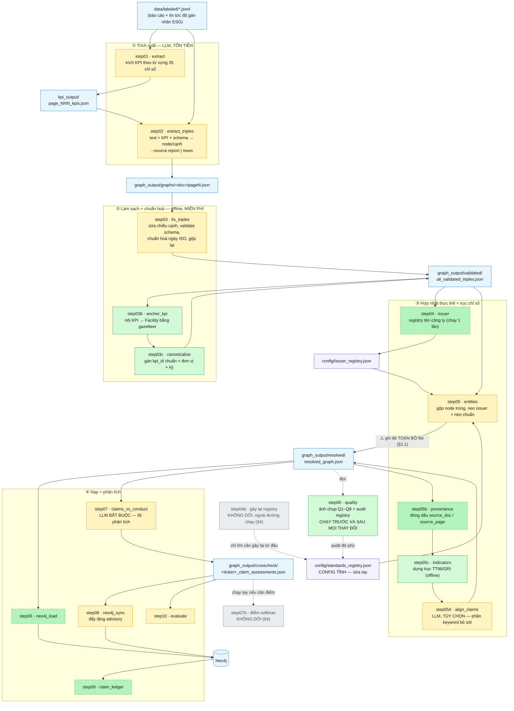
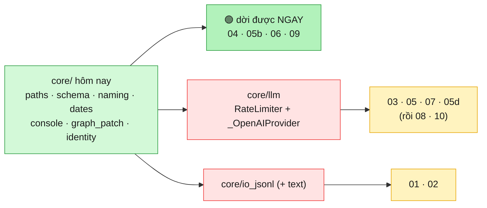
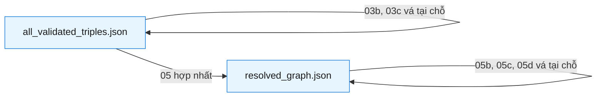
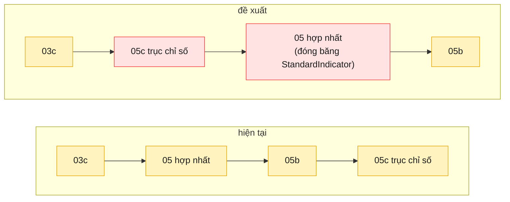

# Pipeline của đợt refactor — `src/` → `src_module/esg_kg/`

Bản đồ **chỉ của stage C** (JSONL đã gán nhãn → đồ thị tri thức thời gian), tức đúng
phần đang được refactor. Không vẽ crawl, phân loại ESG, hay UI — xem `CLAUDE.md` cho
bức tranh toàn hệ thống.

Nguồn sự thật của thứ tự chạy là [`esg_kg/pipeline.py`](esg_kg/pipeline.py); file này
là bản vẽ của cùng dữ liệu đó. `python src_module/run.py --list` luôn nói thật về tiến độ.

**Trạng thái (2026-07-27): 4/16 stage đã dời** — `00 quality`, `03c canonicalize`,
`05c indicators`, `03b anchor_kpi`; 2 stage cố ý không dời (§4). `core/identity.py` đi kèm
lần dời `03b` đã **mở khoá luôn `05b`**. Còn lại đủ điều kiện ngay: `04`, `05b`, `06`, `09`;
module `core/` mở khoá nhiều nhất là `core/llm.py` — xem §2.1, đó mới là bản đồ quyết định
thứ tự làm, không phải sơ đồ chạy ở §1.

---

## 1. Toàn cảnh

**Chú giải màu**

| Màu | Nghĩa |
|---|---|
| 🟩 xanh đậm | đã dời sang `esg_kg` — chạy bằng `python src_module/run.py <tên>` |
| 🟢 xanh nhạt, viền đứt | chưa dời nhưng **mọi symbol nó cần đã có trong `core/`** → dời được ngay (§2.1) |
| 🟨 vàng | chưa dời **và còn bị chặn** bởi một module `core/` chưa viết (§2.1) |
| ⬜ xám | **cố ý không dời** (§4), vẫn còn file trong `src/` |
| 🟦 xanh dương | dữ liệu sinh ra (git-ignored, ship qua HF) |
| 🟪 tím | config (tracked trong Git) |

---

## 2. Bảng stage: vào gì → ra gì

| # | Tên | LLM? | Input chính | Output chính | Trạng thái |
|---|---|---|---|---|---|
| 00 | `quality` | — | `resolved_graph.json` | `quality/quality_report_<label>.{json,md}` | ✅ **đã dời** |
| 01 | `extract` | 💰 | JSONL đã gán nhãn | `kpi_output/…_kpis.json` | ⏳ |
| 02 | `extract_triples` | 💰 | JSONL + KPI + `schema.json` | `graphs/<doc>/pageN.json` | ⏳ |
| 03 | `fix_triples` | 💰 (chỉ pha 2) | các file page | `all_validated_triples.json` | ⏳ |
| 03b | `anchor_kpi` | — | validated + JSONL | vá tại chỗ + `anchor_patch_stats.json` | ✅ **đã dời** |
| 03c | `canonicalize` | — | validated + `kpi_type_aliases.json` | vá tại chỗ + `kpi_canonical_stats.json` | ✅ **đã dời** |
| 04 | `issuer` | — | validated | `config/issuer_registry.json` | 🟢 **dời được ngay** |
| 04b | — | — | ~~resolved~~ | ~~`standards_registry.json`~~ | ⛔ **ngoài đường chạy** |
| 05 | `entities` | 💰 (tùy chọn) | validated + 2 registry | `resolved_graph.json` | ⏳ |
| 05b | `provenance` | — | resolved + các file page | vá tại chỗ | 🟢 **dời được ngay** |
| 05c | `indicators` | — | resolved + `kpi_definitions` + crosswalk + `gri_catalog` | vá tại chỗ | ✅ **đã dời** |
| 05d | `align_claims` | 💰 tùy chọn | resolved | vá tại chỗ | ⏳ |
| 06 | `neo4j_load` | — | resolved | Neo4j | 🟢 **dời được ngay** |
| 07 | `claims_vs_conduct` | 💰 **bắt buộc** | resolved | `<ticker>_claim_assessments.json` | ⏳ |
| 07b | — | — | dossier | dossier (thêm điểm) | ⛔ **không dời** |
| 08 | `neo4j_sync` | — | dossier | Neo4j (tầng advisory) | ⏳ |
| 09 | `claim_ledger` | — | **chỉ Neo4j** | `<ticker>_claim_ledger.md` | 🟢 **dời được ngay** |
| 10 | `evaluate` | 💰 1 nhánh 30 ca | dossier + stats | `<ticker>_evaluation_report.md` | ⏳ |

💰 = tốn tiền. Đây là lý do mọi test đều offline và mọi stage đắt đều có `--dry-run`.

### 2.1 Cái thật sự quyết định thứ tự dời: phụ thuộc **symbol**, không phải thứ tự chạy

Sơ đồ §1 vẽ **dữ liệu chảy đi đâu**. Nó KHÔNG phải thứ tự được phép dời. Luật ở
DESIGN.md là: *một stage chỉ dời được khi **mọi symbol NÓ import** đã nằm trong
`esg_kg.core`* — nên thứ tự dời do đồ thị import quyết định, và đồ thị đó chạy **ngược**
chiều pipeline (stage sau import helper của stage trước).

Bảng dưới là kết quả grep toàn bộ import chéo trong `src/` đối chiếu với `core/` hôm nay
(2026-07-27) — cột cuối là **thứ duy nhất còn thiếu**:

| # | Symbol nó import từ cây `src/` | Còn thiếu gì trong `core/` |
|---|---|---|
| 01 | *(không import stage nào)* | — 🟢 nhưng nó **là** nguồn của `build_page_text`/`load_pages_from_jsonl`/`page_has_esg`/`select_documents` → `core/io_jsonl` |
| 02 | 5 helper JSONL của `01` + `REPO_ROOT` | `core/io_jsonl` |
| 03 | `REPO_ROOT`, `RateLimiter` | **`core/llm`** |
| 03b | `REPO_ROOT`, `load_schema_sets`, `validate_triple`, `normalize_name` | ✅ **đã dời** (2026-07-27) |
| 04 | `REPO_ROOT` | — 🟢 **đủ hết** |
| 05 | `date_start_key`, `load_schema_sets`, `normalize_name` ✅ + `RateLimiter` | **`core/llm`** |
| 05b | `get_identity_keys`, `PROVENANCE_CLASSES`, `get_stable_entity_id`, `parse_source_id` | — 🟢 **đủ hết** kể từ `core/identity.py` |
| 05d | `load_schema_sets`, `GraphPatch`, `temporal_md` ✅ + `_OpenAIProvider`, `RateLimiter` | **`core/llm`** |
| 06 | `REPO_ROOT`, `load_schema_sets` | — 🟢 **đủ hết** |
| 07 | `load_schema_sets`, `normalize_name`, `name_tokens` ✅ + `RateLimiter` | **`core/llm`** |
| 08 | `node_text` (của `step07`) | `core/llm` hoặc `core/text` — xem cảnh báo dưới |
| 09 | *(không import stage nào)* | — 🟢 **đủ hết** |
| 10 | `Adjudicator` (import **lười** trong `try`, `step10:368`) | **`core/llm`** — hỏng thì **im lặng**, không lỗi |

**Đọc ra được ba điều, cả ba đều đổi thứ tự làm:**

1. **Không bị kẹt.** Bốn stage (`04`, `05b`, `06`, `09`) đã đủ điều kiện — `09` thậm chí
   không import stage nào cả. Không cần viết thêm module `core/` nào để đi tiếp.
   ⚠️ Nhưng "đủ điều kiện symbol" **chưa phải** "nên làm ngay": `06`/`09` đọc Neo4j nên arm
   tương đương của chúng chỉ với tới mức import + hàm thuần (DESIGN.md §4 bước 3 xếp lại
   sau vì lý do đó), còn `04` nằm trong lô **hub** làm cuối. Ứng viên có lưới an toàn mạnh
   nhất là **`05b`** — offline hoàn toàn, chạy được trên đồ thị thật.
2. **`core/llm.py` là đòn bẩy lớn nhất: mở khoá 4 stage** (`03`, `05`, `07`, `05d`), rồi
   kéo theo `08`/`10`. Bản trước của file này chỉ ghi nó chặn `05d` — đúng nhưng làm nó
   trông như việc lẻ, trong khi nó là nút thắt của cả nửa sau pipeline.
3. **`01` là hub cuối cùng còn lại.** Nó không import ai, nhưng `02` phụ thuộc 5 helper
   JSONL của nó → `core/io_jsonl` là điều kiện của nhánh trích xuất.

⚠️ **Cái bẫy khi làm `core/llm`:** có **hai** hàm tên `node_text` và chúng **không** trùng
nhau — `step05d:63` nhận *dict thuộc tính*, `step07:133` nhận *node* rồi rẽ theo class.
Gộp chung là **âm thầm viết lại prompt LLM đã trả tiền của `step07`**. Giữ hai tên khác
nhau. (DESIGN.md ghi đây là lỗi trong chính nó, chưa gấp lại.)

---

## 3. Ba khối lặp lại trên vòng đời một node

Cái làm pipeline trông rối là **vá tại chỗ**: nhiều stage đọc và ghi *cùng một file*.
Ba khối dưới đây giải thích vì sao.

- **Trước hợp nhất** (`all_validated_triples.json`): node còn trùng lặp, mỗi lần nhắc
  một node. 03b/03c làm giàu **từng node** — không cần biết node nào là node nào.
- **Sau hợp nhất** (`resolved_graph.json`): mỗi thực thể một node. 05b/05c/05d cần
  điều đó, hoặc cần vị trí node ổn định.
- **Đóng băng vị trí**: step06 khoá Neo4j theo *chỉ số mảng* và dossier step07 trỏ node
  theo *vị trí* — nên 05c bắt buộc **chỉ được nối thêm vào cuối**, không sắp xếp lại.

**Hệ quả cho MỌI test của stage vá tại chỗ** (đã dính hai lần, nên ghi ra thành luật):
file trên đĩa **đã bị chính stage đó vá rồi**. Chạy lại stage trên nó là **no-op**, và một
arm tương đương xây trên no-op sẽ so hai kết quả rỗng rồi in **PASS**.

| Stage | Tàn dư của chính nó trong file | Cách dựng lại input trước khi vá |
|---|---|---|
| `05c` | 67 `StandardIndicator` + 4 nhãn cạnh trục | `strip_axis()` — xoá node + cạnh trục, remap chỉ số mảng |
| `03b` | **95/306** cạnh `observedAtFacility` có `anchor_method=offline_gazetteer` | `strip_anchors()` — xoá đúng 95 cái đó, **giữ 211 cạnh do extraction sinh** |

Luật rút ra: **strip đúng phần stage tự sinh, không strip theo nhãn cạnh** — 211 cạnh
`observedAtFacility` kia có từ trước, xoá nhầm là đo sai. Và kết quả rỗng đừng vứt đi: với
`03b` nó được giữ lại thành arm **idempotency** (chạy lại không nhân bản anchor), vì
CLAUDE.md bảo chạy `03b` trước `05` trên corpus vốn đã vá — nên đó mới là tính chất thật
sự đang được dựa vào. Guard chống rỗng của arm đó **ngược lại**: nó khẳng định input
*đã* được vá.

### 3.1 Chuỗi vá `05 → 05b → 05c` là BẮT BUỘC nhưng KHÔNG có gì bảo vệ

Chỉ tồn tại **một** file `graph_output/resolved/resolved_graph.json`. `05b`/`05c`/`05d`
đều ghi ngược lại đúng đường dẫn đó, còn `step05:655` ghi đè **toàn bộ** — không merge,
không cảnh báo. **Chạy lại `step05` là xoá sạch cả ba bản vá**, và không có dấu hiệu nào
báo điều đó đã xảy ra:

| Chỗ | Bảo vệ hiện có | Hậu quả khi thiếu bản vá |
|---|---|---|
| `step05:655` | **không có** | ghi đè, mất `provenance_method` + trục chỉ số + align |
| `step06:365` | chỉ `logger.warning` | vẫn nạp Neo4j, đồ thị thiếu `StandardIndicator` |
| `step07:703` | **không có** (chỉ kiểm file tồn tại) | index trục chỉ số rỗng ⇒ retrieval tier-1 đóng góp **0**, tụt về token overlap. Không lỗi, không cảnh báo; dấu vết duy nhất là `indicator_tier_pairs: 0` trong file stats |

Thứ đang giữ chuỗi này chạy đúng chỉ là ba dòng log cuối stage (đều nói *"Next: step06
--clear"*) — **hợp đồng bằng trí nhớ**. Khi `step05` được dời, bản `esg_kg` **không được**
mang khiếm khuyết này sang; ba phương án đang cân + ràng buộc: DESIGN.md §5.5.

---

## 4. Hai stage cố ý KHÔNG dời

Không phải "chưa làm" — là **quyết định**. `run.py --list` in `(not ported)` và loại
khỏi mẫu số; nếu tính vào thì tiến độ migrate vĩnh viễn không thể đạt 100%.
Cả hai **vẫn còn file trong `src/`**.

| Stage | Vì sao loại | Chi tiết |
|---|---|---|
| **04b** `build_standards_registry` | Nó đọc `resolved_graph.json` = **output của step05**, trong khi step05 đọc registry là output của nó → **vòng lặp**, bare clone không chạy được. Và lần quét đồ thị đóng góp **0**: cả 10 alias đều là seed hard-code. → registry thành **config tĩnh**, phần quét thành **audit trong step00**. | DESIGN.md §4.2 |
| **07b** `enrich_dossiers` | Bề mặt giao (`frontend/` + `api/`) **không đọc** điểm softmax; cả step08 lẫn step09 đều chịu được khi thiếu. Muốn có điểm thì chạy tay. | DESIGN.md §4.1 |

---

## 5. Đề xuất đang cân nhắc — CHƯA LÀM

> ⚠️ Phần này mô tả **thay đổi được đề xuất**, không phải hiện trạng. Đừng đọc như tài liệu code đang chạy.

Chuyển **05c lên trước 05**, để trục chỉ số thành một phần của việc *dựng* đồ thị thay vì
bản vá dán lên sau:

**Vì sao**: gần như toàn bộ cạnh của 05c **không cần đồ thị đã hợp nhất** — `measuredUnder`
đọc `kpi_id` từng node, `equivalentTo` thuần config, `alignsWithIndicator` khớp text từng
node. Chỉ mỗi việc chọn *đích* của `partOf` là cần. Chuyển lên sớm thì riêng `05c`
**bỏ được cơ chế APPEND-ONLY** (`GraphPatch.assert_append_only`).

⚠️ **Sửa 2026-07-27:** bản trước viết cơ chế này "đang chặn việc dời `step05d`" — không còn
đúng, và chỗ sai đổi hẳn sức nặng của đề xuất. `GraphPatch` nay ở `core/graph_patch.py`, nên
`05d` không còn vướng ở đây; nó vướng `core/llm.py` (`step05d:35` import
`_OpenAIProvider`/`RateLimiter` từ `step07`). Quan trọng hơn: **`05d` vẫn vá
`resolved_graph.json` tại chỗ sau `step05`**, nên append-only sống tiếp dù đề xuất này có
được làm hay không. Đó là lý lẽ *ủng hộ* việc `GraphPatch` lên `core/`, không phải lý lẽ
chống lại — và đề xuất này giờ chỉ còn hứa được phần gọn của `05c`, không còn hứa xoá được
một cơ chế.

**Rủi ro phải xử lý**: 67 node `StandardIndicator` sẽ đi qua Stage B/C của step05.
`identity_keys=['id']` nên Stage A an toàn, nhưng embedding rất dễ gộp nhầm
`TT96-6.3.1 Tiêu thụ năng lượng` với `TT96-6.3.2 Tiết kiệm năng lượng` → phải **đóng băng**
`StandardIndicator` y như neo issuer và neo chuẩn.

**Cách kiểm**: đối chiếu với **bản dựng sạch**, KHÔNG phải với file đang nằm trên đĩa —
xem cảnh báo ngay dưới bảng. Mốc đo lại ngày 2026-07-27 trên đồ thị 10 425 node /
14 402 cạnh (snapshot HF `09cfe062`), cột "dựng sạch" là kết quả chạy `05c` trên chính
đồ thị đó sau khi **strip trục chỉ số**:

| | Trong file | Dựng sạch hôm nay |
|---|---|---|
| `StandardIndicator` | **67** (Môi trường 31 · Xã hội 22 · Quản trị 14) | **67** ✅ |
| `measuredUnder` | **641** | **641** ✅ |
| `equivalentTo` | **26** | **26** ✅ |
| `partOf` **của trục** | **55** | **55** ✅ |
| `alignsWithIndicator` | **639** | **624** ⚠️ |
| *tổng cạnh trục* | *1 361* | *1 346* |

⚠️ **Hai cái bẫy trong bảng này, cả hai đều từng làm bản trước sai:**

1. **`partOf` trong đồ thị là 102, nhưng chỉ 55 thuộc trục chỉ số.** 47 cạnh còn lại là
   `Facility --partOf--> Organization` do extraction sinh, không liên quan gì tới `05c`.
   Đừng lấy 102 làm mốc. (`strip_axis()` trong test cũng xoá luôn 47 cạnh này vì nó lọc
   theo *nhãn* cạnh — chấp nhận được với vai trò fixture, nhưng khiến `edges_added` của
   arm nhỏ hơn tổng cạnh trục thật.)
2. **File hiện tại KHÔNG dựng lại được bằng code hôm nay.** Nó thừa **15 cạnh
   `alignsWithIndicator`** (11 cặp phân biệt, dồn vào `TT96-6.7.2` và `SSCIFC-S6` — các
   node `Initiative`/`Goal` kiểu "Quỹ từ thiện", "Charity Fund"). Đây là **tàn dư của luật
   khớp cũ**: `match_keyword` nay là *"phrase dài nhất thắng"*, còn `05c` thì
   **APPEND-ONLY** — nó chỉ nối thêm, **không bao giờ gỡ**. Nên mỗi lần đổi hành vi khớp,
   file chỉ phình ra, cạnh cũ ở lại vĩnh viễn. Chiều lệch luôn là một phía: bản dựng sạch
   là **tập con thật sự** của file (rebuild-only = 0).

Hệ quả cho đề xuất này: tiêu chí nghiệm thu là **so hai bản dựng sạch với nhau**
(trước/sau khi đổi thứ tự), chứ không phải khớp lại con số trong file — nếu lấy file làm
mốc thì sẽ thấy "hụt 15 cạnh" và tưởng là hồi quy do mình gây ra. Đây cũng chính là một
lý do nữa cho lần trích lại đã lên lịch ở DESIGN.md §5.4: chỉ lần đó mới dọn được tàn dư.

Chụp `step00 --label before/after` để đối chiếu. *(Bản trước ghi 749 cạnh / 73
`alignsWithIndicator` / 35 chỉ số — số của thời trục chỉ số còn là no-op, trước khi
`config/standard_crosswalk.json` được duyệt và `config/gri_catalog.json` xuất hiện.)*

---

## 6. Đọc tiếp

| Cần gì | Đọc file nào |
|---|---|
| Luật refactor (Model A, TDD, vá ở stage sớm nhất) | [`esg_kg/DESIGN.md`](esg_kg/DESIGN.md) §4–§5 |
| Ba phương án cho việc `step05` không được ghi đè (§3.1) | DESIGN.md §5.5 |
| Vì sao corpus AAA sẽ được trích lại và điều đó đổi những gì | DESIGN.md §5.4 |
| Thứ tự chạy dạng dữ liệu (nguồn sự thật) | [`esg_kg/pipeline.py`](esg_kg/pipeline.py) |
| Cách chạy + trạng thái từng phần | [`README.md`](README.md) |
| Chi tiết từng stage, cờ dòng lệnh | `CLAUDE.md` mục "Pipeline architecture" |
